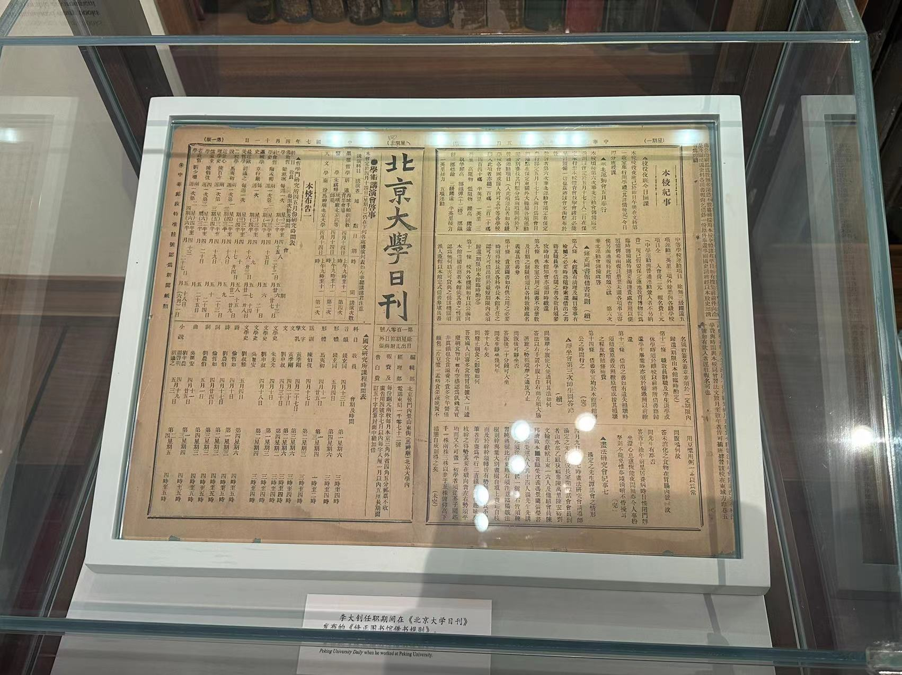
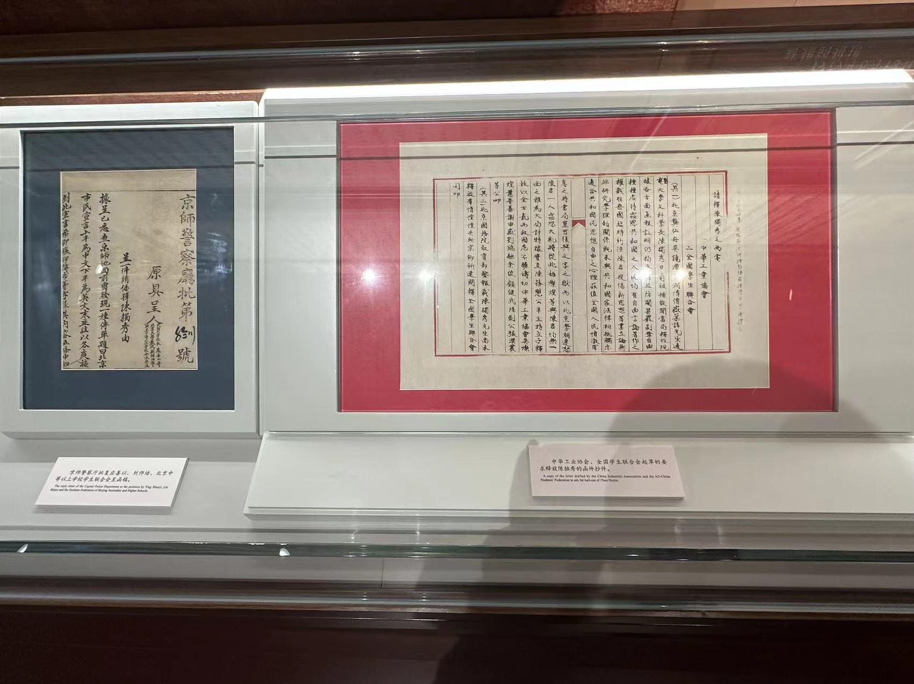

### 2024.2.1

### 2024.1.31

### 2024.1.29

### 2024.1.28

### 2024.1.27

数据结构6

### 2024.1.26

数据结构5

### 2024.1.25

数据结构4

### 2024.1.24

树与二叉树

### 2024.1.23

数据结构2

### 2024.s1.22

数据结构1+英语单词

### 2024.1.21

元编程与安全和密码学

### 2024.1.20

命令行环境和版本控制系统与调试及性能分析

### 2024.1.19

结束vim和数据整理

### 2024.1.18

今天到家了，和家人们一起吃完饭后，把我的台式机重置一下，它居然是 win8OS。

### 2024.1.15\16\17

考试三天，终于解放了~！

### 2024.1.14

又复习了一轮高数加编程基础。

### 2024.1.13

复习英语

### 2024.1.12

解决了昨天新的安装包为什么总是一次性的问题，因为它需要配置环境变量才可以一种存在，还有就是改键问题，还是没成功，我真服了。今天开始了编辑器（vim）.

### 2024.1.11

今天完成了`shell`工具和脚本的学习，并且获得了新的安装包，它原本是为了Mac而产生的。

### 2024.1.10

今天复习完一轮高数，明天考出版，学习了`Shell`工具与脚本。

### 2024.1.9

今天复习了英语加小部分高数，开始`Shell`工具和脚本喽！

### 2023.1.8

马上复习完高数，早点睡。

### 2023.1.7

完成了本学期最后一次线上双周会，今天复习了一小部分高数，该背英语单词了。

### 2023.1.6

复习了一天高数

### 2023.1.5

为Arch配置了kde桌面

### 2024.1.4

今天获得了我的第 4 种操作系统-<mark>Arch</mark>!	Very happy!

### 2024.1.3

开始进行 MIT，给人一种触类旁通的感觉。练习 30 进行中。

### 2024.1.2

学会使用`Tmux`工具,以前只是利用了它的很少一部分功能

### 2024.1.1

去了圆明园，颐和园，天坛。

我买的纪念品，“紫气东来”送给自己也送给大家！

### 2023.12.31

今天完成了考核，开心！

### 2023.12.30

今天复习了高数，又复习了一下自己的编程大杂烩。

### 2023.12.29

更新库和链接，今天早点睡了

### 2023.12.28

完成了 1-18 的编程大程序

### 2023.12.27

在图书馆呆了一个下午加晚自习，终于学完Makefile进阶了，一下子对以前使用过的非常关键的Makefile文件有了很不错的了解，它真的是写程序和项目的关键

### 2023.12.26

开始学 Makefile 进阶，终于要知道Makefile文件里面写的东西的规则和意思了，说实话弄清楚原理的感觉真的很爽！

### 2023.12.25

马上就把上次的 `PPT` 改完了，别急

### 2023.12.24

今天一定要为了 vim 完成改键，不然经常需要按`Esc`

### 2023.12.23
今天打了乒乓球(学了正手）和羽毛球（了解规则后太难打了），看了柯南的新电影，电影真的好看，磕新哀！
### 2023.12.22
今天测试太难了，很不爽!
### 2023.12.21
更新创造性和防御性编程

### 2023.12.20
练习26的项目终于成功了，其实这应该算是我的第二个项目，第一个应该是使用 `markdown` 语法做`PPT`，成功来的总是那么突然，总在你感到绝望时突然降临。

### 2023.12.19
不得不说完成一个真正的程序真的很难，我还是在前人已经将代码编写完的基础上，通过获取文件，来完成这个程序，就需要动脑思考哪里出了问题，如何获取正确的文件。

### 2023.12.18
练习 26 编写第一个真正的程序，完成了一部分，让我学到了很多东西，比如强制在 vim 中进行保存

### 2023.12.17
更新了输入输出和文件，变参函数，今天干了两个练习

### 2023.12.16
今天又在复习线代，共六章，已经复习完第五章了，就差第六章了！更新了达夫设备。

### 2023.12.15
下午到晚上 8.30 在主校图书馆复习线代,学会了给苹果手机开启`VPN`和下载 `Chatgpt `,只需要一个美区的 apple ID

###  2023.12.14 

今天参加了领航，是时事讨论，比读书难多了！今天学到了一下非常巧妙的利用数组下标来实现俩组数的并集排序加除重在编程练习题里，更新了栈、作用域和全局

### 2023.12.13
今天是非常有成就感的一天，因为我学会了如何利用 `wsl2  ` 安装各种发行版的    Linux  并且我从今天下午就开始执行 `Linux101` 第二章中的配置桌面,无数次碰壁，甚至连我 surface 上的 `Ubuntu` 都玩坏了，不得不注销，但是最终的结果是好的，今天的所有过程是我独立完成的，非常自豪。因为注销后，我的    `surface` 上的插件全部都没了，所以我寻求了方法，就是 `stow` 工具，创建 ` dotfile`  目录将配置文件放进去，并上传到仓库，用的时候直接 git clone 就可以。

### 2023.12.12
参加了元旦晚会，玩到大约 9.30 才会，击鼓传花吓死我了。更新了 `Linux101 `， C ： 高级数据类型和控制结构

### 2023.12.11
更新了调试宏

### 2023.12.10
第一次实现游戏程序（c练习19）

### 2023.12.9
好久没学 Linux 了，今天学习了使用重定向，如果只是简单的了解一下概念而不动手实际，我相信并不会学到很多东西，我将重定向里面的所有可以执行的命令全部都进行了实践，它按照你想的一样输出时，感觉很爽，错误情况是难免的，方法总比困难多！更新了 Linux 中的使用重定向，和 C 中的一个简单的对象系统。

该好好规划一下了，不然进度有点松散，很难把握

### 2023.12.8
今天一下子通了好多，对c语言有了进一步的认识，发现了之前有些东西其实并没有弄清楚，或者之前的东西理解的并不深刻，现在才清楚原理。更新了函数指针，补充了堆和栈。

### 2023.12.7
补充了结构体，堆和栈的内容，我的surface在一位高手的辅助下，也配置了 `Ubuntu` 和 `NVIM `，这样我就会经常用到vim喽！（vim的东西还没记熟） 

### 2023.12.6
继结构体后，这个堆和栈也是一下子提升了好几个量级，给我一种刷新世界观和打开新大陆的感觉，这可是198行代码啊！我现在还只是一个菜鸟，怪不得是 by   the  hard way 呢，暗度一下子就来了，烧脑，烧脑，烧脑！不过一点一点分析就可以了，需要的只是时间和冷静分析。

### 2023.12.5
Learn C The Hard Way 结构体更新。

### 2023.12.1/2/3
哈哈完成了下载 `PPT` 转换工具，将内容全部上传，但是排版语法搞不懂！

### 2023.11.30
今天的编程题很有成就感，花费了不少精力，实现了用递归来做到阶乘和写自己的函数(在 c 中的编程练习题里面)

### 2023.11.29
有什么事情烦扰着你或者阻碍着你专注于当下，那么就立刻解决它。补充了指针的一些内容。

### 2023.11.28
今天的指针我感觉也是非常费劲，虽然更新了（记了关于示例程序结合作者的帮助自己的一些理解），但我感觉指针的原理我还需要再理解理解，然后上传。每次听健哥的歌，我都能够净化我的心灵 。

### 2023.11.27
更新了 c 但是还是有点慢！

### 2023.11.26
为了追求极致的效率，我还是决定今天早睡，忙完后，剩余的时间虽然够更新今天的内容，但是考虑到我会睡得不那么好，从而影响了明天一天的效率，那就得不偿失了，还是选择早睡，明天要加倍努力！

### 2023.11.25
今天学习了 2 个循环语句，那个图片比例问题，我使用 html 的百分比的用法，但是图片还是加载不出来，可能是因为编辑器不适配。

### 2023.11.24
《git 入门》完成！看似内容很少，动起手来，问题很多，有很多想像与实际不符的部分，需要自己去弄明白为什么。还有我的 surface 重置了，花了一点时间恢复。

### 2023.11.23
在今天晚上其实我学习了 git ，但我的小电脑因为我上周把 Windows 更新的文件全部都删除了，所以一周后的今天， surface 出了好多的问题，开机慢，打开后任务栏加载慢，电脑无法关机，所以明天再将 git 上传一下。

### 2023.11.22
今天才Linux中用vim敲出了 Hello World !

### 2023.11.21
今天去领航了，学习了本质与现象-《马克思主义哲学》，回来更新了Linux中的筛选文件和计算所有文件总行数，统计与查找完结。

### 2023.11.20
在Linux中更新了正则表达式，我现在只想早点睡觉

### 2023.11.19
今天感觉没怎么学计算机，写作业了。感觉自从每天都有早八后，真的比以前累了好多，周五加周末只想补觉。

### 2023.11.18
今天晚上真是气死我了，刚写好的博客，按了保存之后，不知道为什么写的东西全都删了，顿时火冒三丈。（更新了 c  和 Linux ） 

### 2023.11.16
今天依旧看了《编码》，搞了一晚上英语翻译题，也见识到了C语言中&&与||的区别（在Learn C上已更新）。

### 2023.11.15
今天看了《编码》，并且更新了 Learn C the hard way ,每天都差点忘了英语单词，今天刚搞好了 STEAM，买了个游戏（忍不住想玩）， Linux 文章好久没看了

### 2023.11.14

从今天开始打卡每天看同样页数（秘密）的编码加 learn C 的学习

分享一个不错的[Markdown教程]( https://b23.tv/QHo5ho3)

### 2023.11.13
解决了在Linux上进行 Learn C the hard way 遇到的问题，然后就是第一次见到make让我惊喜，今天要早睡

### 2023.11.11
文章中添加了《初识man》

### 2023.11.10
下午下课后和舍友玩了很长时间的乒乓球，明天准备好好学习喽

- 给你们看一下我的顶配球拍，蓝海绵，黑檀木加芳碳

### 2023.11.9
晚上领航活动

- 这是我第三次进行领航活动，像往常一样依旧读着 1984 年的《马克思主义哲学》第一次看的是矛盾（对立统一）；第二次是否定之否定；第三次也就是今天看的是质量互变
- 

### 2023.11.8
北大红楼一日游

- 

- 

- 

- 

- 
