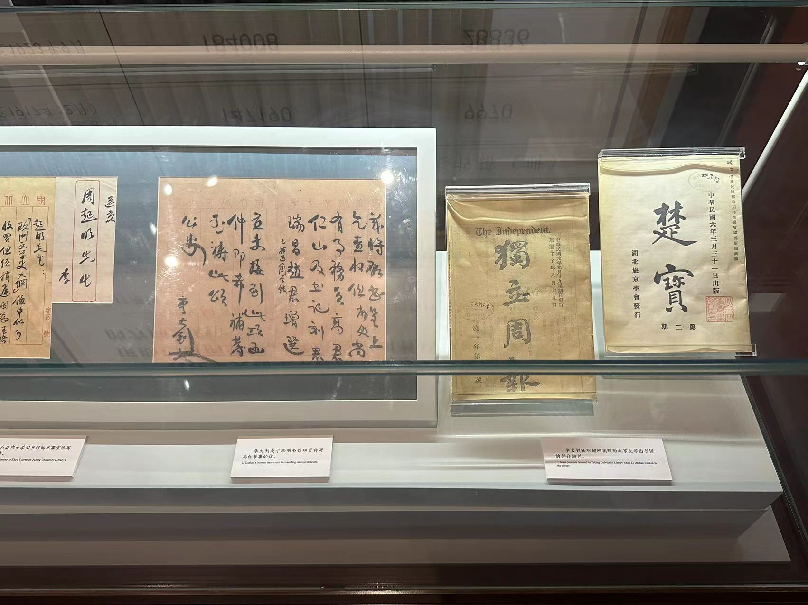
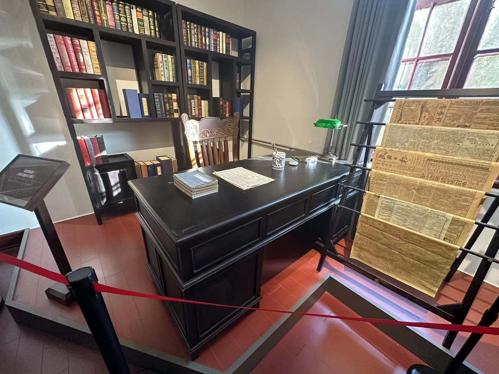

# 2023.11.14从今天开始打卡每天看同样页数（秘密）的编码加learn C的学习

分享一个不错的[Markdown教程]( https://b23.tv/QHo5ho3)

# 2023.11.13解决了在Linux上进行Learn C the hard way 遇到的问题，然后就是第一次见到make让我惊喜，今天要早睡

# 2023.11.11文章中添加了《初识man》

# 2023.11.10下午下课后和舍友玩了很长时间的乒乓球，明天准备好好学习喽

- 给你们看一下我的顶配球拍，蓝海绵，黑檀木加芳碳

# 2023.11.9晚上领航活动

- 这是我第三次进行领航活动，像往常一样依旧读着1984年的《马克思主义哲学》第一次看的是矛盾（对立统一）；第二次是否定之否定；第三次也就是今天看的是质量互变
- 

# 2023.11.8北大红楼一日游

- 

- 

- 

- 

- 
