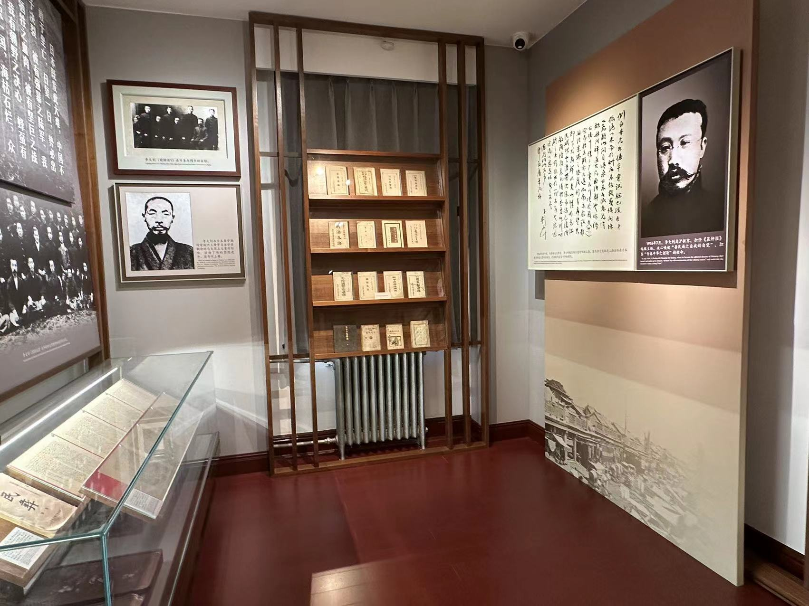

### 2023.12.10第一次实现游戏程序（c练习19）

### 2023.12.9好久没学Linux了，今天学习了使用重定向，如果只是简单的了解一下概念而不动手实际，我相信并不会学到很多东西，我将重定向里面的所有可以执行的命令全部都进行了实践，它按照你想的一样输出时，感觉很爽，错误情况是难免的，方法总比困难多！更新了Linux中的使用重定向，和C中的一个简单的对象系统。

### 该好好规划一下了，不然进度有点松散，很难把握

### 2023.12.8今天一下子通了好多，对c语言有了进一步的认识，发现了之前有些东西其实并没有弄清楚，或者之前的东西理解的并不深刻，现在才清楚原理。更新了函数指针，补充了堆和栈。

### 2023.12.7补充了结构体，堆和栈的内容，我的surface在一位高手的辅助下，也配置了`Ubuntu`和`NVIM`，这样我就会经常用到vim喽！（vim的东西还没记熟） 

### 2023.12.6继结构体后，这个堆和栈也是一下子提升了好几个量级，给我一种刷新世界观和打开新大陆的感觉，这可是198行代码啊！我现在还只是一个菜鸟，怪不得是by the  hard way呢，暗度一下子就来了，烧脑，烧脑，烧脑！不过一点一点分析就可以了，需要的只是时间和冷静分析。

### 2023.12.5 Learn C The Hard Way结构体更新。

### 2023.12.1/2/3哈哈完成了下载PPT转换工具，将内容全部上传，但是排版语法搞不懂！

### 2023.11.30今天的编程题很有成就感，花费了不少精力，实现了用递归来做到阶乘和写自己的函数(在c中的编程练习题里面)

### 2023.11.29有什么事情烦扰着你或者阻碍着你专注于当下，那么就立刻解决它。补充了指针的一些内容。

### 2023.11.28今天的指针我感觉也是非常费劲，虽然更新了（记了关于示例程序结合作者的帮助自己的一些理解），但我感觉指针的原理我还需要再理解理解，然后上传。每次听健哥的歌，我都能够净化我的心灵 。

### 2023.11.27更新了c但是还是有点慢！

### 2023.11.26为了追求极致的效率，我还是决定今天早睡，忙完后，剩余的时间虽然够更新今天的内容，但是考虑到我会睡得不那么好，从而影响了明天一天的效率，那就得不偿失了，还是选择早睡，明天要加倍努力！

### 2023.11.25今天学习了2个循环语句，那个图片比例问题，我使用html的百分比的用法，但是图片还是加载不出来，可能是因为编辑器不适配。

### 2023.11.24《git入门》完成！看似内容很少，动起手来，问题很多，有很多想像与实际不符的部分，需要自己去弄明白为什么。还有我的surface重置了，花了一点时间恢复。

### 2023.11.23在今天晚上其实我学习了git，但我的小电脑因为我上周把Windows更新的文件全部都删除了，所以一周后的今天，surface出了好多的问题，开机慢，打开后任务栏加载慢，电脑无法关机，所以明天再将git上传一下。

### 2023.11.22今天才Linux中用vim敲出了Hello World!

### 2023.11.21今天去领航了，学习了本质与现象-《马克思主义哲学》，回来更新了Linux中的筛选文件和计算所有文件总行数，统计与查找完结。

### 2023.11.20在Linux中更新了正则表达式，我现在只想早点睡觉

### 2023.11.19今天感觉没怎么学计算机，写作业了。感觉自从每天都有早八后，真的比以前累了好多，周五加周末只想补觉。

### 2023.11.18今天晚上真是气死我了，刚写好的博客，按了保存之后，不知道为什么写的东西全都删了，顿时火冒三丈。（更新了c和Linux） 

### 2023.11.16今天依旧看了《编码》，搞了一晚上英语翻译题，也见识到了C语言中&&与||的区别（在Learn C上已更新）。

### 2023.11.15今天看了《编码》，并且更新了Learn C the hard way,每天都差点忘了英语单词，今天刚搞好了STEAM，买了个游戏（忍不住想玩），Linux文章好久没看了

### 2023.11.14从今天开始打卡每天看同样页数（秘密）的编码加learn C的学习

分享一个不错的[Markdown教程]( https://b23.tv/QHo5ho3)

### 2023.11.13解决了在Linux上进行Learn C the hard way 遇到的问题，然后就是第一次见到make让我惊喜，今天要早睡

### 2023.11.11文章中添加了《初识man》

### 2023.11.10下午下课后和舍友玩了很长时间的乒乓球，明天准备好好学习喽

- 给你们看一下我的顶配球拍，蓝海绵，黑檀木加芳碳

### 2023.11.9晚上领航活动

- 这是我第三次进行领航活动，像往常一样依旧读着1984年的《马克思主义哲学》第一次看的是矛盾（对立统一）；第二次是否定之否定；第三次也就是今天看的是质量互变
- 

### 2023.11.8北大红楼一日游

- 

- 

- 

- 

- 
