# Linux studying (一切皆文件)

## 常用命令:

```
1.cd ~  #回到用户目录

2.cd /   #回到根目录

3.cd..   #返回

4.cd../..  #返回上上级目录

5.ls      #显示目录内容列表

6.ll         #列出所有文件

7.pwd   #显示当前目录

8.ctrl + c  #临时强制退出/停止命令的执行

9.touch 文件名   #创建文件

10.df       #显示已挂载的所有磁盘使用情况（用k表示内存）

11.df-h     #显示已挂载的所有磁盘使用情况（用G表示内存）比上一个常用

12.vim      #打开并可编辑文件

13.sort 文件名   #将文件中的内容按从1到n的先后顺序排列展示，但不会改变原文件

14.sort -n 文件名  #按数字大小进行排序

15.sort -nr 文件名 #倒叙排列文件内容

16.cp -i 你想复制的文件 你想复制到的文件

17.mv 原名 新名  #改名

18.mv 文件现在的绝对路径 文件新的绝对路径 #改变地址

19.rm -i 文件名 #彻底删除（慎重使用）

20.sudo mount /dev/sro/mnt/ #挂载

21.sudo umount /mnt      #解除挂载

22.cat 文件名  #查看文件

23.less 文件名  #查看文件（可翻页）

24.kill+PID #结束进程

25.mkdir temp  #创建一个目录temp

26.cp ../newfile . #将上级目录中的文件newfile复制到当前目录下

27.cp newfile aaa  #将文件newfile复制为新文件aaa

28.mv aaa bbb  #将文件aaa重命名为bbb

29.mv bbb ..  #将文件bbb移动到上级目录

30.rm bbb  #删除文件bbb

31.rm -r temp #递归删除目录temp
```

## 在Linux如何分屏:

1.终端中使用

```
sudo qpt install tmux
```

2.输入tmux进入

3.上下分屏：

```
ctrl+b再按"
```

4.左右分屏：

```
ctrl+b再按%
```

5.切换选中屏幕中的内容：

```
ctrl+b再按o      #英文字母o不是数字0
```

6.切换两个相邻的屏幕：

```
ctrl=b再按{或者}，一个向前切换，一个向后切换。
```

## 在Linux中永久调整大小比例的命令：

```
gsettings set org.gnome.desktop.inerface scaling-factor 2
```

- 其中最后的2是倍数，改成1.5，即1.5倍

## 统计与查找：

1.如果想知道当前目录下究竟有多少行代码，可以在命令行中键入如下命令：

```
find . | grep '\.c$\|\.h$' | xargs wc -l
```

2.find是搜索目录中的文件，<MARK>find .</MARK>表示列出当前目录下的所有文件，按Ctrl+C退出。

3.正则表达式：

- 3.1正则表达式使用单个字串来描述，匹配一系列对应某个句法规则的字符串。（一个字符串匹配其他字符串）
- 3.2以行为单位进行字符串的处理，可以完成查找，替换和删除操作。
- 3.3正则表达式在Linux中一般分为两种，基础正则表达式和扩展正则表达式，扩展正则表达式提供了群组功能。
- 3.4Linux中有些命令是支持正则表达式的：

```
grep, sed , awk
```

- 3.5基础正则表达式的一些语法和工具及一些特殊的特性：

   3.5.1语系是什么？语系就是我们所使用的编码方式，我们知道在不同编码方式中同一字符对应的源二进制码是不同的，而正则表达式在底层中是匹配二进制码所以不同的语系，同一正则表达式匹配的模式可能是不同的。

   3.5.2引用鸟哥的例子来解释语系：

    LANG=C时，编码顺序为：ABCD…Zabcd…z
   
    LANG=zh_CN时，编码顺序为：aAbBcC…zZ
   
    在这里当我们使用[a-z]时，LANG=C选取的是所有小写英文字母，而LANG=zh_CN选取的结果包括大写字母，所以一定要注意使用正则表达式时的语系。
   
    一般我们使用正则表达式所使用的语系是LANG=C

而正则表达式为了避免语系对输出结果的影响，设置了一些特殊字符，匹配特定的字符，在不同语系下的结果是相同的。
 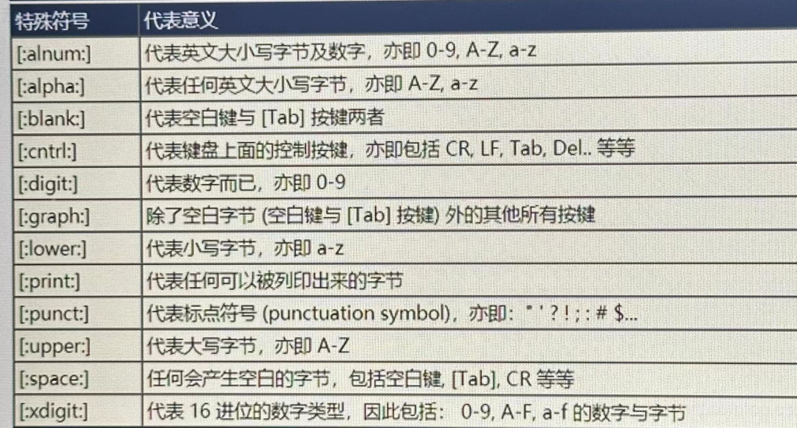

<MARK>这个用法像极了C语言中的 ctype.h 作为头文件引用的一系列函数，它们的功能是计算指定符号的个数，例如大写字母，小写字母，空格，TAB的个数。</MARK>

3.5.3接下来我认为应该是重点，<mark>grep</mark>终于出场了

- <mark>grep</mark>实现了输入的过滤，grep命令是以行为单位来查找字符串的，下面是它的一些语法：

```
1|grep [-acinvA] PATTERN filename
2|-a：将二进制文件以文本文件的方式查找数据
3|-c：计算找到 对应字符 的次数
4|-i：查找时忽略大小写的区别
5|-v：反向查找，即输出不匹配的行
6|-n：输出时输出行号
7|--color=auto：找的的关键字部分加上颜色的显示
8|-A：后面可加数字n，除了列出该行外，后续的n行也列出来
9|-B：后面可加数字n，除了列出该行外，前面的n行也列出来
```

具体该如何简单的使用呢？展示一个例子

输入：

```
grep -in printf ex8  #grep -语法参数 你要查找的内容 文件名
```

输出：

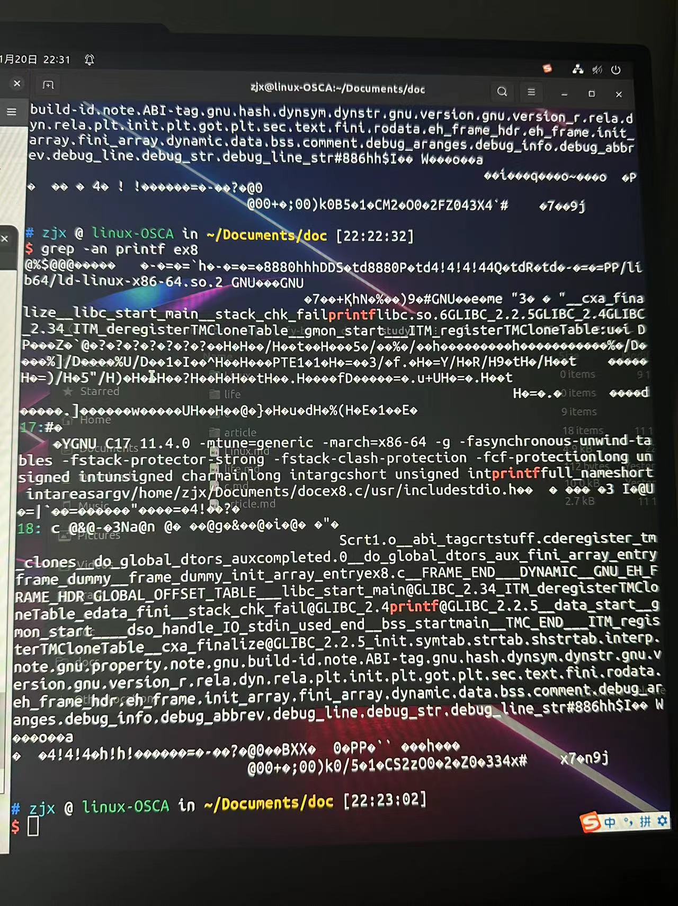

它会将所有的printf高亮，但是因为我的terminal中并没有行数，所以它并没有输出行数。

3.5.4使用<mark>find</mark>加<mark>grep</mark>来筛选文件（比如以<mark>.c</mark>和<mark>.h</mark>结尾的文件）：

管道符号<mark>|</mark>是关键，<mark>A | B</mark>的含义是创建两个进程A和B, 并将`A`进程的标准输出连接到`B`进程的标准输入.

3.5.5eg:筛选当前目录下以.c结尾的文件：

第一种命令：

```
find .|grep .c   #查找所有以.c结尾的文件
```

我的电脑上的结果展示：

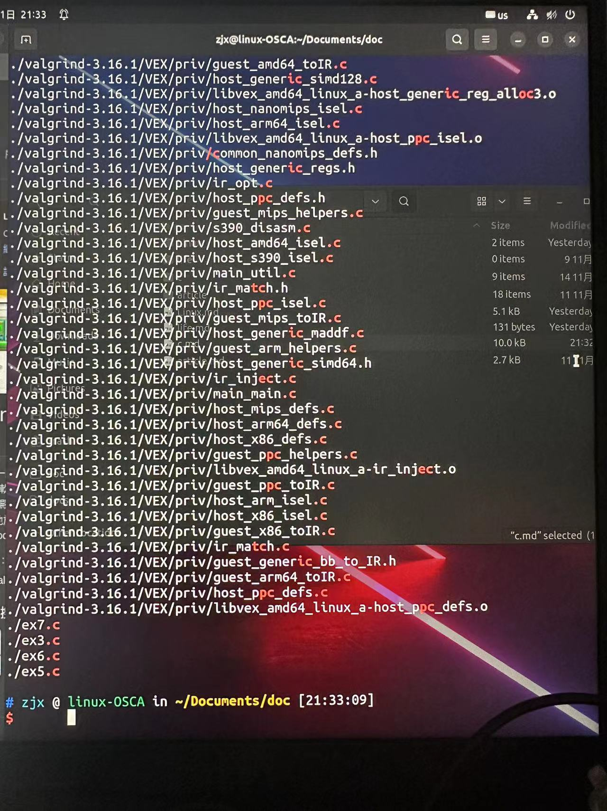

我发现了另一种更实用的命令（它更简洁方便）：

```
ls *.c   #列出当前目录下所有.c文件
```

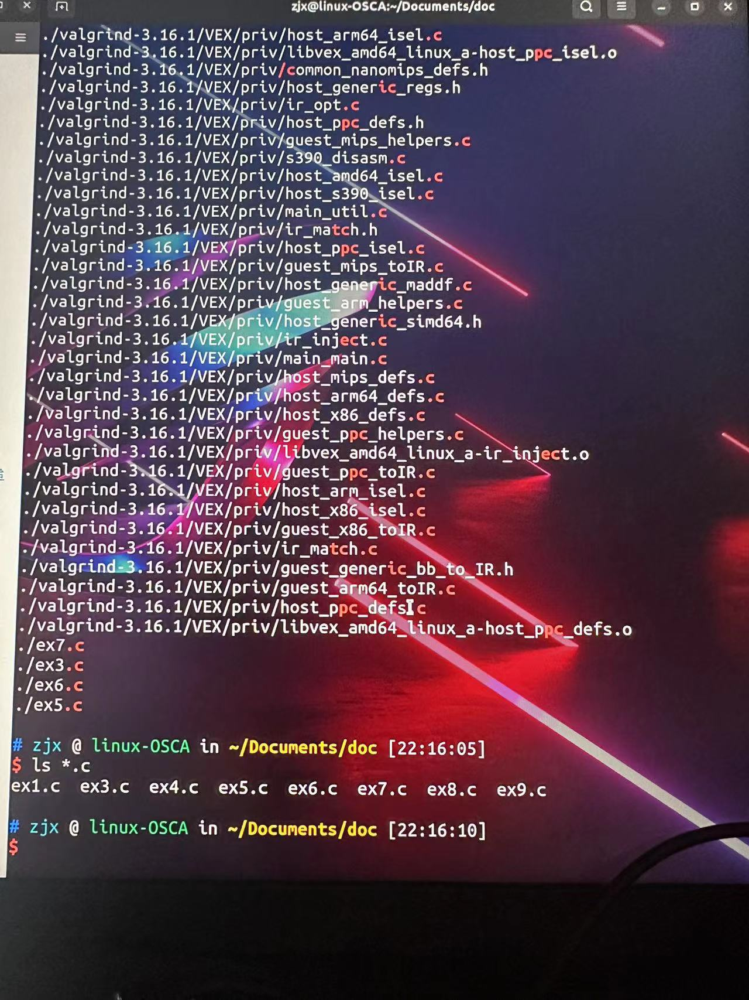

3.5.6我们最后的任务就是统计这些文件所占用的总行数：

`wc`命令的`-l`选项能够计算代码的行数（可在<mark>man wc</mark>中查看）. 

`xargs`命令十分特殊, 它能够将标准输入转换为参数, 传送给第一个参数所指定的程序. 所以, 代码中的`xargs wc -l`就等价于执行`wc -l aaa.c bbb.c include/ccc.h ...`, 最终完成代码行数统计.

利用`xargs`搭配管道符号`|`就可以计算多个文件的总行数。

- 计算一个文件中的行数的命令：

```
wc -l filename
```

- 计算当前目录下多个指定文件(以.c为例)的总行数的命令：

```
ls *.c | xargs wc -l
```

在我的电脑上的展示如图：

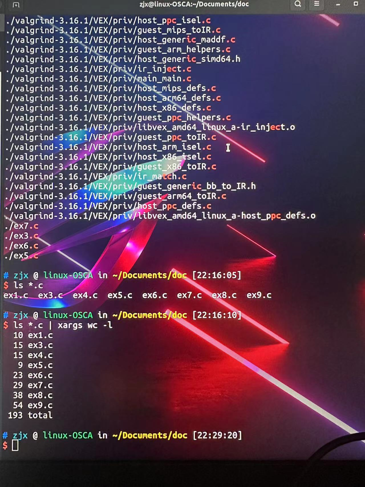

它会把当前目录的所有.c文件的行数列出，并且会计算所有文件的总行数。

当然利用`ls -l`就可以计算当前目录所有文件的情况，`ls *.h`可以计算所有.h文件的情况。

### 统计磁盘使用情况：

我以我的Documents下的目录为例，统计此目录下各个目录所占用的磁盘空间。命令：

```
du -sc ~/Documents/* | sort -nr | less 
```

```
#du是磁盘空间分析工具, du -sc将目录的大小顺次输出到标准输出, 继而通过管道传送给sort. sort是数据排序工具, 其中的选项-n表示按照数值进行排序, 而-r则表示从大到小输出. sort可以将这些参数连写在一起.
```

最后的less工具很好用，当目录过多无法再一个屏幕内全部显示时可以添加“<mark>| less</mark>”来实现翻页 B 是向上翻页，空格是向下翻页。

我的电脑的结果展示：

第一个是Documents目录中的目录：

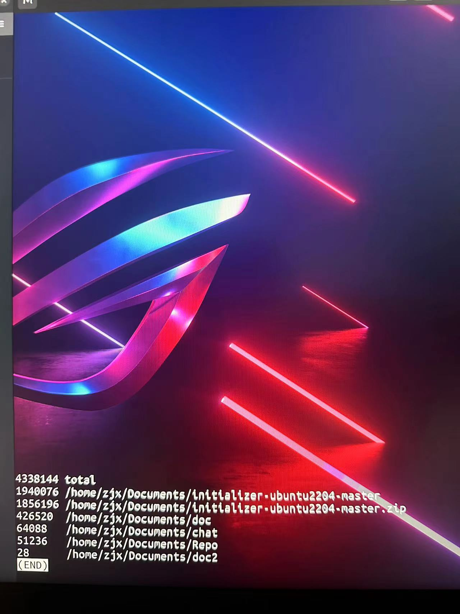

然后是/usr/share目录中的各个目录：

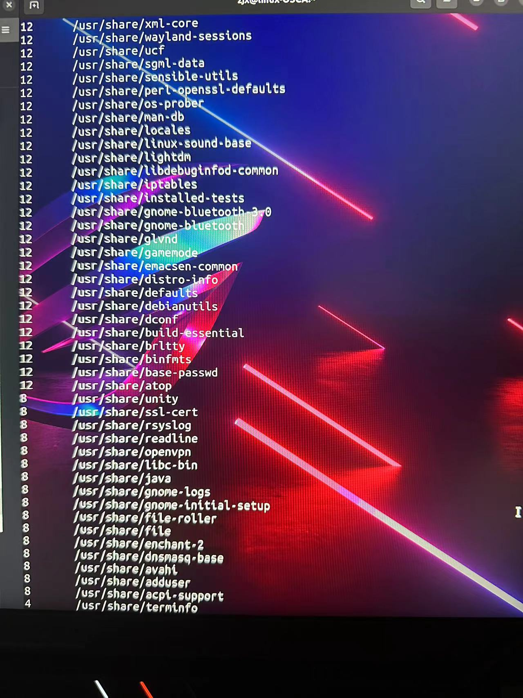

### 在LInux上编写Hello World程序：

1.首先创建一个目录

```
cd ~
mkdir Templates
```

2.然后键入

```
cd Templates
```

3.使用vim开始编辑

```
vi hello.c
```

4.手敲完代码后，按Esc退出insert模式，进入命令模式，然后输入wq+回车，保存并退出。

展示我的电脑上的结果：

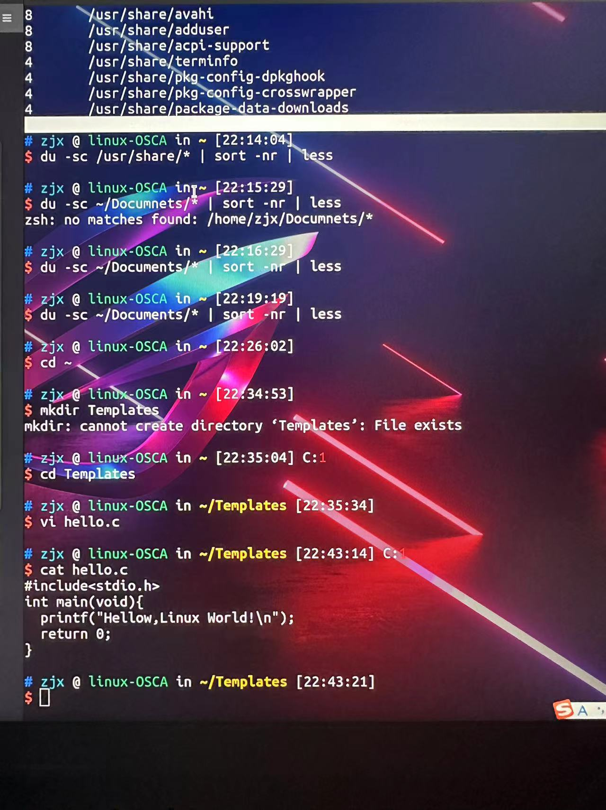

就像第一次用c在windows敲出Hello World一样，内心十分激动。

## 使用重定向：

使用命令将程序输出保存到文件当中（以我上次在Linux中编写的Hello World程序为例）：

<mark>`>`是标准输出重定向符号</mark>

首先为尝试了它给我的命令：

```
objdump -d hello> output
```

可结果却并不是我想要的，此时就体现了实践的重要性了，因为这个重定向看似只是一些命令而已，你可能就会放弃实践，认为它很简单，只需要再使用的时候看一下就可以，可是当你使用的时候它却并不是你想要的结果。

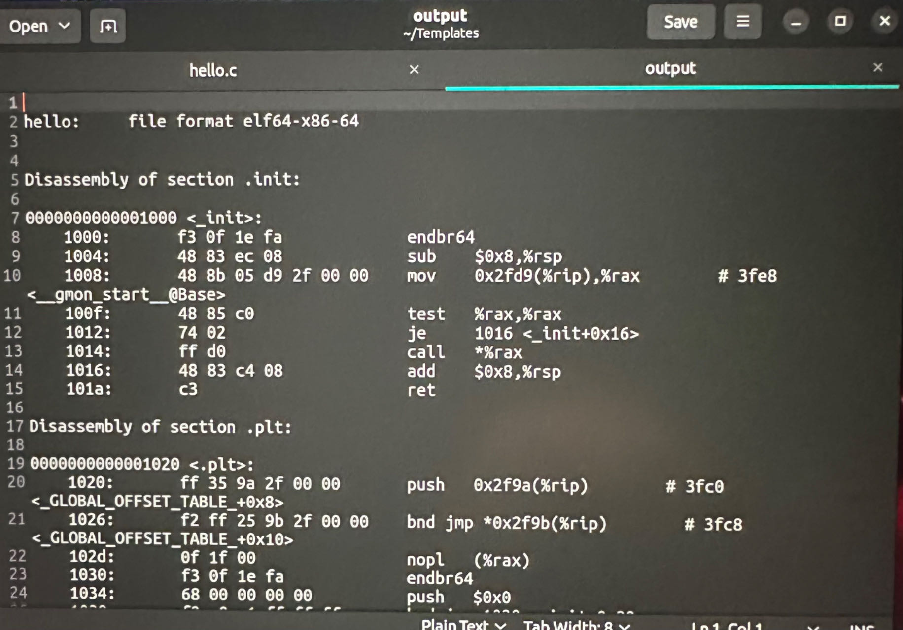

我想了想./不是运行代码程序吗，于是我使用了命令：

```
./hello > output 
```

哈哈，我获得了我想要的结果：

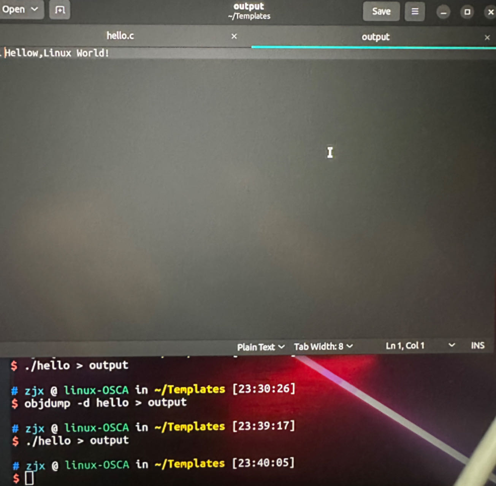

如果你希望输出到文件的同时也输出到屏幕上, 你可以使用`tee`命令:

```
./hello | tee output
```

使用输出重定向还能很方便地实现一些常用的功能, 例如

```
1|> empty                  # 创建一个名为empty的空文件
2|cat old_file > new_file  # 将文件old_file复制一份, 新文件名为new_file
```

data文件：可以将程序要读取的内容提前写入data文件，这样如果你需要多次键入大量相同的数据，就可以节省了大量的时间.

我以一个求平方从程序为例：

平方程序：

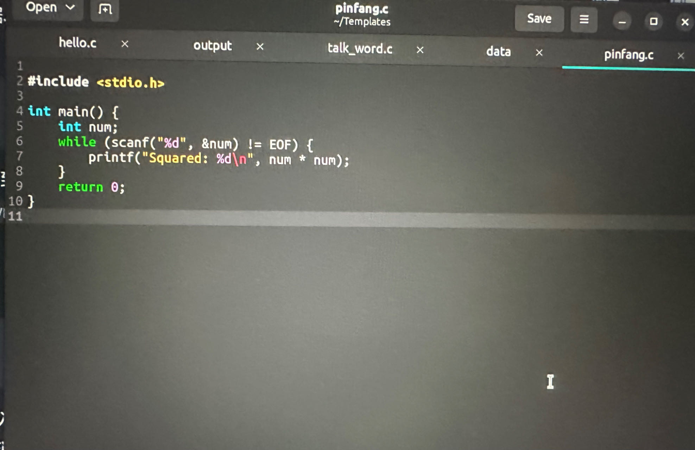

data文件内的输入：

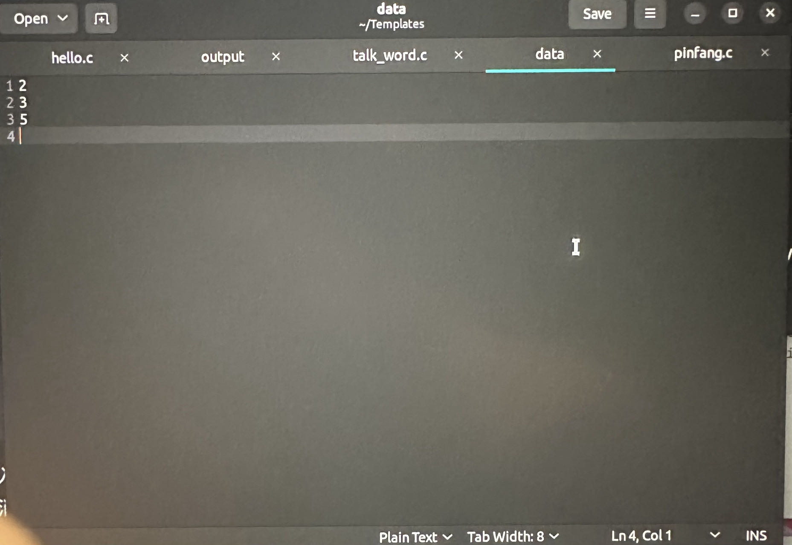

Terminal：

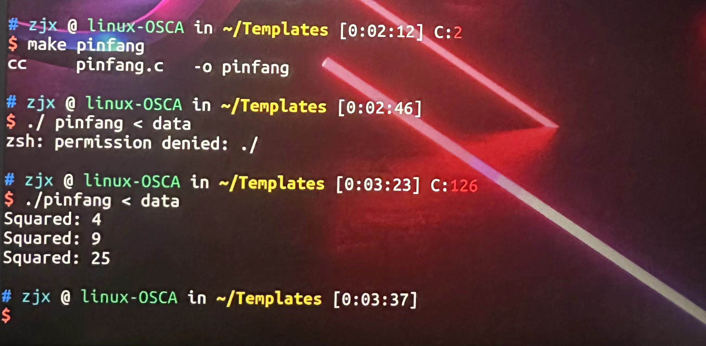

可以看到效果很明显！

选看1.time工具：

```
1|time ./pinfang < data | tee output
```

`time`工具记录了这一过程所消耗的时间, 最后你会在屏幕上看到`pinfang`运行所需要的时间. 如果你只关心`pinfang`的运行时间, 你可以使用以下命令将`pinfang`的输出过滤掉:

```
time ./pinfang < data > /dev/null
```

在我的电脑上的效果展示：

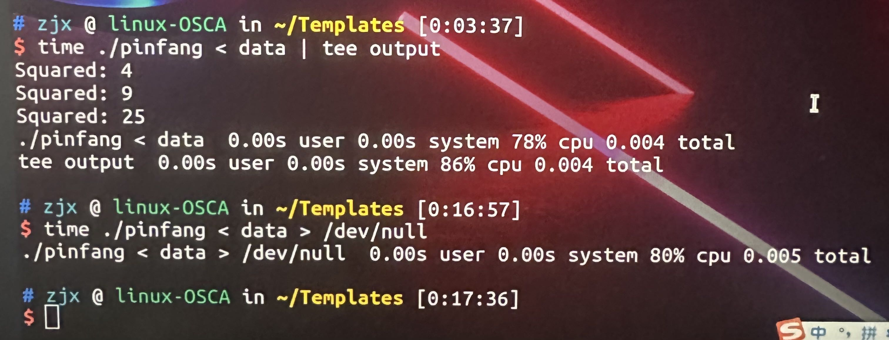

选看2.EOF

- 在C语言中，EOF 表示 "End of File"，它是一个特殊的宏，通常被定义为一个负数，用于表示文件结束的标志。在标准输入（stdin）中，当到达文件末尾时，scanf 函数会返回 EOF。

- 在第一个程序中，循环的条件是 scanf("%d", &num) != EOF，这表示当 scanf 未能成功读取一个整数时，即到达文件末尾时，循环将终止。

- 让我们看一下这个条件的工作方式：

scanf("%d", &num) 尝试从标准输入中读取一个整数，并将其存储在变量 num 中。
如果成功读取一个整数，scanf 返回成功读取的项目数（在这里是1）。
如果到达文件末尾（或者发生读取错误），scanf 返回 EOF。
所以，scanf("%d", &num) != EOF 这个条件的含义是：“只要 scanf 成功读取一个整数，就继续循环；如果到达文件末尾或者发生读取错误，就退出循环”。

在这个特定的例子中，当 scanf 返回 EOF 时，意味着已经读取完输入数据，因此循环结束。这是一种通常用于处理文件输入的常见模式。

## 使用Makefile管理工程

大规模的工程中通常含有几十甚至成百上千个源文件(Linux内核源码有25000+的源文件), 分别键入命令对它们进行编译是十分低效的.  Linux提供了一个高效管理工程文件的工具: GNU Make. 我们首先从一个简单的例子开始, 考虑上次提到的Hello World的例子, 在`hello.c`所在目录下新建一个文件`Makefile`, 输入以下内容并保存:

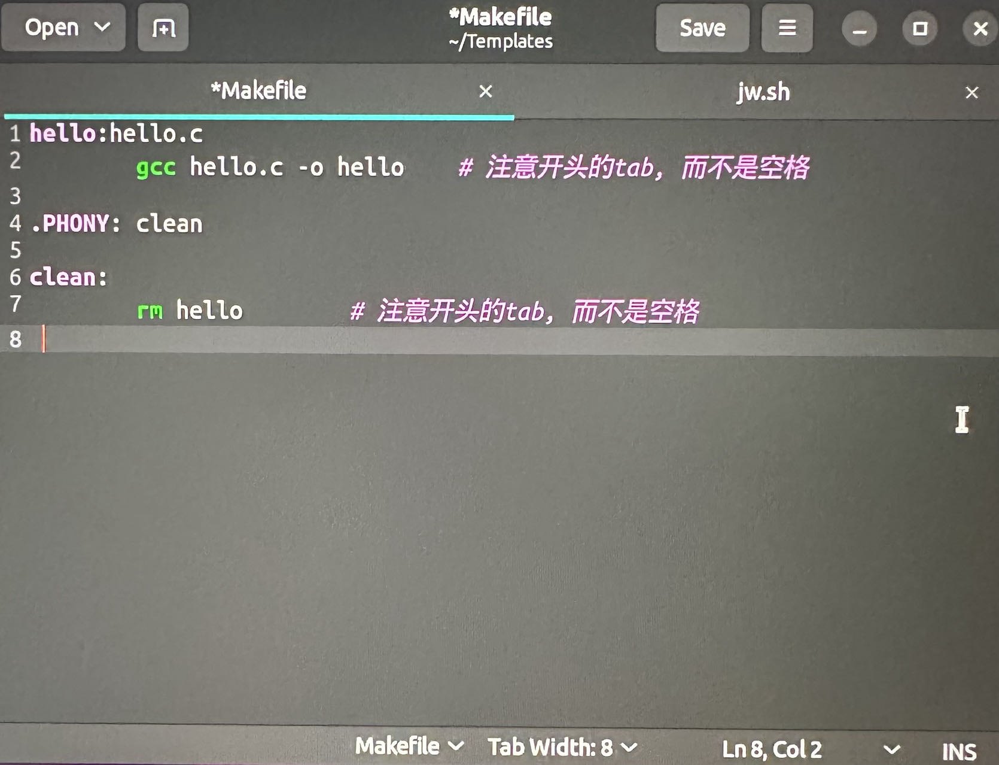

返回命令行, 键入`make`

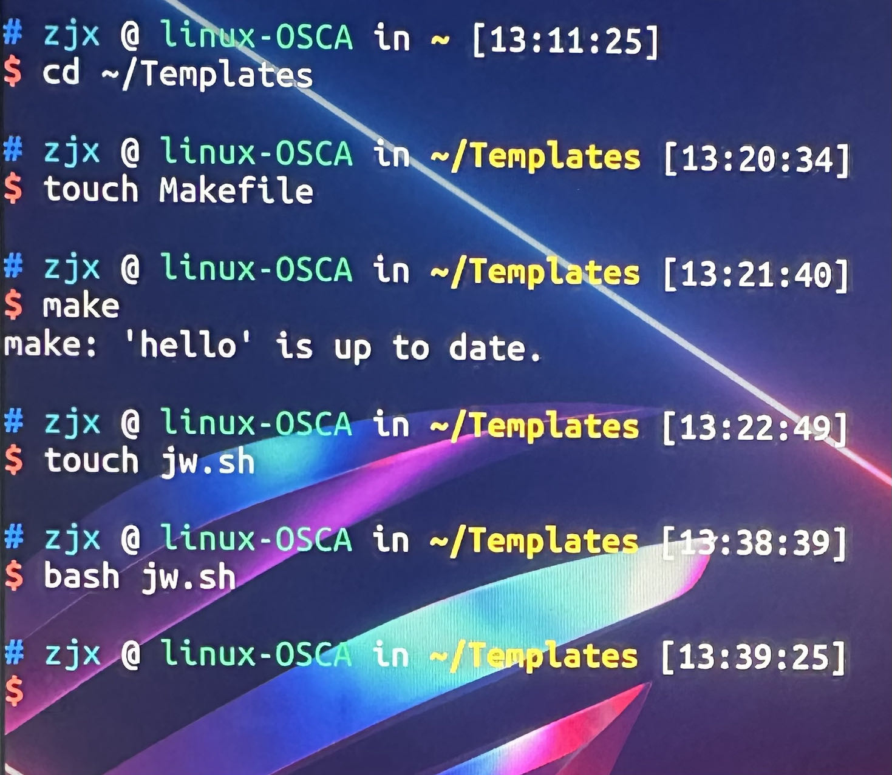

因为我已经使用过命令`make hello`所以它已经是最新的文件了

然后我删除了hello.c重新创建一下看看是什么效果：

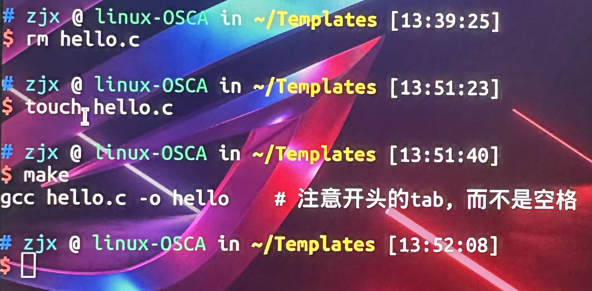

你会发现`make`程序调用了`gcc`进行编译. `Makefile`文件由若干规则组成, 规则的格式一般如下:

```
1|目标文件名:依赖文件列表
2|	用于生成目标文件的命令序列   # 注意开头的tab, 而不是空格
```

我们来解释一下上文中的`hello`规则. 这条规则告诉`make`程序, 需要生成的目标文件是`hello`, 它依赖于文件`hello.c`, 通过执行命令`gcc hello.c -o hello`来生成`hello`文件.

如果你连续多次执行`make`, 你会得到"文件已经是最新版本"的提示信息, 这是`make`程序智能管理的功能. 如果目标文件已经存在, 并且它比所有依赖文件都要"新", 用于生成目标的命令就不会被执行. 你能想到`make`程序是如何进行"新"和"旧"的判断的吗?

上面例子中的`clean`规则比较特殊, 它并不是用来生成一个名为`clean`的文件, 而是用于清除编译结果, 并且它不依赖于其它任何文件. `make`程序总是希望通过执行命令来生成目标, 但我们给出的命令`rm hello`并不是用来生成`clean`文件, 因此这样的命令总是会被执行. 你需要键入`make clean`命令来告诉`make`程序执行`clean`规则, 这是因为`make`默认执行在`Makefile`中文本序排在最前面的规则. 但如果很不幸地, 目录下已经存在了一个名为`clean`的文件, 执行`make clean`会得到"文件已经是最新版本"的提示. 解决这个问题的方法是在`Makefile`中加入一行`PHONY: clean`, 用于指示"`clean`是一个伪目标". 这样以后, `make`程序就不会判断目标文件的新旧, 伪目标相应的命令序列总是会被执行.

## Linux101

## 第一章：Linux的文化和生态，及安装

### Linux的起源：

1991 年，正在大学内进修的林纳斯·托瓦兹对他使用的一个类 UNIX 操作系统 MINIX 十分不满，因为当时 MINIX  仅可用于教育但不允许任何商业用途。于是他在他的大学时期编写并发布了自己的操作系统，也就是后来所谓的 “Linux 内核”，成为了如今各类  Linux 发行版的基础。

Linux发行版：

Debian分支

Debian 是一个完全由自由软件构成的类 UNIX 操作系统，第一个版本发布于 1993 年 9 月 15  日，迄今仍在维护，是最早的发行版之一。其以坚持自由软件精神和生态环境优良而出名，拥有庞大的用户群体，甚至自己也成为了一个主流的子框架，称为“Debian GNU/Linux”。


Debian GNU/Linux 也派生了很多发行版，其中最为著名的便是 Ubuntu（官方译名“友邦拓”）。Ubuntu 由英国的  Canonical  公司主导创立，是一个主打桌面应用的操作系统。其为一般用户提供了一个时新且稳定的由自由软件构成的操作系统，且拥有庞大的社群力量和资源，十分适合普通用户使用。


Red Hat 分支

Red Hat Linux 是美国的 Red Hat 公司发行的一个发行版，第一个版本发布于 1994 年 11 月 3  日，也是一个历史悠久的发行版。它曾经也广为使用，但在 2003 年 Red Hat 公司停止了对它的维护，转而将精力都投身于其企业版 Red  Hat Enterprise Linux（简称 RHEL）上，Red Hat Linux 自此完结，而商业市场导向的 RHEL 维护至今。


在 Red Hat Linux 在停止官方更新后，由社群启动的 Fedora 项目接管了其源代码并构筑了自己的更新，演变成了如今的 Fedora 发行版。Fedora 是一套功能完备且更新迅速的系统，且本身计划也受到了 Red Hat 公司的赞助，成为了公司测试新技术的平台。


虽然 RHEL 是一个收费的、商业化的系统，但是其遵循 GNU  通用公共许可证，因此会开放源代码。编译这些源代码可以重新得到一个可以使用的操作系统，即一个新的发行版：CentOS（Community  Enterprise Operating System，社区版企业操作系统）。因为 CentOS 几乎完全编译自 RHEL 的代码，所以其也像  RHEL 一样具有企业级别的稳定性，适合在要求高度稳定的服务器上运行。

2020 年 12 月，CentOS 社区在其博客中[宣布未来的重点转向 CentOS Stream](https://www.redhat.com/en/blog/centos-stream-building-innovative-future-enterprise-linux)，这是一个全新的滚动发行版。在此之前，RHEL 的上游为 Fedora，而 CentOS 的上游为 RHEL；在推出 CentOS Stream 之后，它就成为了 RHEL  的上游发行版。与此同时，CentOS 8 的支持期限被缩短至 2021 年底，且不再推出新的非 Stream 的 CentOS  版本。不满于该决定的人们也组织了新的社区，推出了诸如 [AlmaLinux](https://almalinux.org/)、[Rocky Linux](https://rockylinux.org/) 等发行版。


Arch Linux 分支

Arch Linux 是一个基于 x86-64 架构的 Linux 发行版，不过因为其内核默认就包含了部分非自由的模块，所以其未受到 GNU  计划的官方支持。即便如此，Arch Linux 也因其“简单、现代、实在、人本、万能”的宗旨赢得了 Linux  中坚用户的广泛青睐。不过，Arch Linux  对这个宗旨的定义和其它发行版有所区别。通常的操作系统为了方便用户快速上手，都是尽可能隐藏底层细节，从而避免用户了解操作系统的运行知识即可直接使用。但是 Arch Linux  则是重在构建优雅、极简的代码结构，这方便了使用者去理解系统，但不可避免地要求使用者自身愿意去了解操作系统的运作方式。某种程度上说，它的“简单”和“人本”注重的是方便用户通过了解而去最大化地利用它，而不是采取屏蔽工作原理的方式来降低使用门槛。因此，本书不建议初学者直接上手 Arch Linux，但十分推荐在读者对 Linux 有进一步了解之后去探索它。


Arch Linux 拥有强大的功能，但因其特殊的理念使得用户不易使用。为了能让一般用户也能用上 Arch Linux 的强大功能，它的变种  Manjaro 发行版于 2011 年问世。Manjaro 发行版基于 Arch Linux，但更注重易用，因而更适合一般用户。


回到本章的标题：什么是 Linux？这个问题在不同的语境下有不同的答案：它可以指代 Linux 内核，也可能指代一个或者多个 Linux 发行版。在日常领域或是作为新手接触到的情境来看，这个词通常都是指代后者，而且往往指的是 GNU/Linux 的发行版。

智能手机：


由谷歌公司推出的 Android 叫做 Android 原生系统，而基于该原生系统诞生出来的各类独特的操作系统就是 Android/Linux  系下的子发行版。Android/Linux 下的子发行版很多，如华为公司的 EMUI 操作系统和小米公司的 MIUI 操作系统等。

服务器：

现代人的生活已经很难离开互联网了，在互联网上，我们可以访问各式各样的网站、利用在线社交平台分享自己的生活、或者是使用联机办公工具和同事协同工作。通常来说这些网站和软件的提供商都需要设立他们自己的计算机来完成计算、存储和通信的功能，这种计算机就被称为服务器。和个人计算机不同，服务器通常都不会使用 Windows 或者 macOS 这种个人计算机操作系统，事实上绝大部分的服务器维护人员都愿意选择一些 Linux  发行版作为它们的操作系统，因为许多 Linux 发行版界面简洁，功能强大，而且某些发行版也是受到专业计算机企业的服务支持的（如前文提到的  RHEL）。

同时，受惠于互联网上丰富的教程，Debian 和 Ubuntu Server 也成为越来越多个人和团体用作服务器操作系统的 Linux  发行版，如下文提到的中科大开源社群 LUG@USTC 使用 Debian 发行版及其衍生产品 Proxmox VE 作为其所有服务器的操作系统。

### 思考题：

一、<mark>计算机的性能在过去几十年内一直呈现指数级增长，而如今其增速却已经放缓，转而开始偏向多核。在指数增长时代，计算机实际上经历过了几个不同的阶段，每个阶段都是通过不同的因素让计算机的性能快速增长。自行动手在线查阅资料，思考如下问题：</mark>

<mark>(1) 指数增长时代经历了哪几个阶段？每个阶段让计算机性能大幅提升的机制都是什么？</mark>

<mark>(2) 导致指数增长时代的终结的因素有哪些？</mark>

<mark>(3) 在多核时代，为了充分利用硬件性能，操作系统需要支持什么样的新特性？</mark>

**(1)**

计算机的指数增长时代大致可以认为由 2 个阶段构成：

- 复杂指令集阶段：这个阶段是大规模集成电路阶段的开始。在这个阶段，得益于电路的集成度大幅度提升，计算机的性能也成指数级增长。这个阶段大致的时间范围是 1978 - 1986 年，平均每年性能提升 22%。
- 精简指令集阶段：随着时间的推移，人们发现许多指令通常都用不到，但它们的存在让处理器不得不采用更复杂的结构，因此研究员开始提倡精简之前的指令集架构以简化处理器。在使用了精简后的指令集架构后，计算机的性能相较之前有了飞跃般的提升（最初在 IBM 360 指令集架构上是 3  倍）。同时，集成电路的密度依然在继续增加，且在这个阶段开发人员通过大力改进“指令级并行”以提升性能，因此此时计算机的性能以更快的速度增长。这个阶段大致的时间范围是 1986 - 2003 年，平均每年性能提升 52%，是计算机科技的黄金时代。

**(2)**

计算机指数增长的黄金年代之所以能长期保持，主要还是因为集成电路的密度可以稳定大幅度提升。罗伯特·丹纳德归纳了一个规律，被称之为丹纳德标度：“在晶体管的密度增加的时候，单个晶体管的功耗会下降，这样下来可以保持晶体管的功耗密度（每单位面积的功耗）不变”。根据这条规律，在晶体管密度增加的同时，计算机性能会提升（正比例于晶体管数目），但功耗不变，因此计算机的能量利用率会越来越高。

不过，这条规律没有考虑到一些重要的问题。一个问题是晶体管的“漏电电流”（微安级别），即晶体管在工作时会有轻微漏电，这些漏电会导致处理器发热，如果不加以控制会造成严重的散热问题。当然，可以通过降低电压的方法来减少散热，但此时也出现了第二个问题，即是晶体管的“阈值电压”（大约是 0.7 ~ 0.8  伏），可以理解成最低工作电压，低于此电压晶体管不再工作。这两个问题导致了晶体管存在一个不可跨越的最低功率（以及最低发热功率），从而使得丹纳德标度失效。进一步增加密度将需要更多能耗而不再恒定，也会导致散热问题。因此，为了避免这个问题，芯片厂商研究了多核处理器来达到并行的效果，从而进入了多核时代。

- 后丹纳德标度阶段：这是多核时代的第一个阶段，这个阶段计算机性能提升的主要因素是采用了多核处理器，通过并行的方式提升计算机的性能。这个阶段大致的时间范围是 2003 - 2011 年，平均每年性能提升 23%，相比之前的 52% 是一个巨大的跌落。

**(3)**

在多核时代，操作系统显然需要适应多核处理器，而其中一个最重要的能力就是进行并行任务调度，即将任务按合适的方式交付给不同的核来同时完成以尽可能充分利用并行的优势。


**题外话**

然而，核并不是越多越好的，因为一个任务总会有一些先后次序是不能颠倒的，所以这些部分就必须串行运行。就算假设一个任务能并行的部分可以被完美地平均切分而并行执行，剩余的串行部分也无法利用到并行的任何收益（而且往往过度的并行反而降低效率），因此增加更多核的收益会越来越低。这种规律被称之为阿姆达尔定律，核的数目越多，越受到阿姆达尔定律的限制。

- 阿姆达尔定律阶段：这是多核时代的第二个阶段，这个阶段标志着多核所带来的性能提升已经越来越不明显了。这个阶段大致的时间范围是 2011 - 2015 年，平均每年性能提升只有 12%。

在 2015 年以后，平均每年的性能提升更是暴跌至 3%，似乎大规模集成电路计算机的性能提升已经快到了尽头，因此又被称为终结阶段。

二、<mark>在英文里，“免费软件”和“自由软件”都叫做“free software”，看起来很一致。事实上免费的软件是否一定自由？自由的软件是否也一定免费？</mark>

免费软件并不一定自由，因为免费的软件可能只是软件的所有者提供了免费许可，但并不一定也会同时允许用户自由地去研究、修改和分发。一些反例诸如：

- QQ: 腾讯公司推出的免费即时通讯软件，在中国十分主流，不过显然腾讯公司从来没公开过 QQ 的源代码，也不允许用户去自行修改它。
- Adobe Reader：Adobe 公司推出的免费 PDF 阅读器，但该公司拥有该软件的所有权，并且此软件也不开源，不允许用户去修改。
- WPS Office：金山办公旗下的一系列办公软件的组合，它是免费的，但同样不允许用户研究和修改。

支持这个命题的例子不胜枚举，比如许多收费的专业软件的个人版、教育版或者社区版等都是免费但不自由的软件。

自由软件也并不一定免费。虽然对于不少初接触的读者来说可能稍微难以想象：因为自由软件一般都是遵循自由软件协议开源的，谁都可以拿出去编译成自己的副本，似乎没有收费的余地。其实不然，一是自由软件的定义并不妨碍其收费，因此理论上想收费就可以收费；二是自由软件的发行商可以为顾客提供专业的技术服务，此时相当于买自由软件的这笔钱可以购买到专业技术支持。一个十分典型的例子就是本章中提到的 Red Hat 公司推出的 RHEL，它是收费的，但遵循 GPL 开源。使用 RHEL 源代码编译成的免费版本（再去掉 RHEL  本身包含的闭源软件和 Red Hat 商标信息）就是本章正文中提到的 CentOS 了。

三、<mark>著作传（英文：copyleft）源于自由软件运动，是一种利用现有著作权的法律体制巧妙地保证用户自由使用软件的权利的许可方式。著作传一般包含哪些规则？它和常见的著作权有什么区别？它和完全放弃权利的“公有领域”又有什么不同？</mark>


著作传的概念源于自由软件运动，是一种利用现有的“著作权”的体制来保障用户软件自由使用权利的许可方式。通常来说，著作传保证了任何用户都可以自由地使用、复制、修改和传播所许可的软件，不过基于这个软件的复制传播和修改后的再分发通常还必须以著作传的方式发布，即后续的用户也能享受到同等的自由。

由上面的解释可见，著作传许可比通常的著作权提供的使用许可要宽容、自由得多，因此可能部分初次接触这个概念的读者会觉得这个许可方式和直接放出去让大家随便使用没什么区别，然而这种想法是不对的。事实上，著作传和著作权、公有领域的关系和区别有以下几个显著的要点：

- 著作传虽然允许软件可以以很自由的方式给用户使用，但用户依然需要遵守著作传的许可，而不是像公有领域的产品一样可以完全随心所欲。著作传许可的一个典型特性就是要求它的传播和衍生还是要继续采用著作传许可，而不可以申请自己的著作权，也不能重新赋予新的许可。这种方法保证了这个软件的权利完全由人类共同体充分享受，不过这种方式也得到了一些反对声音，因为这种许可的传播方式看起来太像是病毒传染。
- 著作传是利用了现有的著作权体系设立的，这说明著作传许可虽然自由，但实际上也可以认为是对软件的一种保护，是另一种“著作权”。这也说明了著作传理论是一种受到法律保护的许可（如果当地法律兼容的话），而不是某种大家自发遵守的倡议。不过和普通的著作权不同，著作传许可面向用户下放了许多权利，这是通常的著作权许可不会做的。

### 安装：

我一共目前见过三种安装Linux的方式：依次是搭建虚拟机，二是安装双系统，三是利用wsl2使用子系统，我已经拥有了两种，双系统其实也可以拥有，但感觉没有那么实用。

一开始我接触的Linux发行版是Ubunt是大佬浩睿学长搭建虚拟机帮我安装的。

之后我和一位`good friend`探讨是否可以像windows一样将其安装在某个磁盘当中，实现双系统，经过二到三周，最终先将镜像文件下到U盘，利用系统U盘在成功安装了Linux系统（Ubuntu），在纯LInux系统中的磁盘分区、进制与windows不同：它有着6个磁盘分区，并且大部分磁盘分区类型都不同，不像windows都是ntfs，并且LInux出采用了1000进制，windows采用了1024进制。

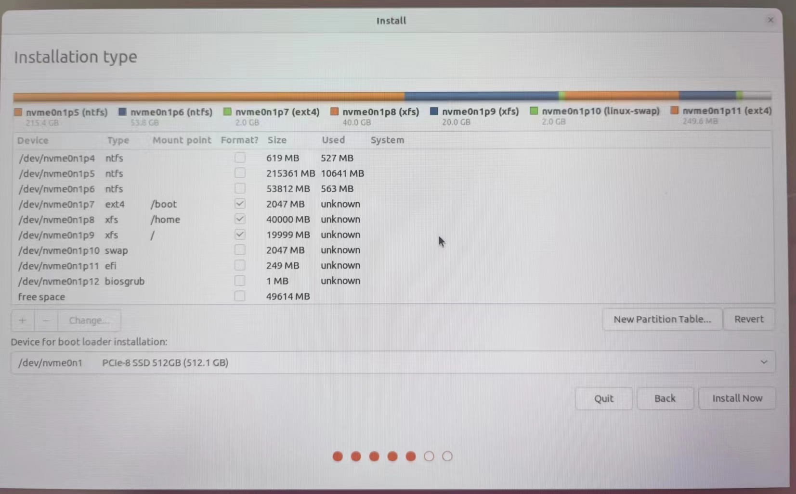

最后就是另一种方式，打开wsl2,利用windows的子系统，在微软商店中获取Ubuntu，这个比较方便，但是我感觉没有虚拟机那样给人一种同时使用双系统的感觉。（by another good friend's help）使用子系统的另一优势是可以很便利的获得多种Linux发行版，体验一下不同的Linux风格，比如arch和fedora

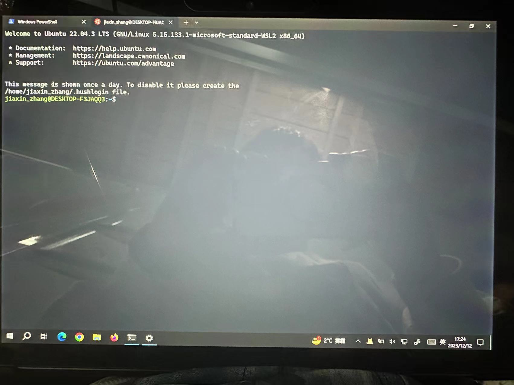

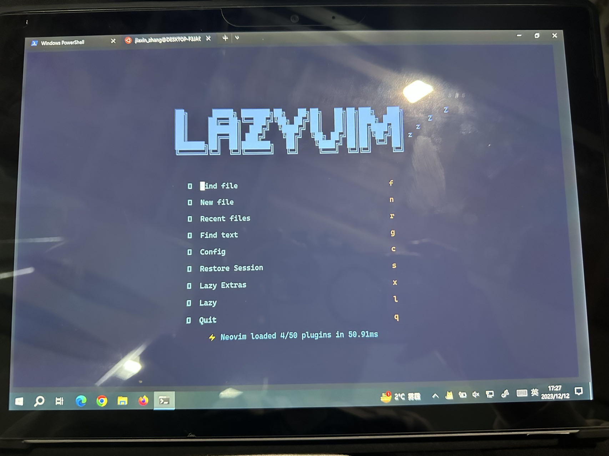

## Tmux

1.安装

```
$ sudo apt-get install tmux
```

2.进入

```
tmux
```

上面命令会启动 Tmux 窗口，底部有一个状态栏。状态栏的左侧是窗口信息（编号和名称），右侧是系统信息。

3.查看帮助

```
$ ctrl+b	+	?
```

4.退出tmux

```
1|ctrl+d	#利用快捷键
2|exit		#输入退出命令
```

5.会话管理

第一个启动的 Tmux 窗口，编号是`0`，第二个窗口的编号是`1`，以此类推。这些窗口对应的会话，就是 0 号会话、1 号会话。

为会话起名的命令：

```
$ tmux new -s <session-name>
```

6.分离对话

在 Tmux 窗口中，按下`Ctrl+b d`或者输入`tmux detach`命令，就会将当前会话与窗口分离。

<mark>如果你想保留这个会话进程，那你就使用 tmux detach 而不是 exit！</mark>

```
 $ tmux detach
```

7.`tmux ls`命令可以查看当前所有的 Tmux 会话。

```
$ tmux ls
```

8.接入对话

`tmux attach`命令用于重新接入某个已存在的会话。

```
# 使用会话编号
$ tmux attach -t 0

# 使用会话名称
$ tmux attach -t <session-name>
```

9.杀死对话

`tmux kill-session`命令用于杀死某个会话。

```
# 使用会话编号
$ tmux kill-session -t 0

# 使用会话名称
$ tmux kill-session -t <session-name>
```

10.切换对话

<mark>在你的 tmux 会话中直接使用这个命令就可以!</mark>

```
# 使用会话编号
$ tmux switch -t 0

# 使用会话名称
$ tmux switch -t <session-name>
```

11.重命名会话

```
$ tmux rename-session -t <old-name> <new-name>
```

12.会话快捷键

```
Ctrl+b d：分离当前会话。
Ctrl+b s：列出所有会话。
Ctrl+b $：重命名当前会话。
```

13.窗格操作

`tmux split-window`命令用来划分窗格

```
# 划分上下两个窗格
$ tmux split-window

# 划分左右两个窗格
$ tmux split-window -h
```

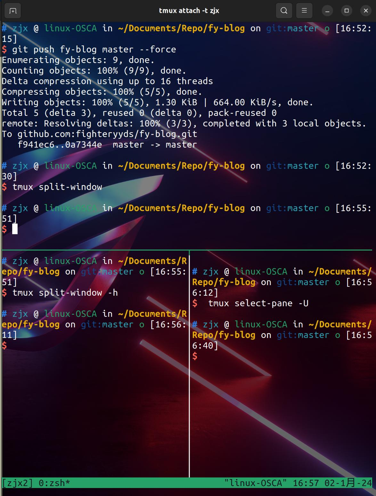   

12.移动光标

`tmux select-pane`命令用来移动光标位置。

```
# 光标切换到上方窗格
$ tmux select-pane -U	#up

# 光标切换到下方窗格
$ tmux select-pane -D	#down

# 光标切换到左边窗格
$ tmux select-pane -L	#left

# 光标切换到右边窗格
$ tmux select-pane -R	#right
```

13.交换窗口位置

`tmux swap-pane`命令用来交换窗格位置。

```
# 当前窗格上移
$ tmux swap-pane -U

# 当前窗格下移
$ tmux swap-pane -D
```

14.<mark>窗格快捷键</mark>

```
Ctrl+b %	#划分左右两个窗格。
Ctrl+b "	#划分上下两个窗格。
Ctrl+b <arrow key>	#光标切换到其他窗格。<arrow key>是指向要切换到的窗格的方向键，比如切换到下方窗格，就按方向键↓。
Ctrl+b ;	#光标切换到上一个窗格。
Ctrl+b o	#光标切换到下一个窗格。
Ctrl+b {	#当前窗格与上一个窗格交换位置。
Ctrl+b }	#当前窗格与下一个窗格交换位置。
Ctrl+b Ctrl+o	#所有窗格向前移动一个位置，第一个窗格变成最后一个窗格。
Ctrl+b Alt+o	#所有窗格向后移动一个位置，最后一个窗格变成第一个窗格。
Ctrl+b x	#关闭当前窗格。
Ctrl+b !	#将当前窗格拆分为一个独立窗口。
Ctrl+b z	#当前窗格全屏显示，再使用一次会变回原来大小。
Ctrl+b Ctrl+<arrow key>		#按箭头方向调整窗格大小。
Ctrl+b q	#显示窗格编号。
```

15.<mark>窗口管理</mark>

a.新建窗口（在同一个会话可以创建多个窗口）

`tmux new-window`命令用来创建新窗口。

```
$ tmux new-window

# 新建一个指定名称的窗口
$ tmux new-window -n <window-name>
```

b.切换窗口

`tmux select-window`命令用来切换窗口。

```
 # 切换到指定编号的窗口
 $ tmux select-window -t <window-number>

 # 切换到指定名称的窗口
 $ tmux select-window -t <window-name>
```

>  我感觉不如快捷键好使

```
Ctrl+b c	#创建一个新窗口，状态栏会显示多个窗口的信息。
Ctrl+b p	#切换到上一个窗口（按照状态栏上的顺序）。
Ctrl+b n	#切换到下一个窗口。
Ctrl+b <number>		#切换到指定编号的窗口，其中的<number>是状态栏上的窗口编号。
Ctrl+b w	#从列表中选择窗口。
Ctrl+b ,	#窗口重命名。
```

c.重命名窗口

`tmux rename-window`命令用于为当前窗口起名（或重命名）。

```
$ tmux rename-window <new-name>
```

16.其他命令

```
# 列出所有快捷键，及其对应的 Tmux 命令
$ tmux list-keys

# 列出所有 Tmux 命令及其参数
$ tmux list-commands

# 列出当前所有 Tmux 会话的信息
$ tmux info

# 重新加载当前的 Tmux 配置
$ tmux source-file ~/.tmux.conf
