# 文章收获：

## 为什么要学习计算机系统基础:


- 该文章主要强调了作为计算机专业的我们在计算机方面的优势就是拥有对计算机系统的整体认知和把握，正是因为这一优势，我们可以在编程相同的命题时，可以编出与其他人效率相差几十倍的代码。
- 之后这篇文章也强调了动手实践的重要性，很多时候学习时的效果与动手实践时的效果可以说是两码事。同时通过动手实践可以促进自己对知识的理解和掌握，二者是相互促进的关系。

## 初识man

- 作为Linux菜鸟，经常面对着一大堆陌生的命令和参数，我经常会无语


- 这时我知道了可以找man帮忙，学会用man独立解决问题，于是我输入了

```
man man
```

- 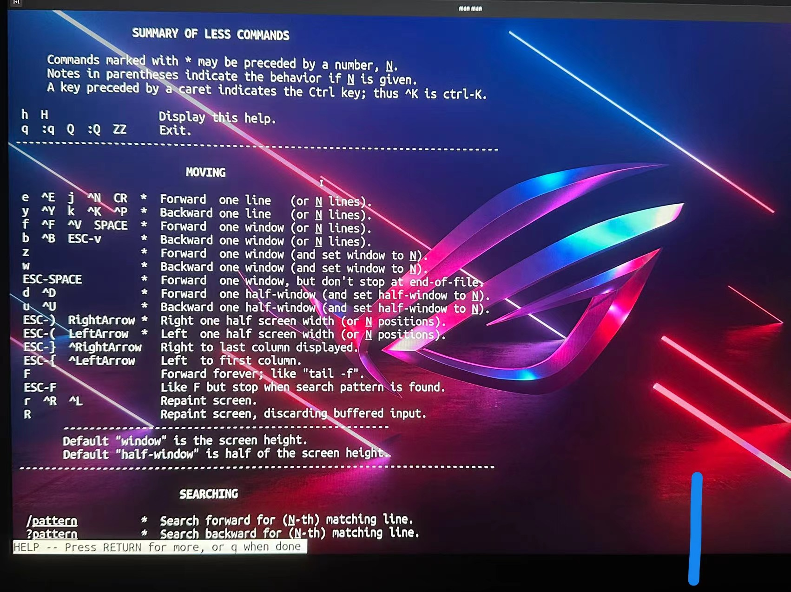
- 进入了man的世界后，还是啥也不懂，于是按了h求寻求帮助（按q可以退出），这时我来到了新的世界，世界的起点是“SUMMARY OF LESS COMMANDS”,然后我按照初识man这篇文章的内容一步一步的在Linux中进行和学习
- 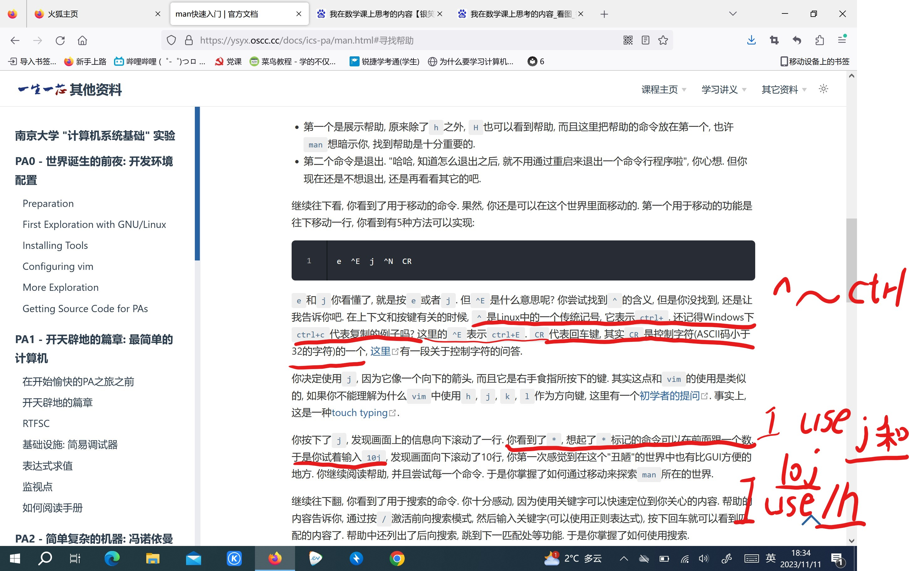
- 我明白了那个像英文音标一样的符号代表了ctrl，然后我也尝试了使用j 和 10j 来分别向下一行和十行。
- 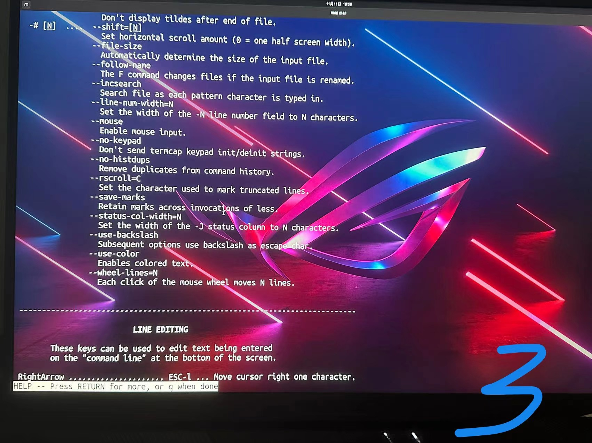
- 使用j后
- 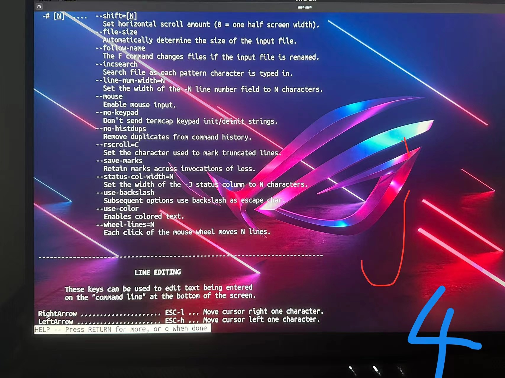
- 使用10j以后
- 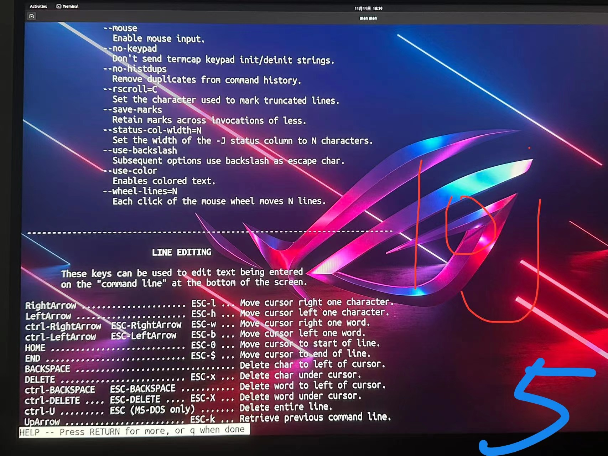
- 然后开始使用搜索命令“/加你要搜索的关键词”
- 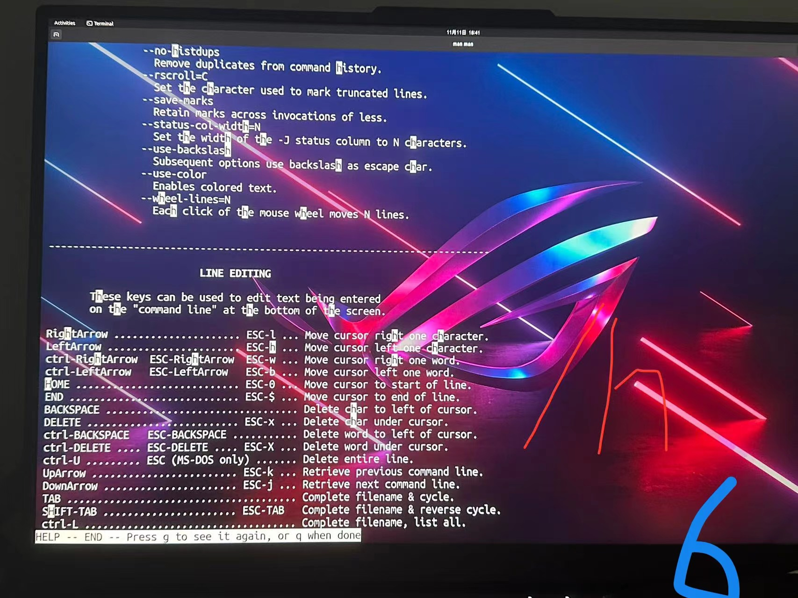
- 它会将所有含有h 和 H 的地方做出标记
- 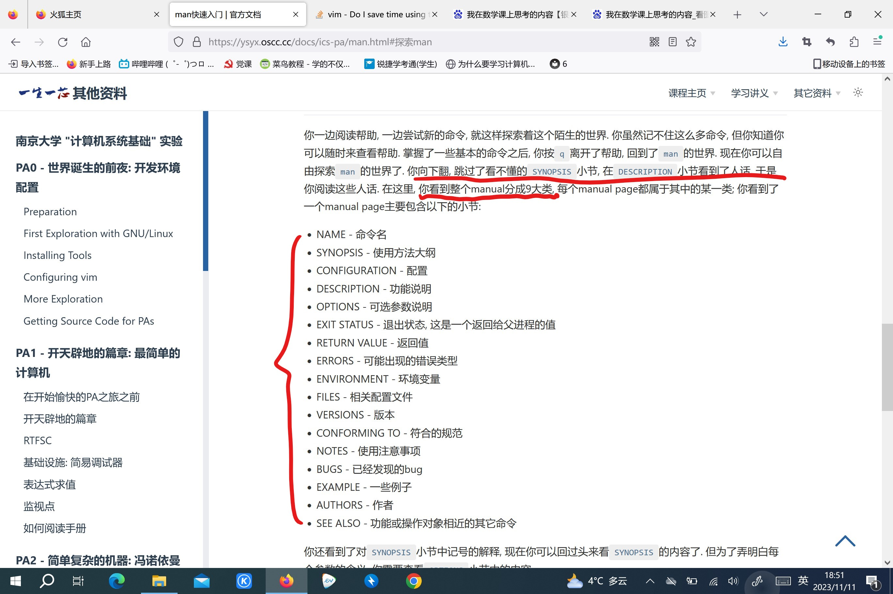
- 然后在DESCRIPTION中了解到了manual分成9大类，每一个manual page属于都属于其中的某一类
- 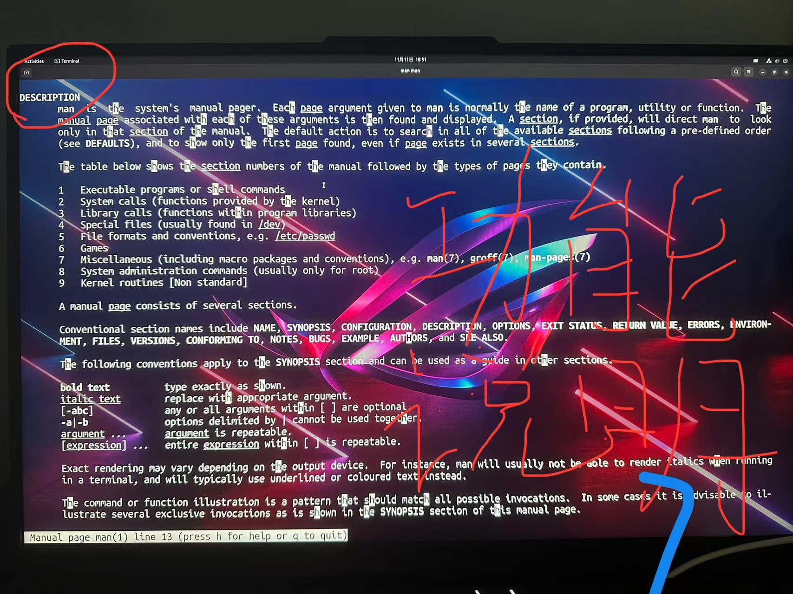
- 然后是为了看懂SYNOPSIS，先在OPTIONS中弄明白每个参数的含义，然后你通过刚刚学会的"/加关键词"，学会了快速标记你想找的参数并搭配n来更快的找到。
- 
- 我在OPTIONS中还是不太明白-k的意思，然后退出man并在命令行中输入:

```
man -k printf
```

- 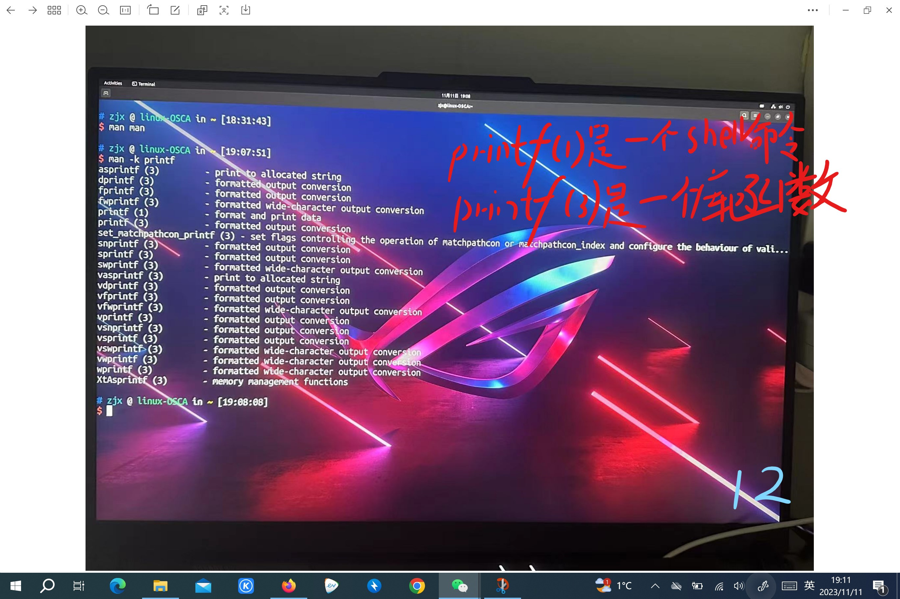
- 查看printf（1）这个shell命令，输入：

```
man 1 printf
```

- 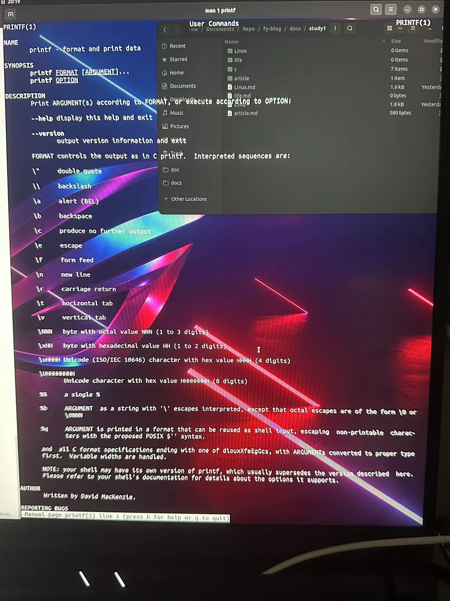
- 查看printf(3)这个库函数，输入:

``` 
man 3 printf
```

- 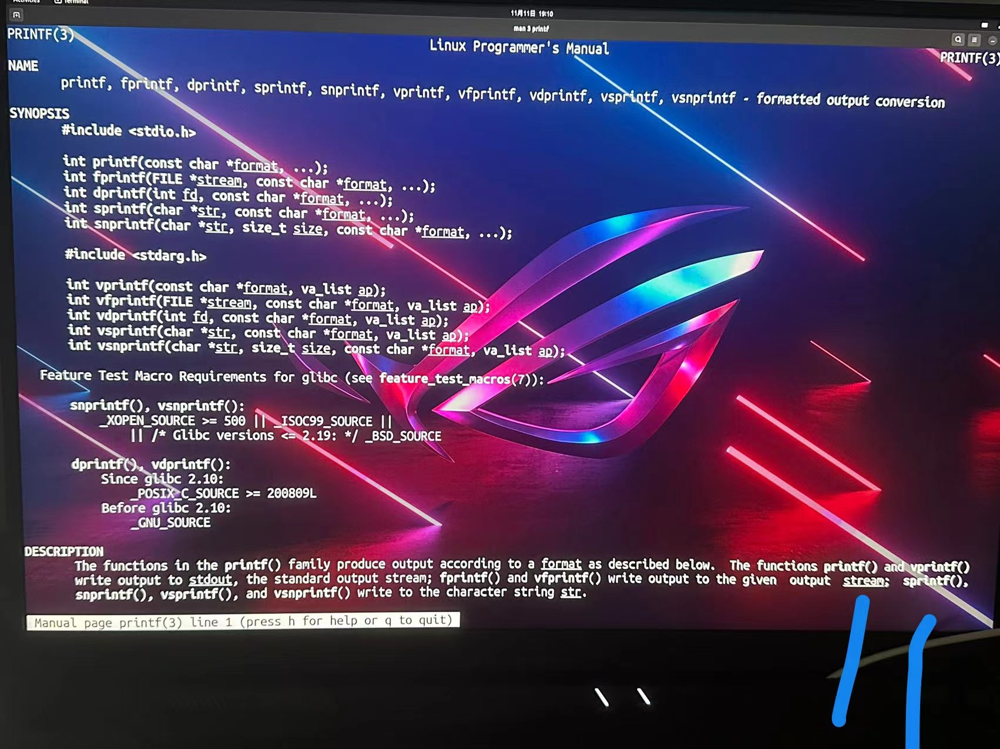
- 在掌握了man的用法后，我们应该经常来拜访ta，很多时候它可以为我们提供可靠的帮助：
- 通过这篇文章我们学会了：
- 1.阅读程序输出的提示
- 2.通过搜索来定位我关心的内容
- 3.动手实践是认识新事物的最好方法（一边看文章，一边动手学习）
- 4.要学会独立寻求帮助

## git快速入门

1.<mark>git</mark> (具有存档功能）能够让你在过去和未来中随意穿梭, 避免构思错误的悲剧降临你的身上.

2.1安装命令：

```
apt-get install git
```

2.2安装后的配置命令（名字可以写自己的）：

```
1|git config --global user.name "Zhang San"		# your name
2|git config --global user.email "zhangsan@foo.com"	# your email
3|git config --global core.editor vim			# your favourite editor
4|git config --global color.ui true
```

3.下载此次实验提供的框架代码：

```
git clone
```

如果想在别的实验/或者项目中使用git，应该先进行初始化：

```
git init
```

4.查看目前所有的存档：

```
git log
```

我的电脑展示：

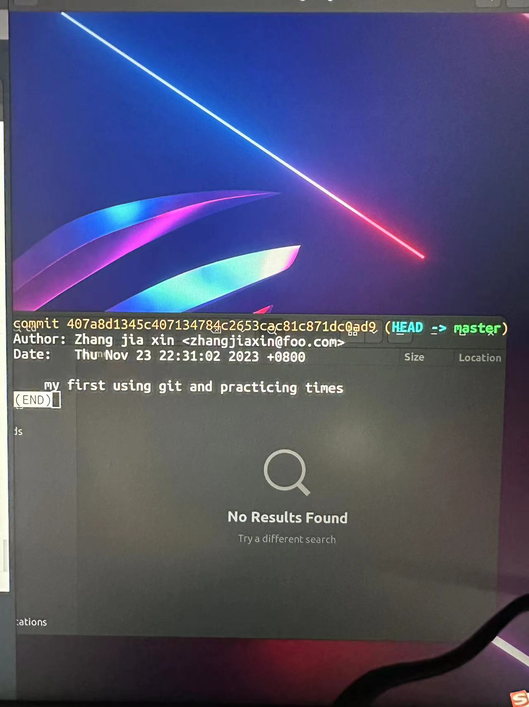

可以看出我有一个存档的记录在昨天晚上的22：31：02时刻，标题为“my first using git and practicing times”，因为是第一次使用，所有把它简单的存为练习题目。第一次使用这个命令，内容应该为空。

5.查看所有跟踪已跟踪文件命令（已跟踪的文件是存档文件的前身）：

```
git status
```

查看是否有新的文件或已修改的文件未被跟踪, 若有, 则使用 `git add` 将文件加入跟踪列表, 例如

```
git add filename
```

想要一次性添加所有当前目录下的文件，你可以使用：

```
git add -A
```

但这样会出现弊端，它会将很多不必要的文件也进跟踪，第一个就是不需要使用的文件，第二个就是因为编译而产生的可执行的二进制文件（binary文件）编译后的binary文件其实是比较大的，要比源码大很多。其实只需要上传源代码即可。

6.<mark>gitignore</mark>这块有我的努力，有想知道它到底怎么用的，可以看一看

所以我仔细地查询了一下`.gitignore`（在这个文件里的文件名，会被跟踪忽略）的相关用法：

6.1.首先需要在你的工作区(项目的根目录)下建立一个名称为`gitignore`的文件，然后把想要忽略的文件名填进去，这样在`git status`和`git add`就会自动忽略在.`gitignore`中的文件名

命令1：

```
touch .gitignore      隐藏文件 .gitignore（linux下以.开头的文件都是隐藏文件）
```

6.2.然后用vim进行编辑：


可以看出我把名为`1124.c`的文件写入了其中，接下来就是见证`.gitignore`的效果的时刻：

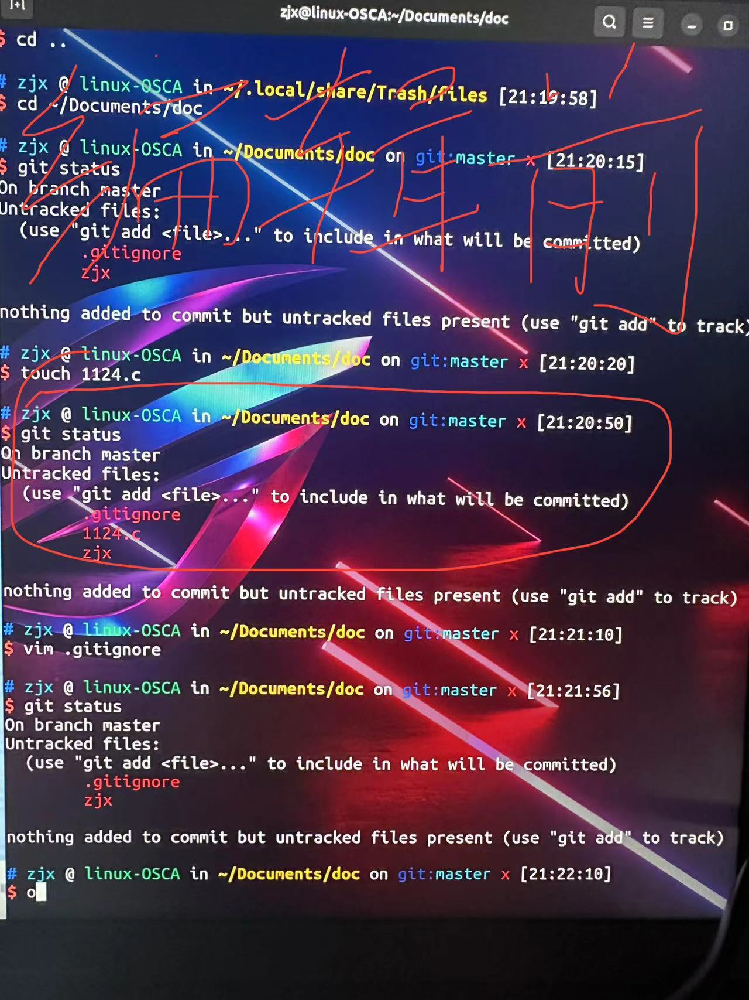

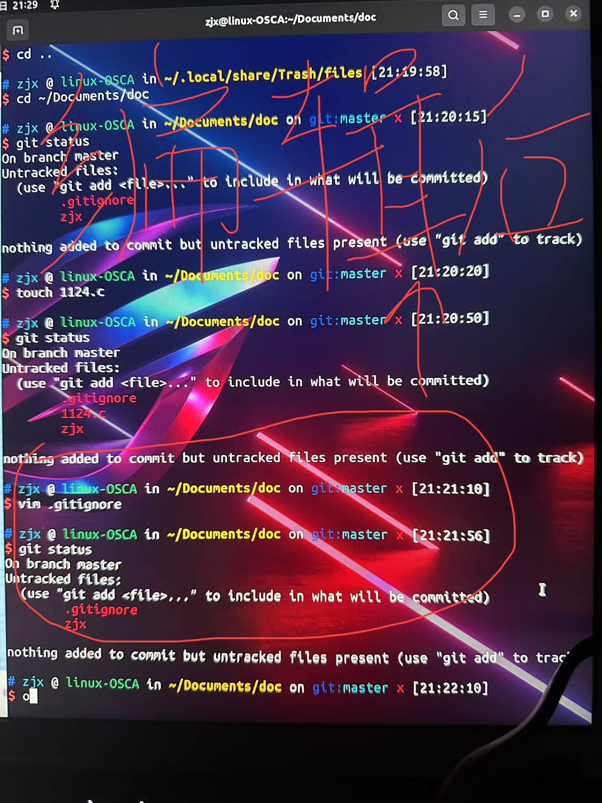

可以看出我的`1124.c`文件被隐藏在了`.gitignore`中了.

其实`.gitignore`也有自己的语法可以在`github`上自己找也可以点击[语法](https://github.com/github/gitignore)：

介绍一个常用的

```
# cat .gitignore
*.xml
*.log
*.apk
*.c
```

`.gitignore`注释用’#’, *表示匹配0个或多个任意字符，所以上面的模式就是要忽略所有的`xml`文件,log文件和`apk`文件。

`.gitignore`配置文件用于配置不需要加入版本管理的文件，配置好该文件可以为版本管理带来很大的便利。

7.存档：

7.1首先你需要使用 `git status` 查看是否有新的文件或已修改的文件未被跟踪, 若有, 则使用 `git add` 将文件加入跟踪列表

7.2然后使用命令:

```
git commit     #将跟踪文件进行存档
```

8.读档：

首先使用 `git log` 来查看已有的存档, 并决定你需要回到哪个过去. 每一份存档都有一个`hash code`, 例如 `b87c512d10348fd8f1e32ddea8ec95f87215aaa5` , 你需要通过`hash code`来告诉 `git` 你希望读哪一个档. 使用以下命令进行读档:

```text
git reset --hard b87c
```

其中 `b87c` 是上文hash code的前缀: 你不需要输入整个hash code. 这时你再看看你的代码, 你已经成功地回到了过去!但事实上, 在使用 `git reset` 的hard模式之前, 你需要再三确认选择的存档是不是你的真正目标. 如果你读入了一个较早的存档, 那么比这个存档新的所有记录都将被删除! 这意为着你不能随便回到"将来"了.

 9.git分支<mark>太烧脑了哈哈哈</mark>

使用git分支就可以在不同的时间节点之间来回随意穿梭，你可以以你存档的那个节点作为主分支，在此基础上不断开设新的分支，用来记录你在主分支基础上更新的内容，因为你可以在分支之间反复s横跳，所以你就可以来回穿梭于在主存档（主分支基础上）各个时间节点（分支）。

使用`git branch`来查看所有分支：


可以看到有俩个分支，一个是1224，一个master,前者是407a下的分支，后者是主分支。

现在使用`git checkout 407a`进行读档，这时我将处于一个虚构的分支中，我可以查看407a存档的内容，也可以对内容进行修改，但是无法存档，需要使用命令`git checkout -B 分支名`来将修改结果保存到一个新的分支中，如果分支已存在，起内容将会被覆盖。

00:04时刻我终于明白这玩意怎么使用了：

1.首先`git checkout master`进入了主分支（我的407a的主分支，你也可以使用`git checkout 407a`进入）

2.然后我在这个虚构分支中，再找一个文件进行内容修改，我在zjx空文件中写入zjx666并保存,这个保存是跟<mark>存档一样的，需要输入命令</mark>(这个十分重要，一开始我以为只要在不同的分支里进行修改，这些修改就会是相互独立的，实际却不是,它是共享修改结果的，为这个问题我想了很久很久，所以需要十分注意，一定要将各个分支的修改分别进行新的<mark>存档 存档 存储</mark>)：

```
1|git add zjx
2|git commit
```

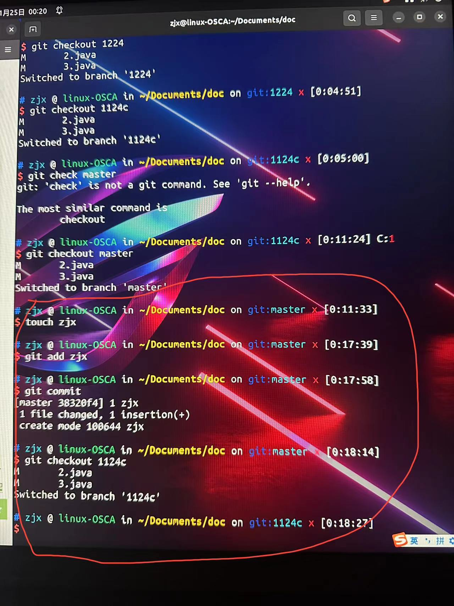

然后我再创建一个新的分支：

```
git branch 1124c
```

看下图你会发现，当我使用命令`git checkout 1124c`进入别的分支后，甚至连zjx这个文件都没有，当我再使用命令git checkout master后，不仅有zjx里面还有内容zjx666。这说明了一个道理，各个分支直接相互独立，互不干涉，这样你就可以随时进入各个时间节点，就像平行时空一样！ 

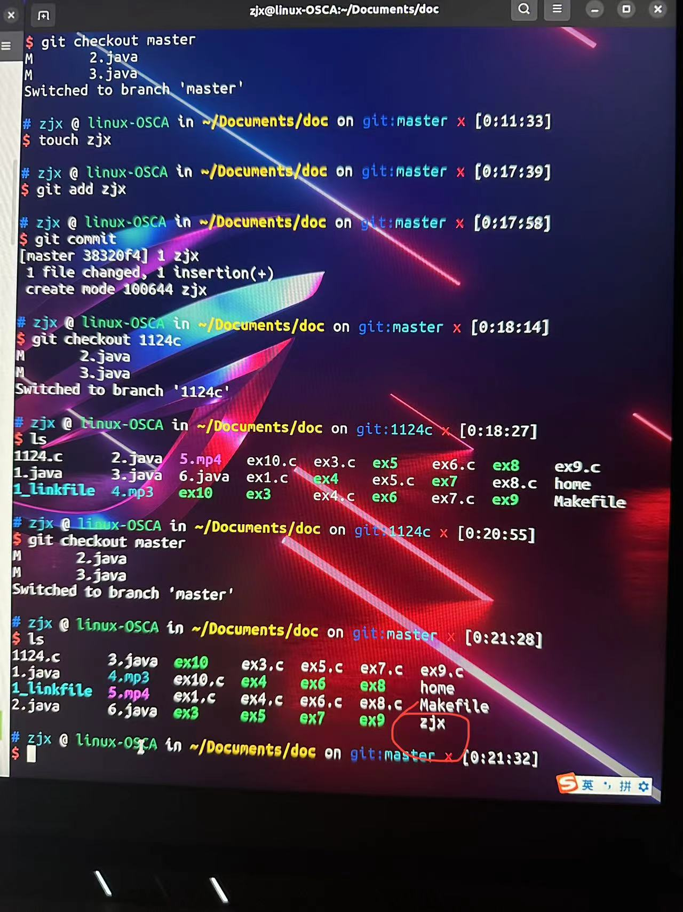

## MIT

### 课程概览与shell

​	1.动机

- 计算机可以帮助我们解决重复性的工作，但其实我们也在重复性的使用计算机。

- 我们在使用工具时，实际上可能只利用了这些工具的很少一部分，就比如我对`tmux`的印象，一开始我以为它只是一个分屏工具，甚至我还觉得它没有`screen`好用,但当我真正好时间去学习如何使用它时，发现它是那么的好用，而且分屏也只是它的很小的卖点，它可以用来保留进程，还可以为同一个进程开多个窗口，同一个窗口可以开多个窗格。

2.课程结构

本课程包含 11 个时长在一小时左右的讲座，每一个讲座都会关注一个特定的主题或者工具。

3.主题1：`The Shell`

为了充分利用计算机的能力，我们不得不回到最根本的方式，使用文字接口：`Shell`,它允许你执行程序，输入并获取某种半结构化的输出。

4.使用shell

bash:

```
zjx@linux-OSCA:~$	#用户名为zjx@linux-OSCA 当前目录为~ $表示现在的身份不是root用户
```

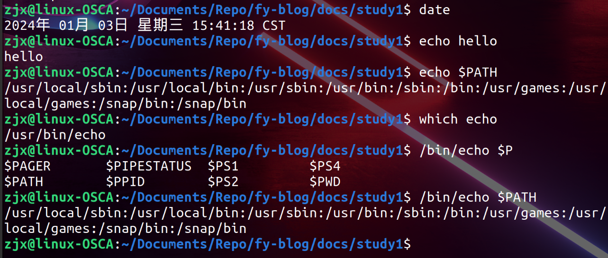

- 执行了 `date` 这个程序，不出意料地，它打印出了当前的日期和时间。然后，shell 等待我们输入其他命令。我们可以在执行命令的同时向程序传递 *参数* ：

- 上例中，我们让 shell 执行 echo ，同时指定参数 hello。
- 但是，shell 是如何知道去哪里寻找 `date` 或 `echo` 的呢？其实，类似于 Python 或 Ruby，shell 是一个编程环境，所以它具备变量、条件、循环和函数（下一课进行讲解）。当你在  shell 中执行命令时，您实际上是在执行一段 shell 可以解释执行的简短代码。如果你要求 shell 执行某个指令，但是该指令并不是  shell 所了解的编程关键字，那么它会去咨询 *环境变量*  `$PATH`，它会列出当 shell 接到某条指令时，进行程序搜索的路径：

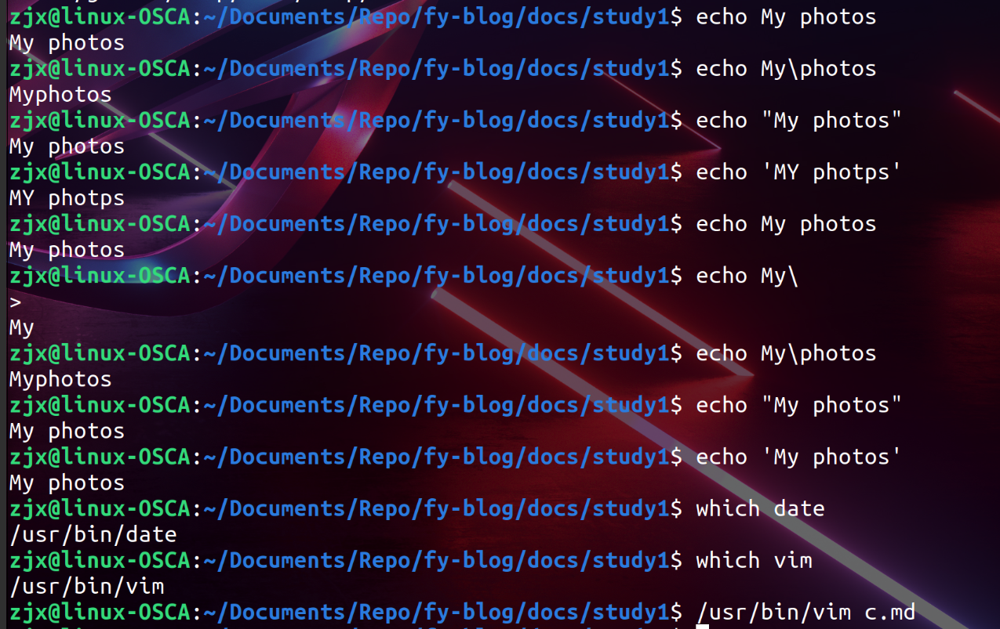

如果希望传递的参数中包含空格（例如一个名为 My Photos 的文件夹），您要么用使用单引号，双引号将其包裹起来，要么使用转义符号 `\` 进行处理（`My\ Photos`）。

> 2024年 01月 03日 星期三 16:22:15 CST

哈哈，我突然搞懂了环境变量是个啥，一下子感觉都非常的简单。

```
export MYSLIDE_HOME=/home/zjx/Documents/Repo/ppt_markdown
```

- export: 这是一个 shell 命令，用于设置或显示环境变量。在这里，它用于设置环境变量。

- `MYSLIDE_HOME`: 这是环境变量的名称。

- `/home/zjx/Documents/Repo/ppt_markdown`: 这是为环境变量 `MYSLIDE_HOME` 指定的值，即设置 `MYSLIDE_HOME `的路径`/home/zjx/Documents/Repo/ppt_markdown`。

```
export MYSLIDE_HOME=/home/zjx/Documents/Repo/ppt_markdown
export MYSLIDE_SCRIPT=$MYSLIDE_HOME/scripts
alias pptopen="$MYSLIDE_SCRIPT/open.sh $1"
```

我知道了使用一个程序时，只需要输入它的绝对路径即可，我就想到了这个`pptgen`也是同样的道理,先利用`MYSLIDE_SCRIPT`环境变量提供路径，再执行shell脚本。

> 以 .sh 结尾的文件通常是 Shell 脚本文件。这种文件包含一系列 Shell 命令，可以由操作系统的命令解释器（例如 Bash、sh、zsh 等）执行。 Shell 脚本被用于自动化和批处理任务，其中包含一系列要在终端中执行的命令。 Shell 脚本文件中的命令按顺序执行，可以包括变量、条件语句、循环等结构，使其具有较强的编程能力。

`Bash`（`Bourne Again SHell`）和 `Zsh`（`Z Shell`）都是类Unix系统中的命令行解释器，也被称为`shell`。`Shell`是用户与操作系统内核之间的接口，它允许用户通过命令行或脚本与操作系统进行交互。

Shell的主要功能包括：

- 命令解释与执行： 用户可以通过Shell输入命令，Shell会解释并执行这些命令。

- 脚本编写： 用户可以编写Shell脚本，将一系列命令组织在一起以完成特定的任务。

- 环境控制： Shell可以设置和管理环境变量，影响系统和用户的行为。

- 文件操作： 用户可以使用Shell执行文件和目录的操作，如创建、删除、移动、复制等。

`Bash`是`Unix`和`Linuz`中最常用的默认`Shell`，而`Zsh`则是一个功能更丰富且用户友好的替代品。它们都支持命令行历史、自动补全、别名等功能，以提高用户在命令行环境中的效率和便利性。选择使用哪种Shell通常取决于个人偏好和需求。

学习shell的过程：

shell 中的路径是一组被分割的目录，在 Linux 和 macOS 上使用 `/` 分割，而在Windows上是 `\`。路径 `/` 代表的是系统的根目录，所有的文件夹都包括在这个路径之下，在Windows上每个盘都有一个根目录（例如： `C:\`）。 我们假设您在学习本课程时使用的是 Linux 文件系统。如果某个路径以 `/` 开头，那么它是一个 *绝对路径*，其他的都是 *相对路径* 。相对路径是指相对于当前工作目录的路径，当前工作目录可以使用 `pwd` 命令来获取。此外，切换目录需要使用 `cd` 命令。在路径中，`.` 表示的是当前目录，而 `..` 表示上级目录：

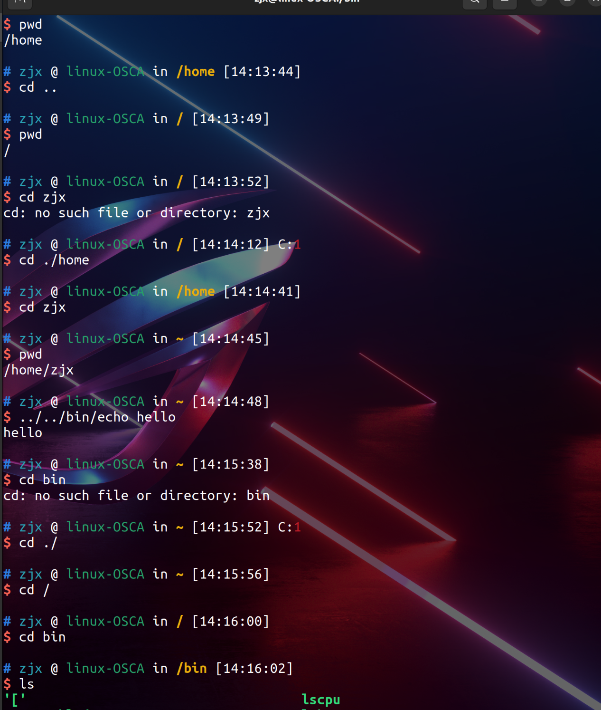

在 shell 中，程序有两个主要的“流”：它们的输入流和输出流。 当程序尝试读取信息时，它们会从输入流中进行读取，当程序打印信息时，它们会将信息输出到输出流中。 通常，一个程序的输入输出流都是您的终端。也就是，您的键盘作为输入，显示器作为输出。 但是，我们也可以重定向这些流！

最简单的重定向是 `< file` 和 `> file`。这两个命令可以将程序的输入输出流分别重定向到文件：

还可以使用 `>>` 来向一个文件追加内容。使用管道（ *pipes* ），我们能够更好的利用文件重定向。 `|` 操作符允许我们将一个程序的输出和另外一个程序的输入连接起来：

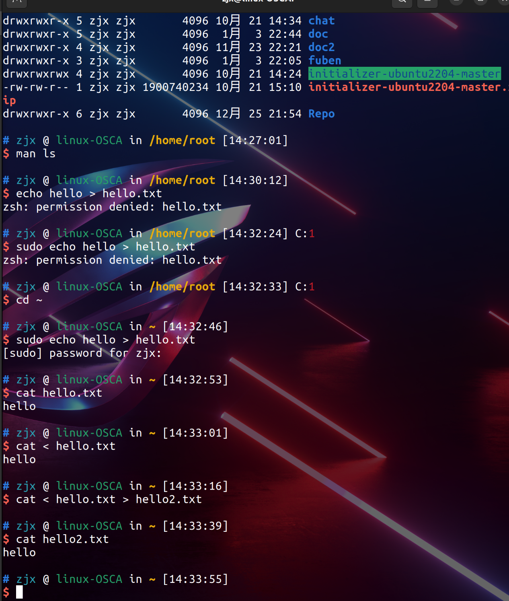

还可以使用 `>>` 来向一个文件追加内容。使用管道（ *pipes* ），我们能够更好的利用文件重定向。 `|` 操作符允许我们将一个程序的输出和另外一个程序的输入连接起来：

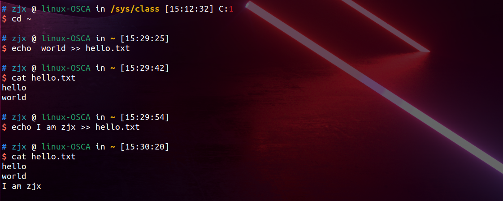

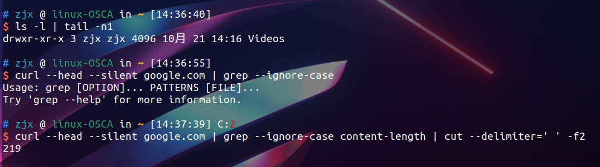


```
$ sudo find -L /sys/class/backlight -maxdepth 2 -name '*brightness*'
/sys/class/backlight/thinkpad_screen/brightness
$ cd /sys/class/backlight/thinkpad_screen
$ sudo echo 3 > brightness
An error occurred while redirecting file 'brightness'
open: Permission denied
```

出乎意料的是，我们还是得到了一个错误信息。毕竟，我们已经使用了 `sudo` 命令！关于 shell，有件事我们必须要知道。`|`、`>`、和 `<` 是通过 shell 执行的，而不是被各个程序单独执行。 `echo` 等程序并不知道 `|` 的存在，它们只知道从自己的输入输出流中进行读写。 对于上面这种情况， *shell* (权限为您的当前用户) 在设置 `sudo echo` 前尝试打开 brightness 文件并写入，但是系统拒绝了 shell 的操作因为此时 shell 不是根用户。

明白这一点后，我们可以这样操作：

```
$ echo 3 | sudo tee brightness
```

### Shell工具和脚本

在bash中为变量赋值的语法是`foo=bar`，访问变量中存储的数值，其语法为 `$foo`。 需要注意的是，`foo = bar` （使用空格隔开）是不能正确工作的，因为解释器会调用程序`foo` 并将 `=` 和 `bar`作为参数。 总的来说，在shell脚本中使用空格会起到分割参数的作用，有时候可能会造成混淆，请务必多加检查。

Bash中的字符串通过`'` 和 `"`分隔符来定义，但是它们的含义并不相同。以`'`定义的字符串为原义字符串，其中的变量不会被转义，而 `"`定义的字符串会将变量值进行替换。

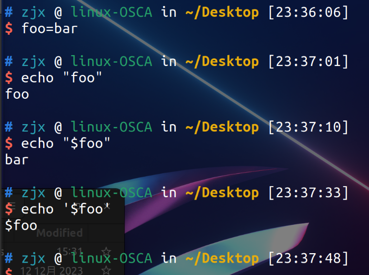

- `$0` - 脚本名
- `$1` 到 `$9` - 脚本的参数。 `$1` 是第一个参数，依此类推。
- `$@` - 所有参数
- `$#` - 参数个数
- `$?` - 前一个命令的返回值
- `$$` - 当前脚本的进程识别码
- `!!` - 完整的上一条命令，包括参数。常见应用：当你因为权限不足执行命令失败时，可以使用 `sudo !!`再尝试一次。
- `$_` - 上一条命令的最后一个参数。如果你正在使用的是交互式 shell，你可以通过按下 `Esc` 之后键入 . 来获取这个值。

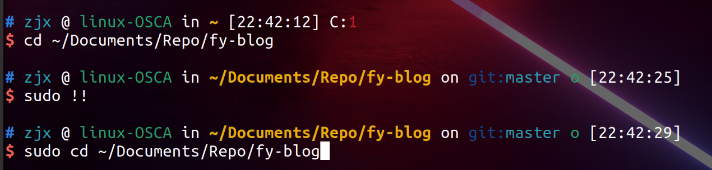

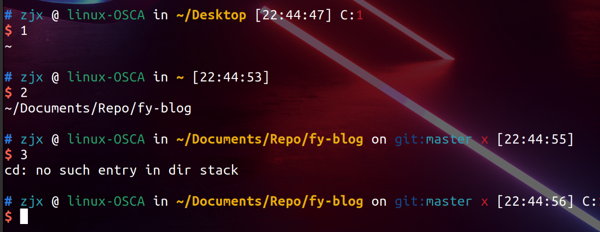


命令通常使用 `STDOUT`来返回输出值，使用`STDERR` 来返回错误及错误码，便于脚本以更加友好的方式报告错误。 返回码或退出状态是脚本/命令之间交流执行状态的方式。返回值0表示正常执行，其他所有非0的返回值都表示有错误发生。

退出码可以搭配 `&&`（与操作符）和 `||`（或操作符）使用，用来进行条件判断，决定是否执行其他程序。它们都属于短路运算符（short-circuiting） 同一行的多个命令可以用` ; `分隔。程序 `true` 的返回码永远是`0`，`false` 的返回码永远是`1`。让我们看几个例子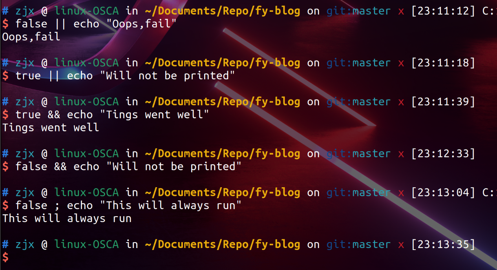

另一个常见的模式是以变量的形式获取一个命令的输出，这可以通过 *命令替换*（*command substitution*）实现。

当通过 `$( CMD )` 这样的方式来执行`CMD` 这个命令时，它的输出结果会替换掉 `$( CMD )` 。例如，如果执行 `for file in $(ls)` ，shell首先将调用`ls` ，然后遍历得到的这些返回值。还有一个冷门的类似特性是 *进程替换*（*process substitution*）， `<( CMD )` 会执行 `CMD` 并将结果输出到一个临时文件中，并将 `<( CMD )` 替换成临时文件名。这在我们希望返回值通过文件而不是`STDIN`传递时很有用。例如， `diff <(ls foo) <(ls bar)` 会显示文件夹 `foo` 和 `bar` 中文件的区别。

说了很多，现在该看例子了，下面这个例子展示了一部分上面提到的特性。这段脚本会遍历我们提供的参数，使用`grep` 搜索字符串 `foobar`，如果没有找到，则将其作为注释追加到文件中。

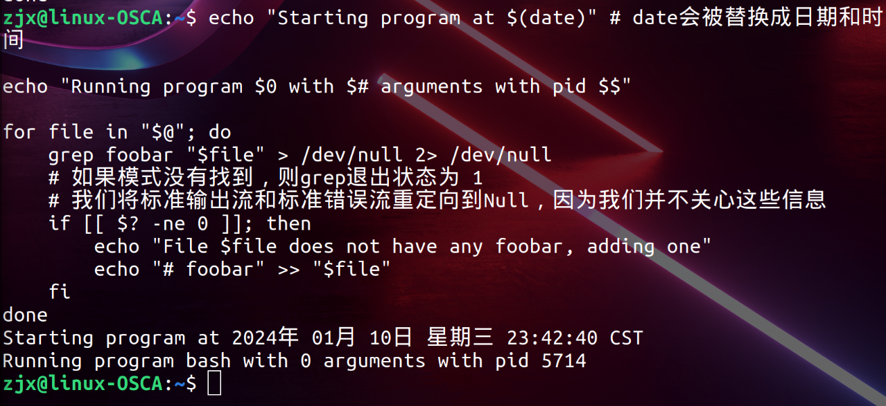

在条件语句中，比较 `$?` 是否等于0。在bash中进行比较时，尽量使用双方括号 `[[ ]]` 而不是单方括号 `[ ]`，这样会降低犯错的几率，尽管这样并不能兼容 `sh`。

shell的 *通配*`（*globbing*)`:

- 通配符 - 当你想要利用通配符进行匹配时，你可以分别使用 `?` 和 `*` 来匹配一个或任意个字符。例如，对于文件`foo`, `foo1`, `foo2`, `foo10` 和 `bar`, `rm foo?`这条命令会删除`foo1` 和 `foo2` ，而`rm foo*` 则会删除除了`bar`之外的所有文件。
- 花括号`{}` - 当你有一系列的指令，其中包含一段公共子串时，可以用花括号来自动展开这些命令。这在批量移动或转换文件时非常方便。

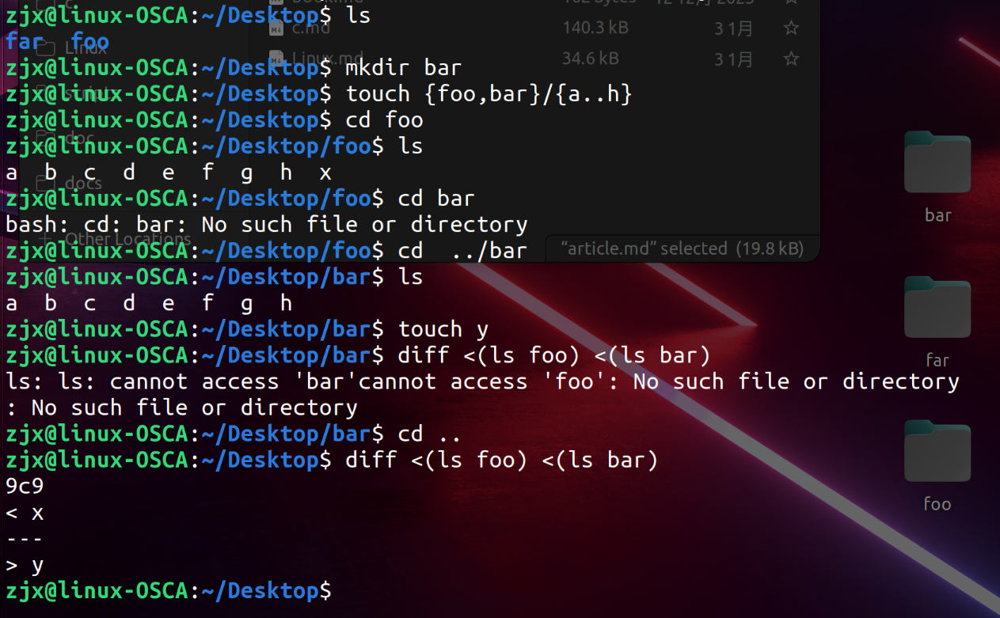在 `shebang` 行中使用`env`命令是一种好的实践，它会利用环境变量中的程序来解析该脚本，这样就提高来您的脚本的可移植性。`env` 会利用我们第一节讲座中介绍过的`PATH` 环境变量来进行定位。 例如，使用了`env`的shebang看上去时这样的`#!/usr/bin/env python`

> `env`命令:

`env`是一个在Unix和类Unix系统中常见的命令，用于执行命令时设置环境变量。环境变量是一种在操作系统中存储配置信息的机制，它们对于控制程序的行为和设置运行时参数非常重要。

`env`命令的基本语法如下：

```
env [OPTION]... [-] [NAME=VALUE]... [COMMAND [ARG]...]
```

其中，`NAME=VALUE`是要设置的环境变量，COMMAND是要执行的命令，`ARG`是命令的参数。

例如，你可以使用`env`命令来设置环境变量并运行一个程序，如下所示：

```
env VAR1=value1 VAR2=value2 myprogram
```

这将使用`env`命令设置`VAR1`和`VAR2`环境变量的值，然后运行`myprogram`。这样做的好处是可以在不修改脚本或程序本身的情况下，通过命令行灵活地更改环境变量的值。

请注意，`env`命令也可以用于简化脚本的开头，以确保脚本在不同系统上的兼容性，因为它可以帮助找到系统中的正确解释器。例如，在脚本的开头使用`#!/usr/bin/env python`可以确保使用系统中安装的`Python`解释器运行脚本，而不是硬编码特定的解释器路径。

> shell函数与脚本的区别：

- 函数只能与shell使用相同的语言，脚本可以使用任意语言。因此在脚本中包含 `shebang` 是很重要的。
- 函数仅在定义时被加载，脚本会在每次被执行时加载。这让函数的加载比脚本略快一些，但每次修改函数定义，都要重新加载一次。
- 函数会在当前的shell环境中执行，脚本会在单独的进程中执行。因此，函数可以对环境变量进行更改，比如改变当前工作目录，脚本则不行。脚本需要使用 `export`将环境变量导出，并将值传递给环境变量。
- 与其他程序语言一样，函数可以提高代码模块性、代码复用性并创建清晰性的结构。shell脚本中往往也会包含它们自己的函数定义。

>  export命令用于将变量设置为环境变量，使其在当前会话中及其子进程中可用。以下是使用export命令的一些示例：


### Shell工具

查看命令如何使用（使用这个命令行并找出它的不同的选项）：

- 可以使用-h或者--help
- 可以使用man,查看手册（manual）

>  查找文件

程序员们面对的最常见的重复任务就是查找文件或目录。所有的类UNIX系统都包含一个名为 `find`的工具，它是 shell 上用于查找文件的绝佳工具。`find`命令会递归地搜索符合条件的文件，例如：

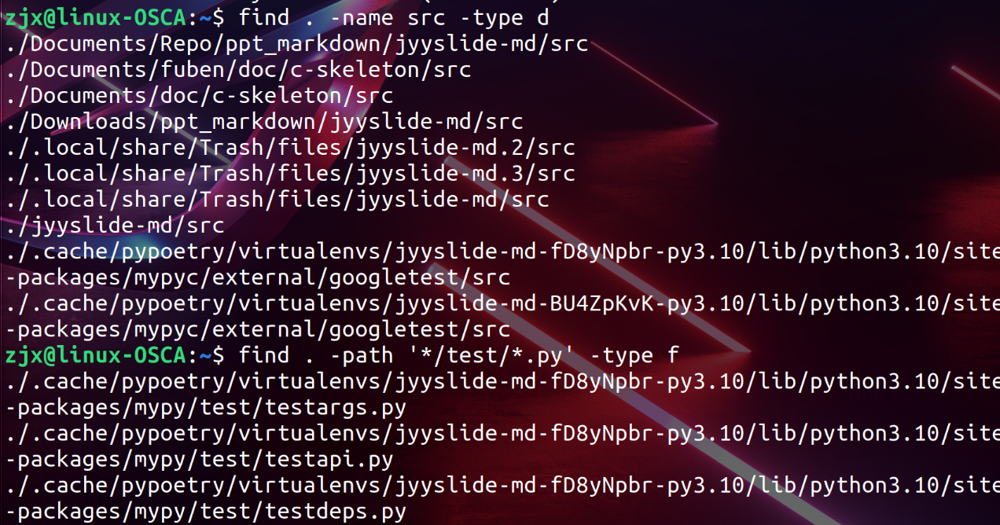

>  查找代码

`grep` 有很多选项，这也使它成为一个非常全能的工具。其中我经常使用的有 `-C` ：获取查找结果的上下文（Context）；`-v` 将对结果进行反选（Invert），也就是输出不匹配的结果。举例来说， `grep -C 5` 会输出匹配结果前后五行。当需要搜索大量文件的时候，使用 `-R` 会递归地进入子目录并搜索所有的文本文件。

<mark>这里的`rg`指的是`ripgrep`，使用apt包是下载不了的，所以我今天第一次使用了新的安装包，就是为Mac专门服务的`Homebrew`.有了它我就能下百分之八十以上的应用了。</mark>

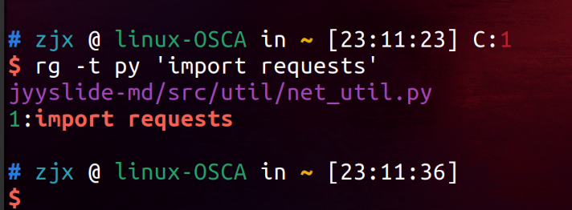

> 查找shell命令

`history` 命令允许您以程序员的方式来访问shell中输入的历史命令。这个命令会在标准输出中打印shell中的里面命令。如果我们要搜索历史记录，则可以利用管道将输出结果传递给 `grep` 进行模式搜索。 `history | grep find` 会打印包含find子串的命令。

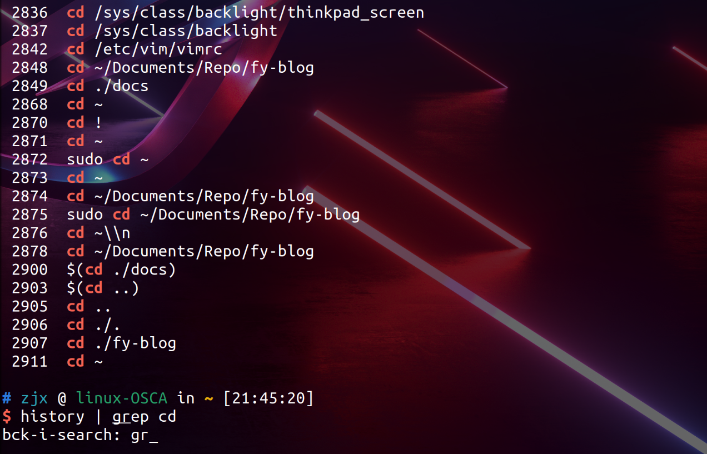

可以修改 shell history 的行为，例如，如果在命令的开头加上一个空格，它就不会被加进shell记录中。当你输入包含密码或是其他敏感信息的命令时会用到这一特性。 为此你需要在`.bashrc`中添加`HISTCONTROL=ignorespace`或者向`.zshrc` 添加 `setopt HIST_IGNORE_SPACE`。 如果你不小心忘了在前面加空格，可以通过编辑。`bash_history`或 `.zhistory` 来手动地从历史记录中移除那一项。<mark>下面是我在`bash`和`zsh`进行的新的配置。</mark>

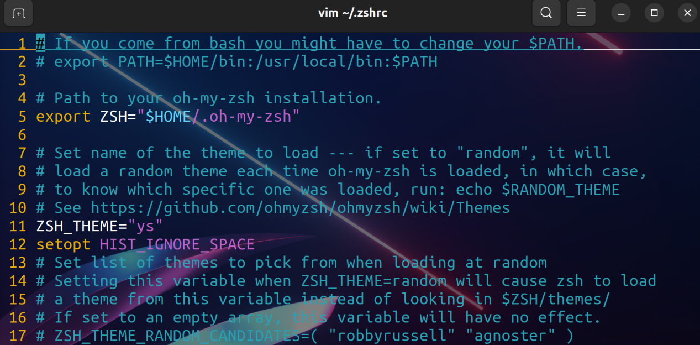

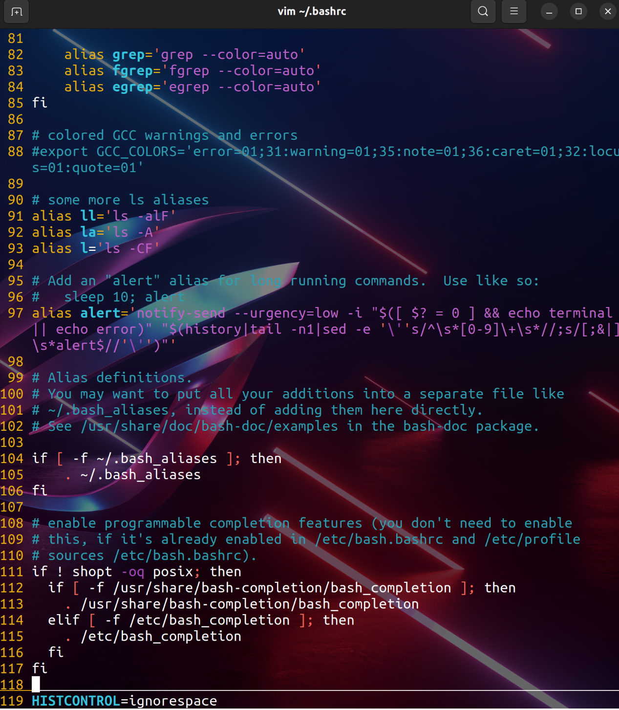

以下就是用`Homebrew`安装包下载工具的截图

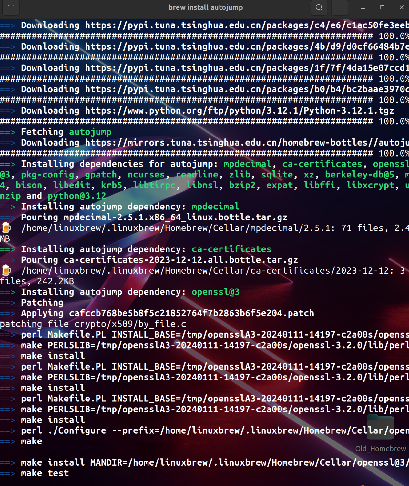

> 文件夹导航

可以下载`fasd`工具或者`autojump`.
