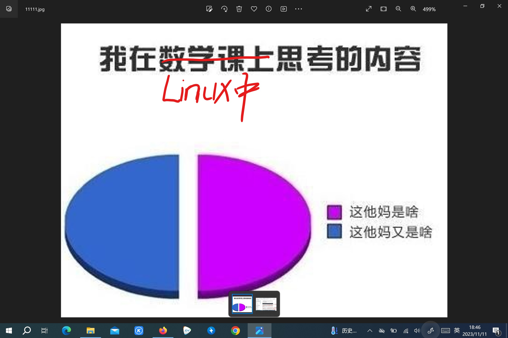

# 文章收获：

## 为什么要学习计算机系统基础:


- 该文章主要强调了作为计算机专业的我们在计算机方面的优势就是拥有对计算机系统的整体认知和把握，正是因为这一优势，我们可以在编程相同的命题时，可以编出与其他人效率相差几十倍的代码。
- 之后这篇文章也强调了动手实践的重要性，很多时候学习时的效果与动手实践时的效果可以说是两码事。同时通过动手实践可以促进自己对知识的理解和掌握，二者是相互促进的关系。

## 初识man

- 作为Linux菜鸟，经常面对着一大堆陌生的命令和参数，我经常会无语



- 这时我知道了可以找man帮忙，学会用man独立解决问题，于是我输入了

```
man man
```

- 

- 进入了man的世界后，还是啥也不懂，于是按了h求寻求帮助（按q可以退出），这时我来到了新的世界，世界的起点是“SUMMARY OF LESS COMMANDS”,然后我按照初识man这篇文章的内容一步一步的在Linux中进行和学习

- 

- 我明白了那个像英文音标一样的符号代表了ctrl，然后我也尝试了使用j 和 10j 来分别向下一行和十行。

- 

- 使用j后

- 

- 使用10j以后

- 

- 然后开始使用搜索命令“/加你要搜索的关键词”

- 

- 它会将所有含有h 和 H 的地方做出标记

- 

- 然后在DESCRIPTION中了解到了manual分成9大类，每一个manual page属于都属于其中的某一类

- 

- 然后是为了看懂SYNOPSIS，先在OPTIONS中弄明白每个参数的含义，然后你通过刚刚学会的"/加关键词"，学会了快速标记你想找的参数并搭配n来更快的找到。

- 

- 我在OPTIONS中还是不太明白-k的意思，然后退出man并在命令行中输入:

  ```  
  man -k printf

- 

- 查看printf（1）这个shell命令，输入：

  ``` 
  man 1 printf  

- 

- 查看printf(3)这个库函数，输入：

  ```
  man 3 printf 

- 

- 在掌握了man的用法后，我们应该经常来拜访ta，很多时候它可以为我们提供可靠的帮助：

- 通过这篇文章我们学会了：

- 1.阅读程序输出的提示

- 2.通过搜索来定位我关心的内容

- 3.动手实践是认识新事物的最好方法（一边看文章，一边动手学习）

- 4.要学会独立寻求帮助