## 十进制与二进制：

```
【问题描述】

假设有一16位的无符号整数，可以对其二进制数据进行循环右移操作，右移后仍然是无符号整数。编写程序从控制台读入要右移的整数和循环右移的位数，求得并输出循环右移后的十进制数据。

【输入形式】

从控制台输入要右移的十进制整数（大于等于0，小于等于65535）和循环右移的位数（大于等于0，小于等于16），两整数之间用一个空格分隔。

【输出形式】

向控制台输出循环右移后的十进制整数。

【输入样例1】

65532 2

【输出样例1】

16383

【样例1说明】

输入的待右移的整数为65532，该无符号整数的二进制形式为：1111111111111100，向右循环右移两位后的二进制形式为：0011111111111111，对应的十进制数据为：16383。

【输入样例2】

6 3

【输出样例2】

49152

【样例2说明】

输入的待右移的整数为6，该无符号整数的二进制形式为：0000000000000110，向右循环右移3位后的二进制形式为：1100000000000000，对应的十进制数据为：49152。
```

- 
- 接下来我用四张图来介绍一下十进制与二进制的相互转化，并且如果你看懂了接下来的四张图，那么你就可以读懂上面这个程序是如何实现的了，先简单介绍一下这个程序的整体思路：1.将二进制的16位数存储到d中，然后从左到右以此判别此位是否为1。2.利用i来判别16次位数，利用c来实现右移，实际上是改变了一开始读取的位次，到尾后又从头开始读取，然后再利用32768也就是2的15次方来实现转换为十进制。
- 
- 
- 
- 

---

## 编程练习题

### 递归

```
【问题描述】

输入精度e 和实数x,用下列公式求cos x 的近似值,精确到最后一项的绝对值小于e｡要求定义和调用函数funcos(e,x)求余弦函数的近似值｡


【输入形式】

输入两个浮点数：精度e和实数x

【输入输出样例1】（下划线部分表示输入）

e: 0.001

x: 1

cos(x)=0.540

【样例说明】

输入提示符后要加一个空格。例如&ldquo;e: &rdquo;，其中&ldquo;:&rdquo;后要加一个且只能一个空格。

输出语句的&ldquo;=&rdquo;两边无空格

计算结果保留3位小数

英文字母区分大小写。必须严格按样例输入输出。
```

```
#include <stdio.h>
#include <math.h>

double factorial(int n) {
	if (n == 1)
		return 1;
	return factorial(n - 1) * n;
}

double funcos(double e, double x);

int main() {
	double e, x;
	scanf("%lf %lf", &e, &x);
	printf("e: x: cos(x)=%.3lf", funcos(e, x));
	return 0;
}

double funcos( double e, double x) {
	int a;
	double c, d;
	a = 2;

	d = 1;
	int n = 2;
	do {
		c = pow(x, a) /factorial(n);
		if (a % 4 == 0) {
			d += c;
		} else if (a % 2 == 0) {
			d -= c;
		}
		a++;
		n++;
	} while (c > e);
	return d;

}
```

这个程序一定要注意阶乘函数的类型必须为double，这是因为阶乘作为了分母，而分子是double类型，所以如果阶乘使用int等整数类型，就会出现有意想不到的错误，本题的错误在于循环中的递归运算到达峰值后，不会再进行下去，出现极大值错误，直接多出2到3位的大小，然后输出，你可以自己试一试，然后就懂我在说什么了，当然必须要看每一步循环的动态输出才可以。这给我们的启示就是，在对俩个变量进行运算时，最好要让它们为相同的类型，如果俩个数较小，那么可能不会产生什么影响，但如果像这道题一样位数十分的大，那么就要注意了！

### 巧妙地利用数组排序俩组数

```
【问题描述】

从标准输入中输入两组整数(每组不超过20个整数，每组整数中元素不重复)，合并两组整数，重复的整数只出现一次，并按从大到小顺序排序输出（即两组整数集的“并集”）。


【输入形式】

首先输入第一组整数的个数，然后在下一行输入第一组整数，以一个空格分隔各个整数；再在新的一行上输入第二组整数的个数，然后在下一行输入第二组整数，以一个空格分隔。


【输出形式】

按从大到小顺序排序输出合并后的整数集（以一个空格分隔各个整数，最后一个整数后的空格可有可无）。


【样例输入】

8
5  105  4  32  8  7  9  -60
5
5  2  87  10  105

【样例输出】

105   87   32   10   9   8   7   5   4   2   -60


【样例说明】

第一组整数有8个，分别为5   105   4   32   8   7   9   -60，第二组整数有5个，分别为5   2   87   10   105。将第一组和第二组整数合并（在两组整数中都出现的整数5和105只出现一次），并按从大到小顺序排序后结果为105   87   32   10   9   8   7   5   4   2   -60。
```

这段代码的目的是输入两组整数，每组整数的个数由用户输入，然后将这些整数放入一个数组 `zu` 中，并在最后输出这两组整数的并集（去重）。

```
#include <stdio.h>

int main() {
    int a, b, c, d;

    // 声明一个大小为1000的整型数组zu，用于标记整数是否存在
    int zu[1000];

    // 初始化数组，全部元素置为0
    for (a = 0; a < 1000; a++)
        zu[a] = 0;

    // 循环两次，每次输入一组整数
    for (a = 0; a < 2; a++) {
        // 用户输入当前组整数的个数
        scanf("%d", &c);

        // 循环读入当前组整数，并在数组zu中标记该整数的存在
        for (b = 0; b < c; b++) {
            scanf("%d", &d);
            zu[d] = 1;
        }
    }

    // 从数组zu的末尾开始遍历，输出标记为存在的整数
    for (a = 1000; a >= 0; a--) {
        if (zu[a] == 1)
            printf("%d ", a);
    }

    return 0;
}
```

## Learn C the hard way：

### 注意事项(目前我遇到的)：

1.在运行你需要运行的文件时，你必须先cd的文件所在目录，列入我的ex4文件


- 首先输入命令：

```
cd ~/Documents/doc
```

- 然后再输入：

```
./ex4
```

这样进可以运行文件中的c程序了

2.要修改文件内容时，比如ex4.c，首先你会在这个文件中进行修改，可是当你修改完，然后运行这个文件输入：

```
./ex4
```

- 你发现怎么还是上次的结果，我不是已经修改了吗，这时你只需要先输入命令：

```
make ex4
```

- 它就会更新新的ex4

### 我目前学到或者见识到的东西：

### make:

1.make(在Python中，你仅仅需要输入`python`，就可以运行你想要运行的代码。Python的解释器会运行它们，并且在运行中导入它所需的库和其它东西。Make会构建源码，执行测试，设置一些选项以及为你做所有Python通常会做的事情。)

### valgrind:

2.valgrind（是一种检测错误的工具）

a.下载：

```
1|wget https://sourceware.org/pub/valgrind/valgrind-3.16.1.tar.bz2      #使用下载命令下载压缩包
```

```
2|tar-jxvf valgrind-3.16.1.tar.bz2   #解压安装包
```

```
3|cd valgrind-3.16.1    #进入目录
```

```
4|./configure    #配置valgrind,生成MakeFile文件
```

```
5|make    #编译Valgrind
```

```
6|make install   #安装Valgrind
```

在valgrind下运行文件

```
valgrind ./ex4
```

### 句法

3.1使用char来声明，以周围带有'（单引号）的单个字符来表示，使用%c来打印。

```
char initial = 'A';
printf("I have an initial %c.\n", initial);
```

- 3.2.使用char name[]来声明，以周围带有“的一些字符来表示，使用%s来打印。

```
char first_name[] = "Zed";
printf("I have a first name %s.\n", first_name);
```

- 3.3.long用%ld占位符
- 3.4.使用%e以科学计算法的形式打印

- 3.5.特殊语法'\0'声明了一个字符，这样创建了一个“空字节”字符，实际上是数字0：

```
char nul_byte = '\0';
int care_percentage = bugs * nul_byte;
printf("Which means you should care %d%%.\n",
            care_percentage);
```

- 结果：

```
Which means you should care 0%.
```

- 3.6.用俩个%%来打印一个%

```
printf("Which means you should care %d%%.\n",
            care_percentage);
```

- 3.7.&&与||：

```
【问题描述】

   在中国数学历史上广泛流传着一个&ldquo;韩信点兵&rdquo;的故事。韩信点兵时，为了知道有多少兵，同时又能保住军事机密，便让士兵排队报数：

按从1至5报数，记录最末一个士兵的报数为1；

按从1至6报数，记录最末一个士兵的报数为5；

按从1至7报数，记录最末一个士兵的报数为4；

按从1至11报数，记录最末一个士兵的报数为10；

你知道韩信至少有多少兵？

【输入输出说明】无输入，输出至少应有的士兵数。
```

```
1  	 :  	#include <stdio.h>
2  	 :  	
3  	 :  	int main() {
4  	 :  	
5  	 :  	    int a ;
6  	 :  	    for (a = 1; a % 5 != 1 || a % 6 != 5 || a % 7 != 4 || a % 11 != 10; a++);
7  	 :  	    printf("%d", a);
8  	 :  	    return 0;
9  	 :  	}
10   :  	
 
```

- 我利用此题来介绍一下二者的区别
- 1.||表示或者，要想此题得出正确答案，那个a除以那四个数之后，得到的余数也是分别四个特定的数。只要不满足其中任何一个，那么就需要使a不断递增，知道找到那一位正确的数。此代码中，只要a满足4个条件中的任意一个，也就是有一个除完数之后余数并不是自己想要的，那么就会继续进入循环，它是一种或的关系。也就是只要有一个满足条件就会进入循环，当所有条件都不满足时，才会跳出循环。
- 2.&&表示并且，也就是说，只有当四个条件都满足时，才会进入循环，也就是说a必须做到除完数后，没有一个余数符合条件，才会进入循环，更新a的值。如果有其中一个余数符合我们想要的，而另外三个不符合，它也会跳出循环，直接输出。也就是只要有一个不满足循环条件，那么它就会跳出循环，满足所有条件时才会进入循环。

### 数组

4.数组大小：

```
#include <stdio.h>

int main(int argc, char *argv[])
{
    int areas[] = {10, 12, 13, 14, 20};
    char name[] = "Zed";
    char full_name[] = {
        'Z', 'e', 'd',
         ' ', 'A', '.', ' ',
         'S', 'h', 'a', 'w', '\0'
    };

    // WARNING: On some systems you may have to change the
    // %ld in this code to a %u since it will use unsigned ints
    printf("The size of an int: %ld\n", sizeof(int));
    printf("The size of areas (int[]): %ld\n",
            sizeof(areas));
    printf("The number of ints in areas: %ld\n",
            sizeof(areas) / sizeof(int));
    printf("The first area is %d, the 2nd %d.\n",
            areas[0], areas[1]);

    printf("The size of a char: %ld\n", sizeof(char));
    printf("The size of name (char[]): %ld\n",
            sizeof(name));
    printf("The number of chars: %ld\n",
            sizeof(name) / sizeof(char));

    printf("The size of full_name (char[]): %ld\n",
            sizeof(full_name));
    printf("The number of chars: %ld\n",
            sizeof(full_name) / sizeof(char));

    printf("name=\"%s\" and full_name=\"%s\"\n",
            name, full_name);

    return 0;
}
```

```
The size of an int: 4
The size of areas (int[]): 20
The number of ints in areas: 5
The first area is 10, the 2nd 12.
The size of a char: 1
The size of name (char[]): 4
The number of chars: 4
The size of full_name (char[]): 12
The number of chars: 12
name="Zed" and full_name="Zed A. Shaw"

```

int的大小是4，areas中含有5个整数，所以自然需要用20个字节来储存它

char的大小是1，name中含有三个字符的字符串，full__ _name中含有12个单字符，而打印出它们的字节大小却分别是4和12，full__ _name很好理解,因为它本身就含有12个单字符，但name为什么是4呢，百思不得其解下，我谷歌了一下，原来char类型的数组是以“\0”空字符结尾的。这下就明白了， full__name本身就是以“\0”空字符来结尾的，所以就是12个字节，不需要+1，而name原本应该是“zed\0”，所以它需要+1.

5.数组和字符串：

```
#include <stdio.h>

int main(int argc, char *argv[])
{
    int numbers[4] = {0};
    char name[4] = {'a'};

    // first, print them out raw
    printf("numbers: %d %d %d %d\n",
            numbers[0], numbers[1],
            numbers[2], numbers[3]);

    printf("name each: %c %c %c %c\n",
            name[0], name[1],
            name[2], name[3]);

    printf("name: %s\n", name);

    // setup the numbers
    numbers[0] = 1;
    numbers[1] = 2;
    numbers[2] = 3;
    numbers[3] = 4;

    // setup the name
    name[0] = 'Z';
    name[1] = 'e';
    name[2] = 'd';
    name[3] = '\0';

    // then print them out initialized
    printf("numbers: %d %d %d %d\n",
            numbers[0], numbers[1],
            numbers[2], numbers[3]);

    printf("name each: %c %c %c %c\n",
            name[0], name[1],
            name[2], name[3]);

    // print the name like a string
    printf("name: %s\n", name);

    // another way to use name
    char *another = "Zed";

    printf("another: %s\n", another);

    printf("another each: %c %c %c %c\n",
            another[0], another[1],
            another[2], another[3]);

    return 0;
}

```

输出：

```
numbers: 0 0 0 0
name each: a   
name: a
numbers: 1 2 3 4
name each: Z e d 
name: Zed
another: Zed
another each: Z e d 
```

- 5.1第一个numbers并没有提供全部的四个参数，第一个name也只提供了一个元素，可是为什么numbers可以将所有的元素打印出来，而name却只有一个a。那是因为numbers为int类型，未提供的剩余元素都会默认为0，而char未写出的元素默认为“\0"空字符，而空字符并不会显示。
- 5.2创建一个字符串的常用语法char name[4] = {'a'}和char *another = "name"俩中，其中后者比较常用。

- 在C语言中字符数组和字符串没有什么不同。

6.字符串数组和循环

字符串数组的写法：

```
1.char *asa = "blash" 
2.char *asa[] = {"blash1","blash2"}
3.char asa[] = {'b','l','a','s','h'}
```

然后就是比较难理解的：

```
#include <stdio.h>

int main(int argc, char *argv[])
{
    int i = 0;
    argc =10;
    
    // go through each string in argv
    // why am I skipping argv[0]?
    for(i = 0; i < argc; i++) {
        printf("arg %d: %s\n", i, argv[i]);
    }
```

例子中的`for`循环使用`argc`和`argv`，遍历了命令行参数，像这样：

- OS将每个命令行参数作为字符串传入`argv`数组，<mark>程序名称`./ex10`在下标为0的位置</mark>，剩余的参数紧随其后。
- OS将`argc`置为`argv`数组中参数的数量，所以你可以遍历它们而不会越界。要记住如果你提供了一个参数，程序名称是第一个，参数应该在第二个。

我特意将for中初始的i赋值为了0，就为了检验它所说的程序名称在下标为0的位置，也就是argv[0]这个数组中存储着程序名称，然后我也给argc赋了值，否则程序直接略过for循环。

结果展现：

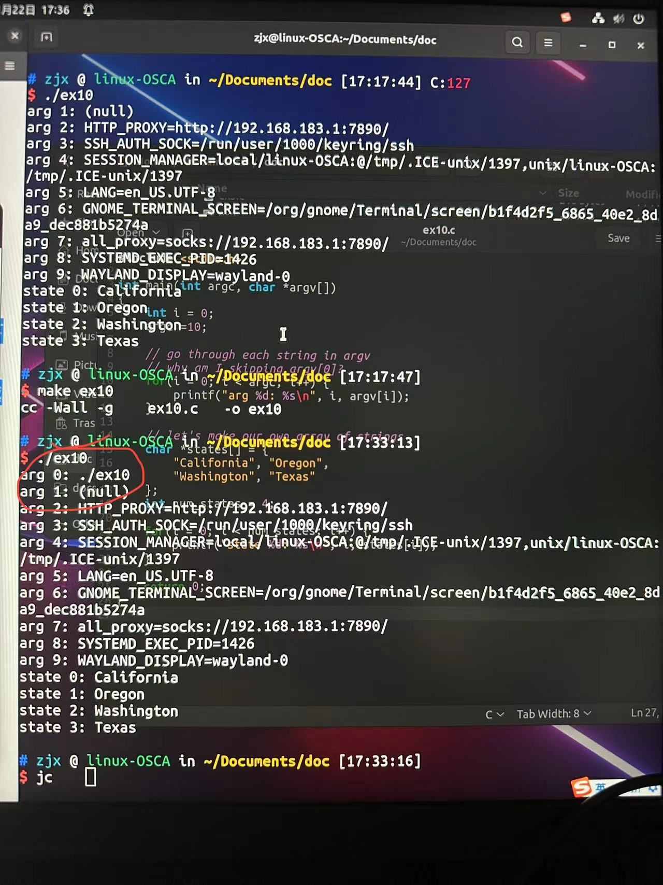

看到它所描述的文件在下标为0处存储的结果输出时，我非常激动，因为我原本并不理解它在说什么，而且给的程序如果自己不加修改，也不会有什么东西会输出。 

 ### while循环：

在这次的练习中，我明白了下面这俩的话的含义：

- OS将每个命令行参数作为字符串传入`argv`数组，<mark>程序名称`./ex10`在下标为0的位置</mark>，剩余的参数紧随其后。
- OS将`argc`置为`argv`数组中参数的数量，所以你可以遍历它们而不会越界。要记住如果你提供了一个参数，程序名称是第一个，参数应该在第二个。

```
#include <stdio.h>

int main(int argc, char *argv[])
{
    // go through each string in argv

    int i = 0;
    while(i < argc) {
        printf("arg %d: %s\n", i, argv[i]);
        i++;
    }

    // let's make our own array of strings
    char *states[] = {
        "California", "Oregon",
        "Washington", "Texas"
    };

    int num_states = 4;
    i = 0;  // watch for this
    while(i < num_states) {
        printf("state %d: %s\n", i, states[i]);
        i++;
    }

    return 0;
}

```

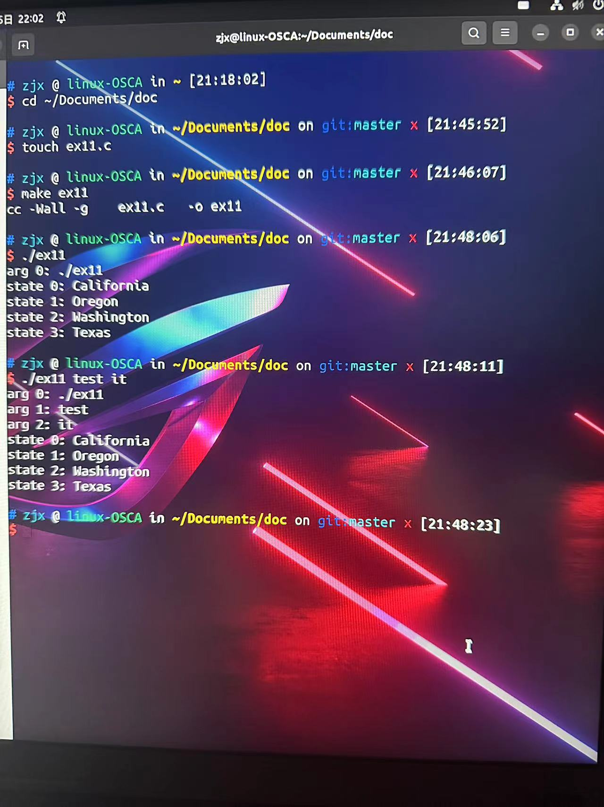

- 原来我在for循环部分就比较困惑，为什么`argc`并没有赋值，却可以使`i<argc`的条件为真，并且可以使函数正常运行，直到我看到了while循环的俩个测试与输出，我才知道它大概是如何实现的了。

- 当我输入`./ex11 test it`这时产生了3个命令行参数，然后这些命令行参数作为字符串传入了`argv`数组，分别存储在`argv[0]`,`argv[1]`,`argv[2]`当中，然后就是解释`argc`是如何得到赋值的，为什么它并没有被输入，却又不是随机数，因为它可以使程序正常运行。原来它的值就是argv数组中所有参数的总数量，这样一来，因为i与数组一样都是从0开始的，argc却是从1开始的，所以i永远小于argc，这样就会使条件为真，并且为真的次数可以用来输出所有的数组中的字符串。

布尔表达式：

在C语言中，实际上没有真正的“布尔”类型，而是用一个整数来代替，0代表`false`，其它值代表`true`。上一个练习中表达式`i < argc`实际上值为1或者0。

在本次代码中需要注意的问题：


- 忘记初始化`int i`，使循环发生错误。
- 忘记初始化第二个循环的`i`，于是`i`还保留着第一个循环结束时的值。你的第二个循环可能执行也可能不会执行。
- 忘记在最后执行`i++`自增，你会得到一个“死循环”

<mark>最后一条给我们以启发，我们可以通过使用一个恒为真的条件，来创造一个无限循环来满足我们有时候对于程序进行不断循环计算或者运行的需要，再使用

```
if（我们要的结果result）{
printf("我们要的结果%d",result);
break;
}
```

break用来跳出无限循环，举个栗子：

```
【问题描述】输入4个整数，要求按由小到大的顺序输出。
【输入形式】输入四个整数
【输出形式】输出排好序的四个数
【样例输入】3 6 -1 -34
【样例输出】-34 -1 3 6
【样例说明】没有说明性的输出
【评分标准】5个测试样例
```

以下方法也被称为冒泡排序法：

```
#include <stdio.h>
int main() {
    int a,b,c,d,e,f,g=0;
    scanf("%d%d%d%d",&a,&b,&c,&d);
    int sz[4]={a,b,c,d};
    while(1){
     for(e=0;e<3;e++){
      if(sz[e]>sz[e+1]){
      f=sz[e];
      sz[e]=sz[e+1];
      sz[e+1]=f; }}
      if(sz[0]<=sz[1]&&sz[1]<=sz[2]&&sz[2]<=sz[3])
      break;}
    while(g<=3){
     printf("%d ",sz[g]);
     g++;}
    return 0; 
}
```

### if,else if,else

我对这个语法有着特别的感觉，因为它也是那么的清新先介绍一下练习中的它，再举一个题例。

```
#include <stdio.h>

int main(int argc, char *argv[])
{
    int i = 0;

    if(argc == 1) {
        printf("You only have one argument. You suck.\n");
    } else if(argc > 1 && argc < 4) {
        printf("Here's your arguments:\n");

        for(i = 0; i < argc; i++) {
            printf("%s ", argv[i]);
        }
        printf("\n");
    } else {
        printf("You have too many arguments. You suck.\n");
    }

    return 0;
}
```

首先的if(argc == 1)就给了一个小范围，然后的else if(argc > 1 && argc < 4)就比较灵活了，其实它完全可以写成else if( **argc** < 4），它们最终会使程序运行的结果完全一致，else if( **argc** < 4）实际代表的范围是（-00，1）U(1,4)，然后再使用else代表范围[4,+00)

程序结果展示：

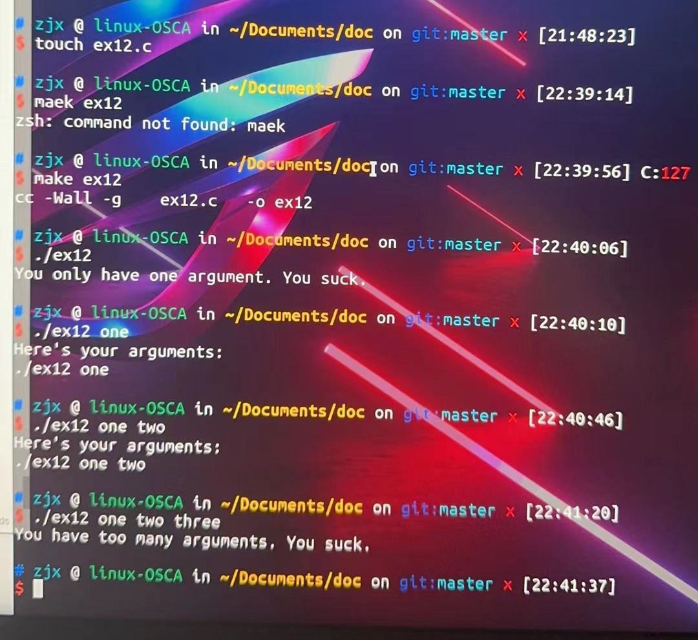

例题展示：

```
【问题描述】当前小学生的成绩单由以前的百分制改为A、B、C、D四个等级，编写程序完成分数的自动转换工作。转换规则如下：60分一下为D；60-69分为C；70-89分为B；90分以上为A。
【输入形式】70
【输出形式】B
【样例输入】95
【样例输出】A
```

```
#include <stdio.h>

int main() {
	int num;
	scanf("%d", &num);
	if (num < 60) {
		printf("D");
	} else if (num < 70) {
		printf("C");
	} else if (num < 90) {
		printf("B");
	} else {
		printf("A");
	}
	return 0;

}
```

### Switch语句:

```
#include <stdio.h>

int main(int argc, char *argv[])
{
    if(argc != 2) {
        printf("ERROR: You need one argument.\n");
        // this is how you abort a program
        return 1;
    }

    int i = 0;
    for(i = 0; argv[1][i] != '\0'; i++) {
        char letter = argv[1][i];

        switch(letter) {
            case 'a':
            case 'A':
                printf("%d: 'A'\n", i);
                break;

            case 'e':
            case 'E':
                printf("%d: 'E'\n", i);
                break;
         
                if(i > 2) {
                    // it's only sometimes Y
                    printf("%d: 'Y'\n", i);
                }
                break;

            default:
                printf("%d: %c is not a vowel\n", i, letter);
        }
    }

    return 0;
}
```

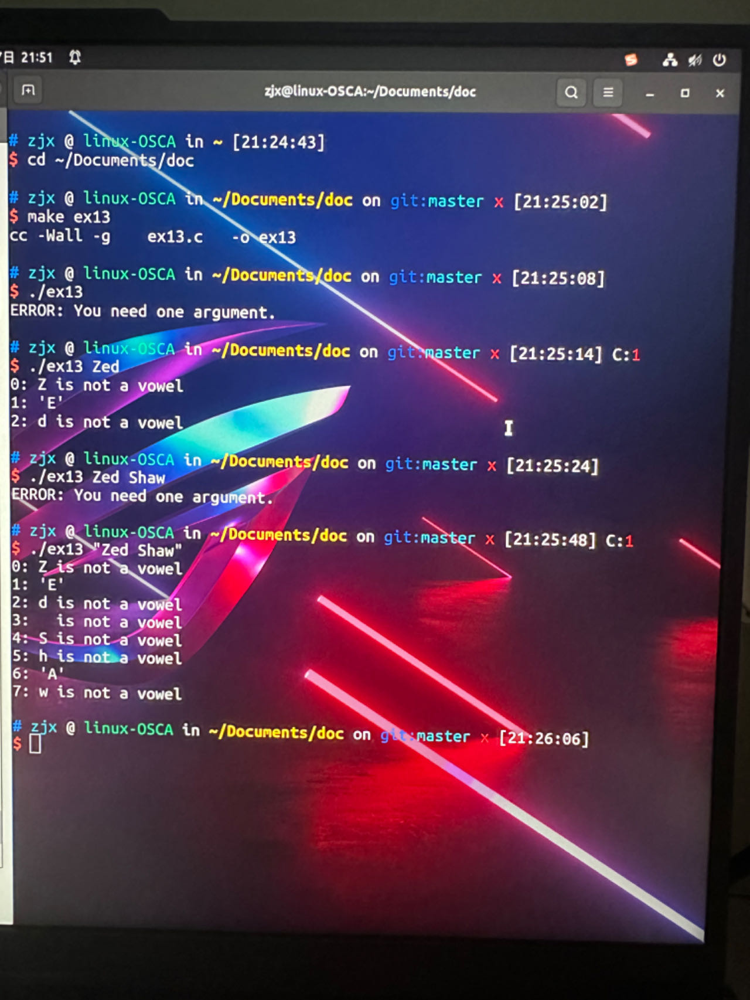

我将程序走一遍：

- 此程序从上往下走，当输入的命令行参数的个数不等于而时，就会输出一段话，让你来输入出来`./ex*`外，再输入一个命令行参数，所以输入` ./ex13 Zed Shaw`会被警告，然后就是读取`argv[1][i]`代表了从下标为1的数组中依次取出带个字母，然后再来判断是否属于元音字母(大小写都会进入），每判断完一个字母，它就会跳出Switch语句重新进入。如果不是元音会进入default，输出它不是一个元音。
- 这里利用for循环来实现每次letter的变换，有点像putchar函数。

```
char ch;
ch = putchar;
```

作者要点：

- switch实际上是一个<mark>跳转表</mark>，只能够放置结果为整数的表达式，而不是一些随机的布尔表达式，这些整数用于计算从switch顶部到匹配部分的跳转。
- switch的工作原理：

1.编译器会标记`swicth`语句的顶端，我们先把它记为地址Y。

2.接着对`switch`中的表达式求值，产生一个数字。在上面的例子中，数字为`argv[1]`中字母的原始的ASCLL码。

3.编译器也会把每个类似`case 'A'`的`case`代码块翻译成这个程序中距离语句顶端的地址，所以`case 'A'`就在`Y + 'A'`处。

4.接着计算是否`Y+letter`位于`switch`语句中，如果距离太远则会将其调整为`Y+Default`。

5.一旦计算出了地址，程序就会“跳”到代码的那个位置并继续执行。这就是一些`case`代码块中有`break`而另外一些没有的原因。

6.如果输出了`'a'`，那它就会跳到`case 'a'`，它里面没有`break`语句，所以它会贯穿执行底下带有代码和`break`的`case 'A'`。

7.最后它执行这段代码，执行`break`完全跳出`switch`语句块。

原则：

1.总是要包含一个`default:`分支，可以让你接住被忽略的输入。

2..不要允许“贯穿”执行，除非你真的想这么做，这种情况下最好添加一个`//fallthrough`的注释。

3.一定要先编写`case`和`break`，再编写其中的代码。

4.如果能够简化的话，用`if`语句代替。

### 编写并使用函数：

```
#include <stdio.h>
#include <ctype.h>

// forward declarations
int can_print_it(char ch);
void print_letters(char arg[]);

void print_arguments(int argc, char *argv[])
{
    int i = 0;

    for(i = 0; i < argc; i++) {
        print_letters(argv[i]);
    }
}

void print_letters(char arg[])
{
    int i = 0;

    for(i = 0; arg[i] != '\0'; i++) {
        char ch = arg[i];

        if(can_print_it(ch)) {
            printf("'%c' == %d ", ch, ch);
        }
    }

    printf("\n");
}

int can_print_it(char ch)
{
    return isalpha(ch) || isblank(ch);
}


int main(int argc, char *argv[])
{
    print_arguments(argc, argv);
    return 0;
}
```

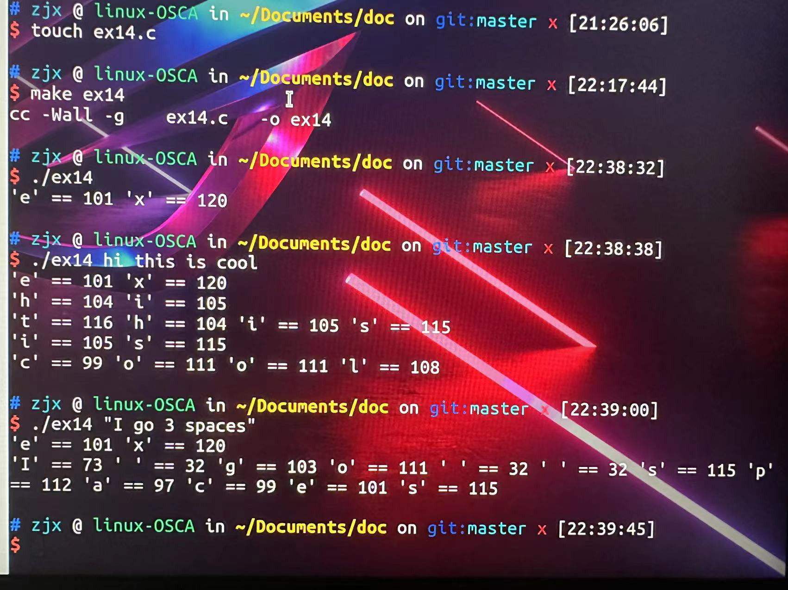

自己写一个函数大概的<mark>步骤</mark>：

类型一

1.先声明函数

2.再定义函数（本例就是如此）

3最后在主函数中进行调用

类型二

1.先声明函数

2.在主函数中进行调用

3.最后定义函数

此程序要点：

1.判断条件为函数的返回值

```
if(can_print_it(ch))    #if当中的式子为非零时，执行if当中的内容，当if当中的值为0时，不执行|也就是看can_print_it(char ch)函数的返回值是否为0
```

```
int can_print_it(char ch)
{
    return isalpha(ch) || isblank(ch);
}
```

此函数返回值为字母与空格的或运算，一真为正（返回1），全假为假（返回0）

2.测试时输入的命令行参数

```
1|./ex14 hi this is cool
```

```
2|./ex14 "I go 3 spaces"
```

为什么这俩个测试命令的结果一个有输出空格，而另一个没有呢？
因为在读取时，第一个用空格隔开共读取了5个命令行参数，而第二个共读取了2个命令行参数，双引号整体算一个命令行参数。所以第二个会逐字读取。

### 指针（哈哈，看了好几遍才理解）

```
#include <stdio.h>
 
int main(int argc, char *argv[])
{
    // create two arrays we care about
    int ages[] = {23, 43, 12, 89, 2};
    char *names[] = {
        "Alan", "Frank",
        "Mary", "John", "Lisa"
    };

    // safely get the size of ages
    int count = sizeof(ages) / sizeof(int);
    int i = 0;

    // first way using indexing
    for(i = 0; i < count; i++) {
        printf("%s has %d years alive.\n",
                names[i], ages[i]);
    }

    printf("---\n");
    // setup the pointers to the start of the arrays
    int *cur_age = ages;
    char *cur_name* = names;

    // second way using pointers
    for(i = 0; i < count; i++) {
        printf("%s is %d years old.\n",
                *(cur_name+i), *(cur_age+i));
    }
    //names[i],ages[i]

    printf("---\n");

    // third way, pointers are just arrays
    for(i = 0; i < count; i++) {
        printf("%s is %d years old again.\n",
                cur_name[i], cur_age[i]);
    }

    printf("---\n");

    // fourth way with pointers in a stupid complex way
    for(cur_name = names, cur_age = ages;
            (cur_age - ages) < count;
            cur_name++, cur_age++)
    {
        printf("%s lived %d years so far.\n",
                *cur_name, *cur_age);
    }

    return 0;
}
```

此程序以四种方式打印出了相同的输出：

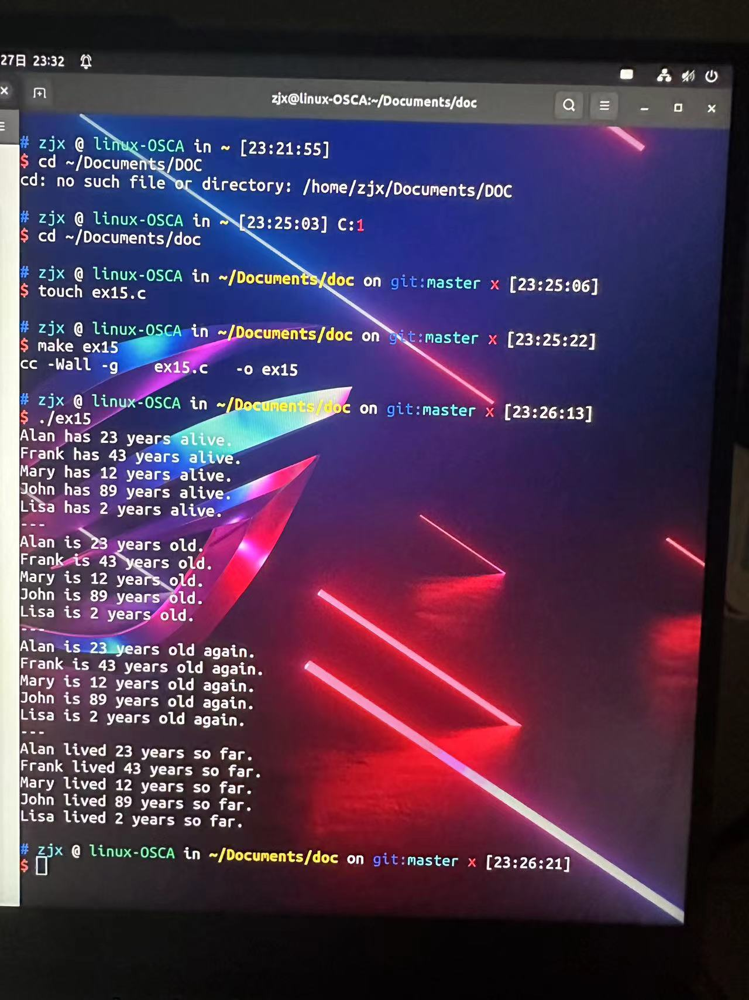

在他说“<mark>这个看似简单的程序却包含了大量的信息，其目的是在我向你讲解前尝试让你自己弄清楚指针。直到你写下你认为指针做了什么之前，不要往下阅读。</mark>”我先从头到尾看走了一遍程序，将每一步都理解了一下，尽可能地知道它们都是如何实现的了，一些比较新的地方，我也是意会了一下（比如比较抽象的数组++ ：“cur_name++”）。做完这一步后，我也是对这个程序不再陌生了，越看越熟悉（因为这里的指针与数组有着微妙的关系，指针在用着数组的语法，有时甚至只是换了一种形式来表达相同的含义）。

- sizeof(int)在64位中值为8

sizeof可以用类型做参数，strlen只能用char*做参数，且必须是以“\0”结尾的。

- `*(cur_name+i)`和`name[i]`是一样的，你应该把它读作“‘`cur_name`指针加`i`’的值”。这样就可以理解第一种与第二种本质是一样的。
- 第三种甚至可以说只是给`name`和`age`数组换了个名字一样
- 第四中就比较复杂了全部都使用指针（我有时再Frank的影响下，认为是快捷方式）来作为变量实现for中的初始化和条件判断和递增，这显然要比前三种看起来更复杂一些，但是你如果把它单纯的看作是一个变量那就非常好理解了，实际上并不是。
- 无论怎么样，你都不应该把指针和数组混为一谈。它们并不是相同的东西，即使C让你以一些相同的方法来使用它们。例如，如果你访问上面代码中的`sizeof(cur_age)`，你会得到指针的大小，而不是它指向数组的大小。如果你想得到整个数组的大小，你应该使用数组的名称`age`，就像第12行那样
- 创建了指向`names`的指针。`char *`已经是“指向`char`的指针”了，所以它只是个字符串。你需要两个层级，因为`names`是二维的，也就是说你需要`char **`作为“指向‘指向字符的指针’的指针”。

```
for(cur_age = ages;
(cur_age - ages) < count;
cur_age++;)
#cur_age为基址，然后对基址不断的实现偏移，差值分别为0 、1、2、3、4、5，因为count为5所以加到5后不再进入循环。for循环的增加部分增加了cur_name和cur_age的值，这样它们可以只想names和ages的下一个元素。
```

指针原理：

C把你的计算机看成一个庞大的字节数组。

- 在你的计算机中开辟一块内存。
- 将`ages`这个名字“指向”它的起始位置。
- 通过选取`ages`作为<mark>基址</mark>，并且获取位置为`i`的元素，来对内存块进行索引。
- 将`ages+i`处的元素转换成大小正确的有效的`int`，这样就返回了你想要的结果：下标`i`处的`int`。

现在访问数组和指针的语法都会翻译成相同的机器码，并且表现一致。由此，你应该每次尽可能使用数组，并且按需将指针用作提升性能的手段。

# 结构体

```
#include <stdio.h>
#include <assert.h>
#include <stdlib.h>
#include <string.h>

// 定义一个 Person 结构体，表示一个人的信息
struct Person {
    char *name;  // 人的姓名
    int age;     // 人的年龄
    int height;  // 人的身高
    int weight;  // 人的体重
};

// 函数声明，用于创建一个新的 Person 结构体
struct Person *Person_create(char *name, int age, int height, int weight);

// 函数声明，用于销毁一个 Person 结构体
void Person_destroy(struct Person *who);

// 函数声明，用于打印一个 Person 结构体的信息
void Person_print(struct Person *who);

int main(int argc, char *argv[])
{
    // 创建两个 Person 结构体实例
    struct Person *joe = Person_create("Joe Alex", 32, 64, 140);
    struct Person *frank = Person_create("Frank Blank", 20, 72, 180);

    // 打印它们的信息以及内存中的位置
    printf("Joe is at memory location %p:\n", joe);
    Person_print(joe);

    printf("Frank is at memory location %p:\n", frank);
    Person_print(frank);

    // 使两人都年龄增加20岁，然后再次打印它们的信息
    joe->age += 20;
    joe->height -= 2;
    joe->weight += 40;
    Person_print(joe);

    frank->age += 20;
    frank->weight += 20;
    Person_print(frank);

    // 销毁两个结构体实例，进行内存清理
    Person_destroy(joe);
    Person_destroy(frank);

    return 0;
}

// 函数定义，用于创建一个新的 Person 结构体
struct Person *Person_create(char *name, int age, int height, int weight)
{
    // 使用 malloc 分配内存来存储一个 Person 结构体的空间
    struct Person *who = malloc(sizeof(struct Person));
    assert(who != NULL);  // 检查内存分配是否成功

    // 使用 strdup 复制输入的姓名字符串，并将其分配给 Person 结构体的 name 成员
    who->name = strdup(name);

    // 将传入的年龄、身高和体重分配给相应的成员变量
    who->age = age;
    who->height = height;
    who->weight = weight;

    return who;
}

// 函数定义，用于销毁一个 Person 结构体
void Person_destroy(struct Person *who)
{
    assert(who != NULL);  // 检查结构体是否存在

    // 释放姓名字符串的内存
    free(who->name);
    
    // 释放结构体的内存
    free(who);
}

// 函数定义，用于打印一个 Person 结构体的信息
void Person_print(struct Person *who)
{
    printf("Name: %s\n", who->name);
    printf("\tAge: %d\n", who->age);
    printf("\tHeight: %d\n", who->height);
    printf("\tWeight: %d\n", who->weight);
}

```

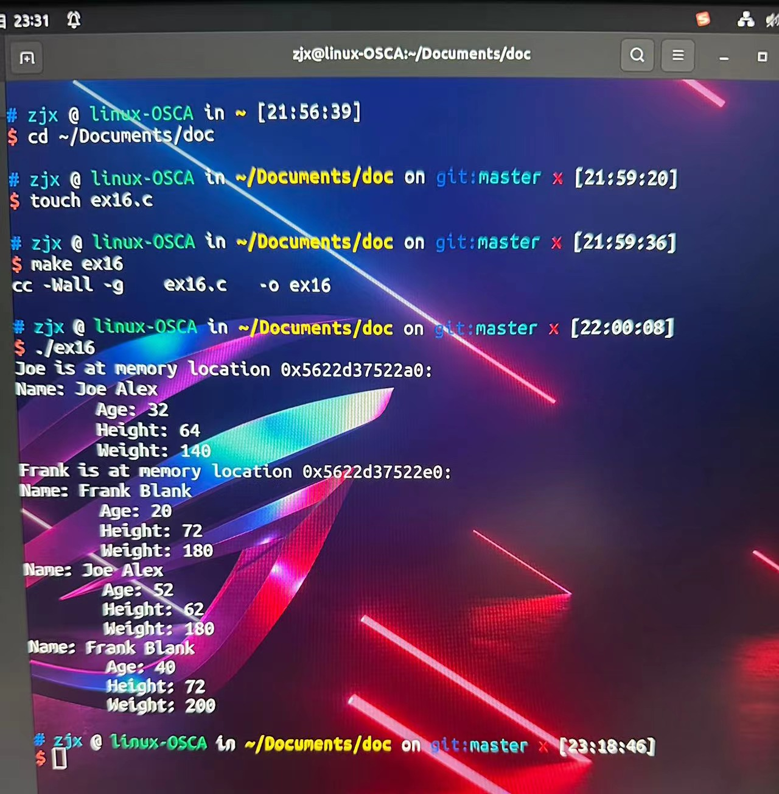

- malloc用于内存分配
- assert确保从malloc得到一块有效的内存
- NULL表示未设置或无效的指针
- asset大致检查了malloc会不会返回NULL
- x->y即（*x）.y语法来初始化struct Person的每个成员

### 12月7号补充内容：

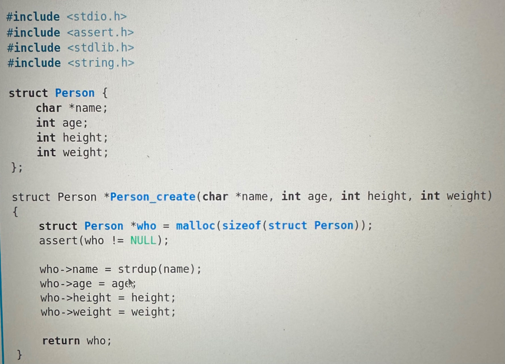

- <mark>who->name也可以用*who.name来代替</mark>（12.7）
- <mark>12月7日对终于加深了指针的原理的理解，struct Person *who = malloc(sizeof(struct Person)); #这里的*号其实就可以看作是指针pointer类型，后面是用malloc来请求的一块地址，让这个指针来指向这块内存，这块内存的大小就是`struct Person`里面包含的各个数据类型的大小的总和，一个char加上三个int.</mark>

- ```c
  struct Person *Person_create(char *name, int age, int height, int weight)   
  ```

​     这块代码其实创造了一个函数。

```c
who->name = strdup(name);
```

这块访问了name并使用strduo来使name获得name数组的内容，之所以它不想age,height,weight那样，是因为它是一个数组，本质是指针，不存在string这样字符串的数据类型，数组其实只存储了第一个字符的地址，然后通过不断的递增访问来获取剩下的内容，直到读取NULL也就是'/0'

free用来释放内存，防止内存泄漏。


结构体给我一种先创造出一个模版，然后再创造函数来使用这个模版，再然后直接调用这个函数，只需要简单输入一些参数就可以。

使用了`free`函数来交还通过`malloc`和`strdup`得到的内存。如果你不这么做则会出现“内存泄露”。

内存溢出与泄漏：

- 内存溢出 out of memory**，是指程序在申请内存时，没有足够的内存空间供其使用，出现out of memory；比如申请了一个integer,但给它存了long才能存下的数，那就是内存溢出。内存溢出就是你要求分配的内存超出了系统能给你的，系统不能满足需求，于是产生溢出。

- 内存泄漏是指你向系统申请分配内存进行使用(new)，可是使用完了以后却不归还(delete)，结果你申请到的那块内存你自己也不能再访问（也许你把它的地址给弄丢了），而系统也不能再次将它分配给需要的程序。一个盘子用尽各种方法只能装4个果子，你装了5个，结果掉倒地上不能吃了。这就是溢出！比方说栈，栈满时再做进栈必定产生空间溢出，叫上溢，栈空时再做退栈也产生空间溢出，称为下溢。就是分配的内存不足以放下数据项序列,称为内存溢出.

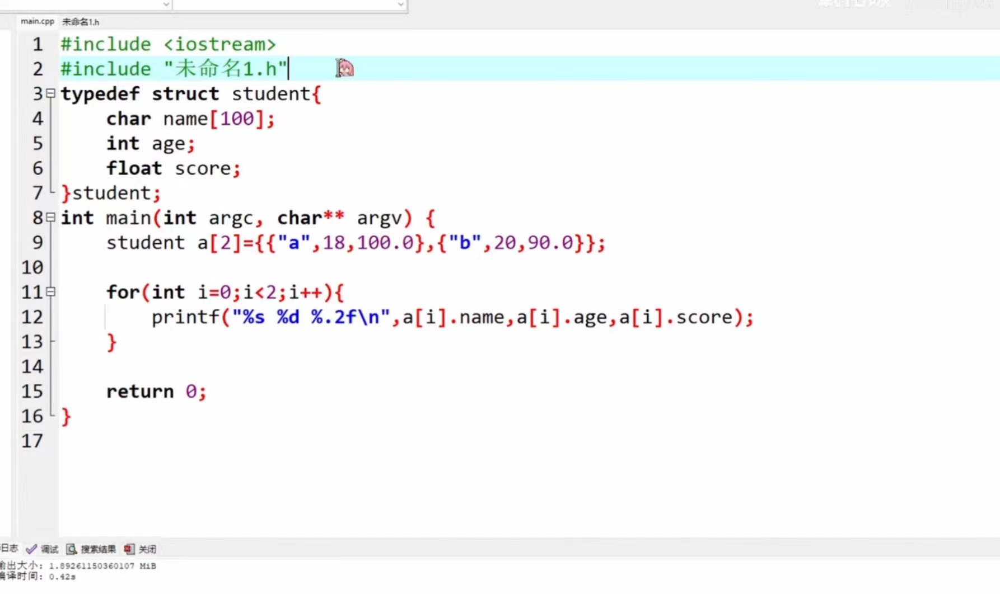

1.<mark>其实结构体就相当于一个含有多种类型的变量的变量类型，它可以声明一个变量。并且结构体具有很便利的用途，比如介绍几个学生的情况，就可以创造一个`struct student`的结构体来提供基本的介绍框架，里面包括了姓名，年龄，成绩。之后你就可以直接来使用这个模版，以上图片中的例子是声明了一个a数组，将俩个人的信息存储在这个数组当中，它的便利就体现出来了，只需要在大括号里填入对于的参数即可，如果是大于一个人只需要用逗号将俩个大括号隔开。</mark>

2.图中的typedef是用来重命名的，只需要在你需要重命名的结构体前面写下typedef，然后在结构体大括号的最后写下重命名后的名字即可。

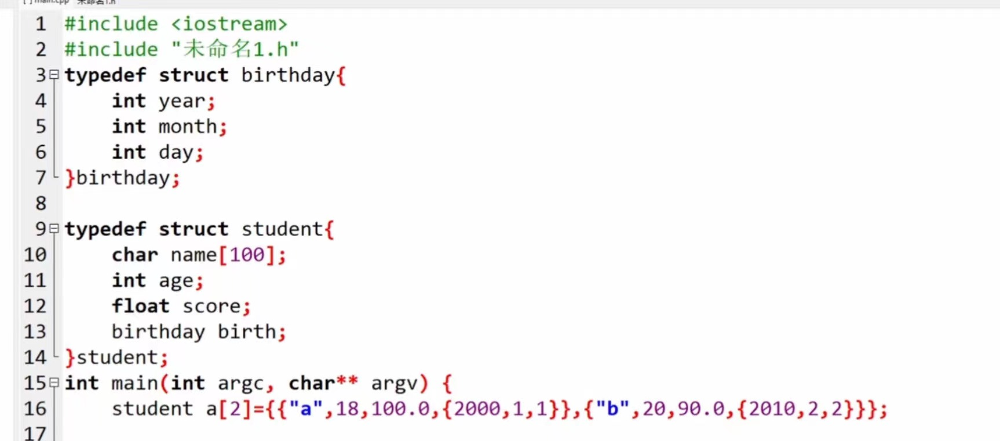

<mark>在一个结构体中甚至还可以嵌套另一个结构体，然后输入参数时只需要再加一个大括号即可!</mark>

## 堆和栈的内存分配

```
#include <stdio.h>
#include <assert.h>
#include <stdlib.h>
#include <errno.h>
#include <string.h>

#define MAX_DATA 512
#define MAX_ROWS 100

// 定义 Address 结构体，表示数据库中的一条记录
struct Address {
    int id;
    int set;
    char name[MAX_DATA];
    char email[MAX_DATA];
};

// 定义 Database 结构体，表示整个数据库
struct Database {
    struct Address rows[MAX_ROWS];
};

// 定义 Connection 结构体，表示与数据库的连接
struct Connection {
    FILE *file;
    struct Database *db;
};

// 函数声明，用于打印错误信息并退出程序
void die(const char *message);

// 函数声明，用于打印一条记录
void Address_print(struct Address *addr);

// 函数声明，用于加载数据库内容
void Database_load(struct Connection *conn);

// 函数声明，用于打开数据库连接
struct Connection *Database_open(const char *filename, char mode);

// 函数声明，用于关闭数据库连接
void Database_close(struct Connection *conn);

// 函数声明，用于写入数据库内容
void Database_write(struct Connection *conn);

// 函数声明，用于创建数据库
void Database_create(struct Connection *conn);

// 函数声明，用于设置数据库中的一条记录
void Database_set(struct Connection *conn, int id, const char *name, const char *email);

// 函数声明，用于获取数据库中的一条记录
void Database_get(struct Connection *conn, int id);

// 函数声明，用于删除数据库中的一条记录
void Database_delete(struct Connection *conn, int id);

// 函数声明，用于列出数据库中所有的记录
void Database_list(struct Connection *conn);

int main(int argc, char *argv[])
{
    // 检查命令行参数是否足够
    if (argc < 3) die("USAGE: ex17 <dbfile> <action> [action params]");

    // 从命令行参数获取数据库文件名和操作类型
    char *filename = argv[1];
    char action = argv[2][0];
    struct Connection *conn = Database_open(filename, action);
    int id = 0;

    // 如果有额外的参数，将其解析为记录的 ID
    if (argc > 3) id = atoi(argv[3]);
    if (id >= MAX_ROWS) die("There's not that many records.");

    // 根据操作类型执行相应的操作
    switch (action) {
        case 'c':
            Database_create(conn);
            Database_write(conn);
            break;

        case 'g':
            if (argc != 4) die("Need an id to get");

            Database_get(conn, id);
            break;

        case 's':
            if (argc != 6) die("Need id, name, email to set");

            Database_set(conn, id, argv[4], argv[5]);
            Database_write(conn);
            break;

        case 'd':
            if (argc != 4) die("Need id to delete");

            Database_delete(conn, id);
            Database_write(conn);
            break;

        case 'l':
            Database_list(conn);
            break;
        default:
            die("Invalid action, only: c=create, g=get, s=set, d=del, l=list");
    }

    // 关闭数据库连接
    Database_close(conn);

    return 0;
}

// 函数定义，用于打印错误信息并退出程序
void die(const char *message)
{
    // 如果 errno 设置，使用 perror 打印详细错误信息，否则只打印错误信息
    if (errno) {
        perror(message);
    } else {
        printf("ERROR: %s\n", message);
    }

    // 退出程序
    exit(1);
}

// 函数定义，用于打印一条记录
void Address_print(struct Address *addr)
{
    printf("%d %s %s\n", addr->id, addr->name, addr->email);
}

// 函数定义，用于加载数据库内容
void Database_load(struct Connection *conn)
{
    int rc = fread(conn->db, sizeof(struct Database), 1, conn->file);
    if (rc != 1) die("Failed to load database.");
}

// 函数定义，用于打开数据库连接
struct Connection *Database_open(const char *filename, char mode)
{
    // 分配 Connection 结构体的内存
    struct Connection *conn = malloc(sizeof(struct Connection));
    if (!conn) die("Memory error");

    // 分配 Database 结构体的内存
    conn->db = malloc(sizeof(struct Database));
    if (!conn->db) die("Memory error");

    // 根据打开模式选择打开文件
    if (mode == 'c') {
        conn->file = fopen(filename, "w");
    } else {
        conn->file = fopen(filename, "r+");

        if (conn->file) {
            // 如果是读写模式，加载数据库内容
            Database_load(conn);
        }
    }

    // 检查文件是否成功打开
    if (!conn->file) die("Failed to open the file");

    return conn;
}

// 函数定义，用于关闭数据库连接
void Database_close(struct Connection *conn)
{
    // 检查 Connection 结构体是否存在
    if (conn) {
        // 如果文件存在，关闭文件
        if (conn->file) fclose(conn->file);
        // 如果数据库结构体存在，释放内存
        if (conn->db) free(conn->db);
        // 释放 Connection 结构体的内存
        free(conn);
    }
}

// 函数定义，用于写入数据库内容
void Database_write(struct Connection *conn)
{
    // 将文件指针定位到文件开头
    rewind(conn->file);

    // 将整个数据库结构体写入文件
    int rc = fwrite(conn->db, sizeof(struct Database), 1, conn->file);
    if (rc != 1) die("Failed to write database.");

    // 刷新文件缓冲区
    rc = fflush(conn->file);
    if (rc == -1) die("Cannot flush database.");
}

// 函数定义，用于创建数据库
void Database_create(struct Connection *conn)
{
    int i = 0;

    // 遍历数据库中的所有记录，初始化为未设置状态
    for (i = 0; i < MAX_ROWS; i++) {
        // 创建 Address 结构体的原型以进行初始化
        struct Address addr = {.id = i, .set = 0};
        // 直接赋值
        conn->db->rows[i] = addr;
    }

```

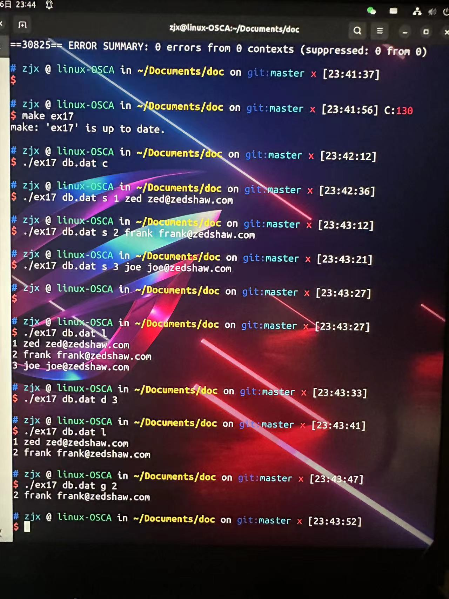

1.调用了`malloc`就是堆，其它的是静态分配，或者栈。

2.当你将一个结构体传入到函数中，如果你不使用指针，直接传入完整的结构体，结构体就可以取代一部分函数调用栈，这意味着它会使用更多空间，而且需要被拷贝到栈中。

3.在创建Database时使用堆传递需要再各处共享的东西。

4.数据库里边不是一个指针，里边其实有一个完整的地址元素数组`struct Database {structure Address rows[MAX_ROWS]}`MAX_ROWS是100，就会有100个地址，每个地址有512大小的字符和512大小的email,也就是100*512，再加上俩个int，这是很大的一块内存数据。

5.嵌套结构体指针

```
db->conn->row + i
```

它读作“读取`db`中的`conn`中的`rows`的第`i`个元素

6.`die`函数

```
void die(const char *message)
{
    // 检查全局变量 errno 是否被设置
    if(errno) {
        // 如果 errno 被设置，使用 perror 打印错误消息和描述
        perror(message);
    } else {
        // 如果 errno 没有被设置，直接打印错误消息
        printf("ERROR: %s\n", message);
    }

    // 退出程序，状态码为1，表示发生了错误
    exit(1);
}
```

`const char *message`：这是一个指向字符串的指针，表示要打印的错误消息。

`if(errno)`：检查全局变量` errno` 是否被设置。`errno` 是一个在标准库中定义的全局变量，它在发生错误时被设置为一个特定的错误码。如果` errno` 被设置，说明发生了错误。

`perror(message)：`如果 `errno` 被设置，`perror `函数会打印一个描述错误的消息，然后打印 message 参数指向的字符串。这样可以提供更详细的错误信息。`perror` 函数根据` errno `的值查找相应的错误描述，并将其打印到标准错误流`(stderr)`。

else 块：如果 `errno` 没有被设置，表示错误消息不需要更详细的描述，直接使用 `printf` 打印传入的 message 字符串。

exit(1)：无论是通过 `perror `还是` printf `打印错误消息，都会导致程序退出。exit(1) 用于终止程序的执行，状态码为1，表示发生了错误。

这个 die 函数的设计使得在程序遇到错误时能够方便地打印错误消息并退出程序，同时提供了可选的详细错误描述。

## 函数指针

```
typedef int (*compare_cb)(int a, int b);

int *bubble_sort(int *numbers, int count, compare_cb cmp)
{
    // ...
    if(cmp(target[j], target[j+1]) > 0) {
        // ...
    }
    // ...
}

void test_sorting(int *numbers, int count, compare_cb cmp)
{
    // ...
    int *sorted = bubble_sort(numbers, count, cmp);
    // ...
}

```

- 1.在这里，`compare_cb` 是一个函数指针类型，它可以指向一个以两个整数为参数并返回整数的比较函数。`bubble_sort` 函数接受一个比较函数作为参数，并在排序过程中调用这个比较函数。`test_sorting` 函数也接受一个比较函数，并在测试排序时调用。

  通过这种方式，你可以灵活地指定排序过程中使用的比较方式，而不必修改排序算法的实现。这样的设计使得代码更具可复用性和可扩展性。

- 2.`compare_cb cmp` 是在函数参数列表中定义的一个参数，其中 `compare_cb` 是一个类型，而 `cmp` 是该类型的一个实例（函数指针）。这里使用 `cmp` 的目的是通过这个函数指针来调用比较函数。

  具体来说：

  `compare_cb` 是一个函数指针类型的别名，它可以指向以两个整数为参数并返回整数的函数。
  `cmp` 是作为参数传递进来的具体的比较函数，可以是 `sorted_order`、`reverse_order` 或 `strange_order` 中的任何一个，因为它们都符合 `compare_cb` 类型的定义。
  这种方式允许你在调用 bubble_sort 函数时灵活地指定不同的比较函数，而不需要修改 bubble_sort 的实现。这是 C 语言中使用函数指针来实现回调的一种常见用法。

```
if(cmp(target[j], target[j+1]) > 0) {
    // ...
}
```

- 3.`cmp` 是一个函数指针，指向一个用于比较两个整数的比较函数。这个函数接受两个整数参数，然后返回一个整数值，表示它们的相对顺序。

  `target[j]` 和 `target[j+1]` 是数组中相邻的两个元素。

  `cmp(target[j], target[j+1]) `调用了比较函数，将两个相邻元素的值传递给比较函数进行比较。

  `if(cmp(target[j], target[j+1]) > 0) `检查比较函数的返回值是否大于0。如果返回值大于0，表示 `target[j]` 大于 `target[j+1]`，那么需要进行交换，以实现升序排序。

  整个 if 语句表示：如果比较函数返回的结果表明 `target[j]` 大于 `target[j+1]`，那么执行相关的交换操作，以便将较大的元素移动到数组的右侧。这就是冒泡排序算法的核心部分，通过多次迭代，不断比较和交换相邻的元素，实现整个数组的排序。

### 4.“回调” :

向其他函数传递“回调”是一种常见的编程模式，它允许你将一个函数作为参数传递给另一个函数，使得另一个函数能够调用这个传递进来的函数。这种做法通常用于实现灵活的、可定制的行为，尤其是在涉及到事件处理、排序、过滤或其他需要在运行时决定的情境中。

在C语言中，回调通常通过函数指针来实现。函数指针是指向函数的指针，允许你在运行时动态地选择要调用的函数。

5.利用非运算符将假变为真，来打印错误原因

```
int *target = malloc(count * sizeof(int));
if (!target) die("Memory error.");
```

target 是一个指向动态分配内存的指针（通过 `malloc` 分配的内存）。在 C 语言中，如果动态内存分配失败，`malloc `将返回一个空指针（`NULL`）。

if (!target) 意味着如果 target 是空指针，即动态内存分配失败，条件成立。! 是逻辑非运算符，将空指针转换为真，因此条件成立表示发生了内存分配错误。

die("Memory error."); 是在发生内存分配错误时调用的函数。die 函数是你提供的一个用于处理错误的函数。它打印错误消息并终止程序运行，确保在发生内存错误时能够进行适当的处理。

因此，这行代码的含义是：如果动态分配内存失败（target 是空指针），则打印 "Memory error." 错误消息并终止程序运行。这是一种常见的处理动态内存分配错误的方式。

6.`memcpy`复制函数

```
int count = argc - 1;
memcpy(target, numbers, count * sizeof(int));
```

- `memcpy` 是 C 标准库中的一个函数，用于内存块的复制。它的原型是` void *memcpy(void *dest, const void *src, size_t n);`，其中 `dest` 是目标内存地址，`src` 是源内存地址，n 是要复制的字节数。

- `target` 是目标内存地址，即要将数据复制到的位置。

- `numbers` 是源内存地址，即要从中复制数据的位置。

- `count * sizeof(int)` 表示要复制的字节数。`count` 是数组中元素的数量，`sizeof(int) `是一个 int 类型的元素占用的字节数。因此，`count * sizeof(int)` 表示整个数组的字节数。

- 因此，这行代码的含义是：将从 numbers 数组开始的一段内存块（总共 `count * sizeof(int) `字节）复制到` target `数组开始的位置。这通常用于初始化一个新的数组，使其包含与另一个数组相同的数据。

7.测试排序的函数

```
void test_sorting(int *numbers, int count, compare_cb cmp)
{
    // 用 bubble_sort 函数对数组进行排序，返回排序后的数组
    int *sorted = bubble_sort(numbers, count, cmp);

    // 检查排序结果是否成功
    if (!sorted) {
        die("Failed to sort as requested.");
    }

    // 打印排序后的数组
    for (int i = 0; i < count; i++) {
        printf("%d ", sorted[i]);
    }
    printf("\n");

    // 释放排序后的数组占用的内存
    free(sorted);
}
```

`bubble_sort(numbers, count, cmp)：`调用 `bubble_sort` 函数，对传入的 `numbers` 数组进行排序。`cmp` 参数是一个函数指针，用于指定排序的比较方式。

`int *sorted = ...：`将排序后的数组保存在 `sorted` 指针中。

`if (!sorted)：`检查排序是否成功。如果 `sorted` 是空指针，表示排序失败，调用 die 函数打印错误消息并终止程序。

`for (int i = 0; i < count; i++)：`遍历排序后的数组，并使用 `printf` 打印每个元素。

`free(sorted)：`释放排序后的数组占用的内存，以避免内存泄漏。

这个函数的目的是通过调用 `bubble_sort` 对输入的数组进行排序，然后打印排序后的结果。如果排序失败（例如，由于内存分配问题），则程序会终止并打印错误消息。这是一个通用的测试排序函数，可以用于测试不同的排序算法和不同的比较方式。

### 8.如何实现的以从小到大，从大到小，和以奇怪的方式排列

整个程序通过使用冒泡排序算法实现了升序和降序排序。冒泡排序是一种简单的排序算法，它多次遍历要排序的列表，依次比较相邻的两个元素，如果它们的顺序不符合要求（升序或降序），则交换它们，直到整个列表排序完成。

以下是冒泡排序的核心部分，即 bubble_sort 函数的关键代码：

```
int *bubble_sort(int *numbers, int count, compare_cb cmp)
{
    int temp = 0;
    int i = 0;
    int j = 0;
    int *target = malloc(count * sizeof(int));

    if (!target) die("Memory error.");

    memcpy(target, numbers, count * sizeof(int));

    for (i = 0; i < count; i++) {
        for (j = 0; j < count - 1; j++) {
            if (cmp(target[j], target[j + 1]) > 0) {
                temp = target[j + 1];
                target[j + 1] = target[j];
                target[j] = temp;
            }
        }
    }

    return target;
}
```

`cmp` 参数是一个函数指针，用于指定比较两个元素的规则，即升序排序的规则或降序排序的规则。

内部的嵌套循环用于多次遍历数组，比较并交换相邻的元素，直到整个数组有序。

`if (cmp(target[j], target[j + 1]) > 0)` 表示如果按照比较规则 `cmp`，target[j] 大于 `target[j + 1]`，则进行交换，从而实现升序或降序排序。

整个程序在调用 `test_sorting` 函数时，<mark>传递了不同的比较函数参数（sorted_order 或 reverse_order），从而在打印排序结果时实现了升序或降序排序。</mark>

那么什么是比较函数呢？它到底是如何影响的排序呢？

在这个程序中，通过传递不同的比较函数参数，影响到了排序算法的行为。这是因为排序算法需要知道如何比较两个元素的大小以确定它们的相对顺序。

具体来说，影响排序结果的是在 `bubble_sort` 函数中的比较部分，即以下代码：

```
if (cmp(target[j], target[j + 1]) > 0) {
    temp = target[j + 1];
    target[j + 1] = target[j];
    target[j] = temp;
}
```

```
test_sorting(numbers, count, sorted_order);   // 升序排序
test_sorting(numbers, count, reverse_order);  // 降序排序
```

```
int sorted_order(int a, int b)
{return a - b;}
int reverse_order(int a, int b)
{return b - a;}
```

最具体一点就是`if (cmp(target[j], target[j + 1]) > 0)`,你可以看到这是一个条件，其中的`target[j]`就代表了比较函数中的参数`a`,同理`target[j+1]`代表了`b`,那么假设使用了`sorted_order`升序排序，你会发现，如果用`a-b`大于0，返回正数，那么这个条件就会为真，那么就会进行换位，从而实现了从小到大的排序结果。

这里的 `cmp` 是一个函数指针，指向一个比较函数。该比较函数根据特定的规则返回一个整数值，表示两个元素的相对顺序。具体而言：

如果比较函数返回正数，表示第一个元素大于第二个元素。
如果比较函数返回负数，表示第一个元素小于第二个元素。
如果比较函数返回零，表示两个元素相等。
因此，通过传递不同的比较函数，可以改变排序算法中的比较规则，从而实现升序、降序或其他特定的排序方式。

## C预处理器如何工作

### 1.`OOP`语言：

`"OOP"` 代表面向对象编程（Object-Oriented Programming）。`OOP` 是一种程序设计范 `paradigma`，它将程序的结构组织为对象，每个对象包含数据和与之相关的操作。面向对象编程强调对象的概念，它们是程序中的基本单元，可以封装数据和行为。

主要的面向对象编程的特征包括：

封装（Encapsulation）： 封装是指将数据和操作数据的方法捆绑在一起，形成一个单独的单元。这样，对象的内部细节对外部是不可见的，只有通过对象的公共接口才能访问对象的功能。

继承（Inheritance）： 继承是一种机制，允许一个对象（子类/派生类）基于另一个对象（父类/基类）进行构建。子类可以继承父类的属性和方法，并且可以通过扩展或修改继承的功能。

多态（Polymorphism）： 多态性是指同一种操作可以在不同的对象上有不同的行为。它允许使用同样的方法名调用不同对象的方法，具体执行的方法由对象的实际类型决定。

主要的面向对象编程语言包括：

`Java`： 一种跨平台的面向对象编程语言，广泛用于企业级应用和移动应用开发。

`C++`： 是C语言的扩展，支持面向对象编程和一些其他特性。

`C#`： 由Microsoft开发，专门为.NET平台设计，支持面向对象编程。

`Python`： 一种通用编程语言，支持多种编程范 paradigma，包括面向对象编程。

`Ruby`： 一种动态、面向对象的编程语言，注重简洁和开发人员的幸福感。

`Swift`： 由Apple开发，用于`iOS`和`MacOS`应用程序开发，支持面向对象编程。

面向对象编程有助于提高代码的可重用性、可维护性和扩展性，使得软件开发更加灵活和模块化。

### 2.`Object`头文件结构

```
#ifndef _object_h
#define _object_h

// 枚举类型表示方向
typedef enum {
    NORTH, SOUTH, EAST, WEST
} Direction;

// 定义通用的 Object 结构
typedef struct {
    char *description;
    int (*init)(void *self);         // 初始化方法
    void (*describe)(void *self);    // 描述方法
    void (*destroy)(void *self);      // 销毁方法
    void *(*move)(void *self, Direction direction);  // 移动方法
    int (*attack)(void *self, int damage);          // 攻击方法
} Object;

// Object 结构的初始化方法
int Object_init(void *self);

// Object 结构的销毁方法
void Object_destroy(void *self);

// Object 结构的描述方法
void Object_describe(void *self);

// Object 结构的移动方法
void *Object_move(void *self, Direction direction);

// Object 结构的攻击方法
int Object_attack(void *self, int damage);

// 创建新的 Object 实例的函数
void *Object_new(size_t size, Object proto, char *description);

// 宏定义，用于创建新的 Object 实例
#define NEW(T, N) Object_new(sizeof(T), T##Proto, N)
#define _(N) proto.N

#endif
```

`Direction` 枚举类型定义了四个方向：`NORTH`、`SOUTH`、`EAST`、`WEST`。

`Object` 结构定义了一个通用的对象，包含了一些通用的属性和方法。这是一个泛型的框架，实际的对象可以通过继承这个框架来实现自己的特定行为。

定义了一些函数指针作为 `Object` 结构中的方法，例如 `init`、`describe`、`destroy`、`move`、`attack`。

提供了一些操作 `Object` 结构的函数，如初始化、销毁、描述、移动、攻击等。

`Object_new` 函数用于创建新的 `Object` 实例，接受实例的大小、原型（`proto`）、描述信息为参数。

NEW 宏用于创建新的对象实例，它接受类型（T）和描述信息（N），并调用 `Object_new` 函数。

`_(N)` 宏用于获取原型中的成员。这里假定 `proto` 是一个 Object 结构的实例。

总体来说，这个框架提供了一个简单的面向对象的结构，可以作为其他对象的基础。在创建实例时，通过调用 NEW 宏，可以方便地初始化对象并获取实例。

### 3.`enum`(枚举)

枚举是 C 语言中的一种基本数据类型，用于定义一组具有离散值的常量，它可以让数据更简洁，更易读。

枚举类型通常用于为程序中的一组相关的常量取名字，以便于程序的可读性和维护性。

定义一个枚举类型，需要使用 `enum` 关键字，后面跟着枚举类型的名称，以及用大括号 {} 括起来的一组枚举常量。每个枚举常量可以用一个标识符来表示，也可以为它们指定一个整数值，如果没有指定，那么默认从 0 开始递增。

枚举语法定义格式为：

```
enum　枚举名　{枚举元素1,枚举元素2,……};
```

4.枚举类型别名：

Direction 枚举类型别名：

```
typedef enum {
    NORTH, SOUTH, EAST, WEST
} Direction;
```

这里使用 typedef 定义了一个新的类型别名 Direction，它代表了一个枚举类型，包含了四个方向。之后，你可以直接使用 Direction 来声明变量，而不必写出完整的 `enum` 定义。

Object 结构类型别名：

```
typedef struct {
    char *description;
    int (*init)(void *self);
    void (*describe)(void *self);
    void (*destroy)(void *self);
    void *(*move)(void *self, Direction direction);
    int (*attack)(void *self, int damage);
} Object;
```

同样地，这里使用 typedef 定义了一个新的类型别名 Object，它代表了一个结构体类型，包含了描述、初始化、描述、销毁、移动和攻击等属性和方法。之后，你可以直接使用 Object 来声明变量，而不必写出完整的结构体定义。

typedef 的主要作用是提高代码的可读性和可维护性，通过引入更具表达性的名称，使代码更加清晰。在这个代码中，使用 typedef 让枚举类型和结构体类型的声明更加简洁，使代码更易理解。

5.`object`结构体:

```
typedef struct {
    char *description;
    int (*init)(void *self);
    void (*describe)(void *self);
    void (*destroy)(void *self);
    void *(*move)(void *self, Direction direction);
    int (*attack)(void *self, int damage);
} Object;
```

这结构体定义了一个名为 Object 的数据结构，该结构体包含了一些成员变量和函数指针，用于表示一个通用的对象。让我们逐个解释这些成员：

description（描述）:

类型：char *
说明：这是一个指向字符数组（C 字符串）的指针，用于存储对象的描述信息。
`init`（初始化函数指针）:

类型：int (*)(void *self)
说明：这是一个指向函数的指针，该函数接受一个指向对象自身的指针 void *self，返回一个整数。这通常用于对象的初始化。
describe（描述函数指针）:

类型：void (*)(void *self)
说明：这是一个指向函数的指针，该函数接受一个指向对象自身的指针 void *self，并返回 void。这通常用于描述对象的信息。
destroy（销毁函数指针）:

类型：void (*)(void *self)
说明：这是一个指向函数的指针，该函数接受一个指向对象自身的指针 void *self，并返回 void。这通常用于释放对象占用的资源。
move（移动函数指针）:

类型：void *(*)(void *self, Direction direction)
说明：这是一个指向函数的指针，该函数接受一个指向对象自身的指针 void *self 和一个方向参数 Direction direction，并返回一个指向 void 的指针。这通常用于实现对象的移动。
attack（攻击函数指针）:

类型：int (*)(void *self, int damage)
说明：这是一个指向函数的指针，该函数接受一个指向对象自身的指针 void *self 和一个伤害参数 int damage，并返回一个整数。这通常用于实现对象的攻击功能。
这个结构体的设计是为了提供一个通用的对象模型，其中包括了常见的初始化、描述、销毁、移动和攻击等功能。通过使用函数指针，可以在运行时将具体的实现绑定到这些功能上，使得这个对象模型更加灵活和可扩展。

6.`C`预处理器

C预处理器的工作原理是，如果你给它一个文件，比如`.c`文件，它会处理以`#`（井号）字符开头的各种文本。当它遇到一个这样的文本时，它会对输入文件中的文本做特定的替换。C预处理器的主要优点是他可以包含其他文件，并且基于该文件的内容对它的宏列表进行扩展。

```
#ifndef _object_h
#define _object_h
```

`#ifndef _object_h` 表示 "if not defined"，如果 _object_h 这个宏没有被定义过，那么执行接下来的代码。
`#define _object_h` 定义了宏 _object_h，这样下次再遇到 `#ifndef _object_h` 的时候，就会发现 _object_h 已经定义了，就会跳过后面的代码，从而防止重复定义。
最后的 `#endif `表示条件编译的结束。
这个机制保证了头文件只会被包含一次，避免了重复定义的问题。每个头文件都应该使用类似的头文件保护机制，以确保在编译时不会出现问题。

### 实现游戏（激动激动激动！）来之不易：

在练习19中整个示例程序是一个游戏程序，你需要创建5个文件来实现这个游戏：分别是`object.h`、`obejct.c`、`ex19.h`、`ex19.c`、`Makefile`

- 第一个难点是你需要知道里面分别要写入哪些代码（这个并不是太难）。

- 第二个难点是，你将这些代码都写入了对应的文件后，你会发现有报错，你会想不通，因为你写入的代码都是复制过来的并没有错误，也分别写入了对应的文件名当中了啊！

<mark>其实你可以搜一下它给你的报错，它会告诉你这个错误通常是由于 Makefile 中使用了不正确的缩进方式引起的。</mark>

这时你可以检查一下Makefile文件：

```
1|CFLAGS=-Wall -g
2|all: ex19
3|ex19: object.o
4|	cc $(CFLAGS) ex19.c object.o -o ex19
clean:
5|	rm -f ex19
```

没错就是第4行和第5行的缩进有问题，你应该都使用tab键来进行缩进！

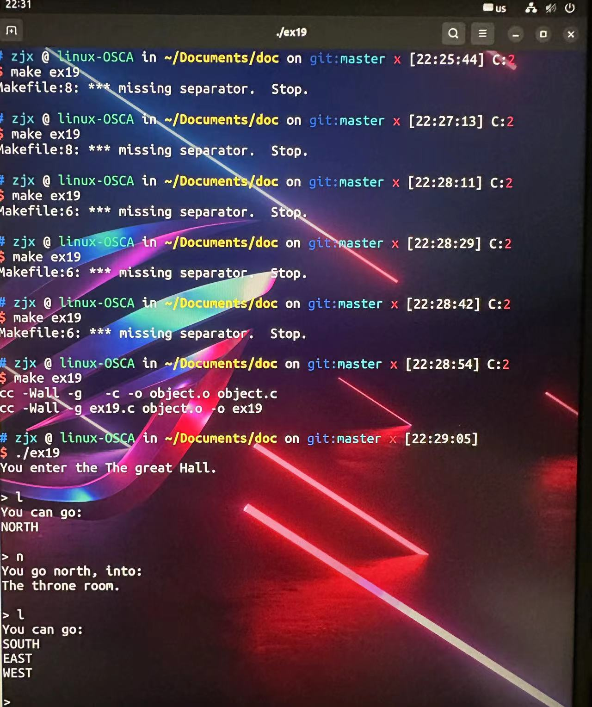

有图有真相，可以看出我被报错了好多次，当我最后能够通过5个文件实现游戏的时候，也是非常的激动！

## 调试宏

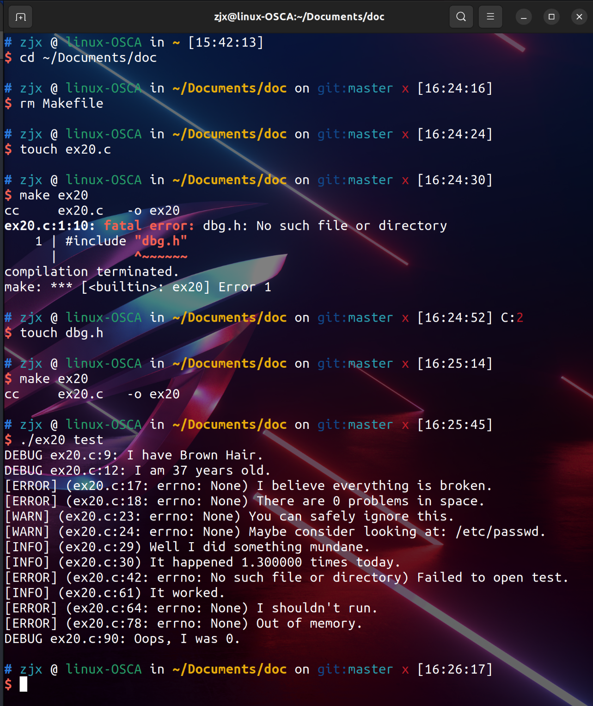（前言 )C的错误处理问题:

C通过返回错误码或设置全局的`errno`值来解决这些问题，并且你需要检查这些值。这种机制可以检查现存的复杂代码中，你执行的东西是否发生错误。当你编写更多的C代码时，你应该按照下列模式：

- 调用函数。
- 如果返回值出现错误（每次都必须检查）。
- 清理创建的所有资源。
- 打印出所有可能有帮助的错误信息。

这意味着对于每一个函数调用（是的，每个函数）你都可能需要多编写3~4行代码来确保它正常功能。这些还不包括清理你到目前创建的所有垃圾。如果你有10个不同的结构体，3个方式。和一个数据库链接，当你发现错误时你应该写额外的14行。

之前这并不是个问题，因为发生错误时，C程序会像你以前做的那样直接退出。你不需要清理任何东西，因为OS会为你自动去做。然而现在很多C程序需要持续运行数周、数月或者数年，并且需要优雅地处理来自于多种资源的错误。你并不能仅仅让你的服务器在首次运行就退出，你也不能让你写的库使使用它的程序退出。这非常糟糕。

它语言通过异常来解决这个问题，但是这些问题也会在C中出现（其它语言也一样）。在C中你只能够返回一个值，但是异常是基于栈的返回系统，可以返回任意值。C语言中，尝试在栈上模拟异常非常困难，并且其它库也不会兼容。

调试宏（主角）：

以上问题的解决方案->使用一系列“调试宏”，它们在C中实现了基本的调试和错误处理系统。这个系统非常易于理解，兼容于每个库，并且使C代码更加健壮和简洁。

它通过实现一系列转换来处理错误，任何时候发生了错误，你的函数都会跳到执行清理和返回错误代码的“error:”区域。你可以使用`check`宏来检查错误代码，打印错误信息，然后跳到清理区域。你也可以使用一系列日志函数来打印出有用的调试信息。

现在展示目前所见过的，最强大且卓越的代码的全部内容:

```
#ifndef __dbg_h__
#define __dbg_h__

#include <stdio.h>
#include <errno.h>
#include <string.h>

#ifdef NDEBUG
#define debug(M, ...)
#else
#define debug(M, ...) fprintf(stderr, "DEBUG %s:%d: " M "\n", __FILE__, __LINE__, ##__VA_ARGS__)
#endif

#define clean_errno() (errno == 0 ? "None" : strerror(errno))

#define log_err(M, ...) fprintf(stderr, "[ERROR] (%s:%d: errno: %s) " M "\n", __FILE__, __LINE__, clean_errno(), ##__VA_ARGS__)

#define log_warn(M, ...) fprintf(stderr, "[WARN] (%s:%d: errno: %s) " M "\n", __FILE__, __LINE__, clean_errno(), ##__VA_ARGS__)

#define log_info(M, ...) fprintf(stderr, "[INFO] (%s:%d) " M "\n", __FILE__, __LINE__, ##__VA_ARGS__)

#define check(A, M, ...) if(!(A)) { log_err(M, ##__VA_ARGS__); errno=0; goto error; }

#define sentinel(M, ...)  { log_err(M, ##__VA_ARGS__); errno=0; goto error; }

#define check_mem(A) check((A), "Out of memory.")

#define check_debug(A, M, ...) if(!(A)) { debug(M, ##__VA_ARGS__); errno=0; goto error; }

#endif
```

将它写在`dbg.h`文件中

使用格式：

```
#ifdef MACRO_NAME
    // 这部分代码只有在 MACRO_NAME 被定义时才会编译
#endif
```

```
#ifndef HEADER_FILE_H
#define HEADER_FILE_H

// 头文件的内容

#endif
```

解释部分代码：

```
#ifdef NDEBUG
#define debug(M, ...)
#else
#define debug(M, ...) fprintf(stderr, "DEBUG %s:%d: " M "\n", __FILE__, __LINE__, ##__VA_ARGS__)
#endif
```

`#ifdef NDEBUG:` 这是一个条件编译指令，如果定义了 `NDEBUG` 宏（通常是通过编译器选项 -`DNDEBUG` 定义的），则执行下面的代码，否则跳过。

`#define debug(M, ...)`: 如果定义了 `NDEBUG`，则将 debug 宏替换为一个空操作，即不执行任何代码。这是通过空操作 `##__VA_ARGS__·`实现的，表示将宏参数中的可变参数部分展开，如果没有可变参数，就什么都不做。

 `#else`: 如果没有定义 `NDEBUG`，则执行下面的代码。

`#define debug(M, ...) fprintf(stderr, "DEBUG %s:%d: " M "\n", __FILE__, __LINE__, ##__VA_ARGS__)`: 如果没有定义 `NDEBUG`，则将 debug 宏定义为一个输出调试信息的操作。这个操作使用了 `fprintf` 函数，将调试信息输出到标准错误流 `stderr`。具体的调试信息格式为 "DEBUG 文件名:行号: 信息"，其中 `__FILE__` 和` __LINE__` 是预定义的宏，分别表示当前文件名和行号。`##__VA_ARGS__` 表示将可变参数展开，并插入到格式字符串中。

代码分析：

1.包含头文件：

```
#include "dbg.h"
#include <stdlib.h>
#include <stdio.h>
```

`"dbg.h"` 包含了调试宏，你可以查看这个头文件的内容以了解它的实现。
`<stdlib.h>` 包含了动态内存分配和其他一些杂项的标准库函数。
`<stdio.h>` 包含了输入输出函数。

2.定义测试调试宏的函数：

```
void test_debug()
{
    // notice you don't need the \n
    debug("I have Brown Hair.");

    // passing in arguments like printf
    debug("I am %d years old.", 37);
}
```

`debug` 宏用于输出调试信息，类似于 `printf`，但无需在末尾添加换行符。

3.定义测试错误日志宏的函数：

```
void test_log_err()
{
    log_err("I believe everything is broken.");
    log_err("There are %d problems in %s.", 0, "space");
}
```

`log_err` 宏用于记录错误信息。

4.定义测试警告日志宏的函数：

```
void test_log_warn()
{
    log_warn("You can safely ignore this.");
    log_warn("Maybe consider looking at: %s.", "/etc/passwd");
}
```

`log_warn` 宏用于记录警告信息。

5.定义测试信息日志宏的函数：

```
void test_log_info()
{
    log_info("Well I did something mundane.");
    log_info("It happened %f times today.", 1.3f);
}
```

`log_info` 宏用于记录一般信息

6.定义一个检查内存分配和文件打开的函数：

```
int test_check(char *file_name)
{
    FILE *input = NULL;
    char *block = NULL;

    block = malloc(100);
    check_mem(block); // 检查内存分配是否成功

    input = fopen(file_name,"r");
    check(input, "Failed to open %s.", file_name); // 检查文件打开是否成功

    free(block);
    fclose(input);
    return 0;

error:
    if(block) free(block);
    if(input) fclose(input);
    return -1;
}
```

`check_mem` 宏用于检查内存分配是否成功。
`check` 宏用于检查函数返回值，如果返回值为 `NULL` 或者 `0`，则跳转到 `error` 标签处。

7.定义一个测试带有哨兵值的函数：

```
int test_sentinel(int code)
{
    char *temp = malloc(100);
    check_mem(temp);

    switch(code) {
        case 1:
            log_info("It worked.");
            break;
        default:
            sentinel("I shouldn't run.");
    }

    free(temp);
    return 0;

error:
    if(temp) free(temp);
    return -1;
}
```

sentinel 宏用于标记不应该运行到的代码块。

8.定义一个测试检查内存分配的函数：

```
int test_check_mem()
{
    char *test = NULL;
    check_mem(test); // 检查内存分配是否成功

    free(test);
    return 1;

error:
    return -1;
}
```

9.定义一个测试检查调试宏的函数：

```
int test_check_debug()
{
    int i = 0;
    check_debug(i != 0, "Oops, I was 0."); // 检查调试条件是否为真

    return 0;
error:
    return -1;
}
```

10.主函数，进行各种测试：

```
int main(int argc, char *argv[])
{
    check(argc == 2, "Need an argument.");

    test_debug();
    test_log_err();
    test_log_warn();
    test_log_info();

    check(test_check("ex20.c") == 0, "failed with ex20.c");
    check(test_check(argv[1]) == -1, "failed with argv");
    check(test_sentinel(1) == 0, "test_sentinel failed.");
    check(test_sentinel(100) == -1, "test_sentinel failed.");
    check(test_check_mem() == -1, "test_check_mem failed.");
    check(test_check_debug() == -1, "test_check_debug failed.");

    return 0;

error:
    return 1;
}
```

主函数进行了一系列的测试，使用了之前定义的各种宏和函数。`check` 和 `sentinel` 宏在发生错误时会跳转到 `error` 标签处，进行错误处理。

工作原理：

假设有一个函数叫做`dosomething()`，执行成功是返回0，发生错误时返回-1。每次调用`dosomething`的时候，都要检查错误码，所以将代码写成这样：

```
int rc = dosomething();

if(rc != 0) {
    fprintf(stderr, "There was an error: %s\n", strerror());
    goto error;
}
```

- 在这段代码中，`strerror() `是一个函数，用于将标准错误代码转换为相应的错误消息字符串。它接受一个整数参数，通常是系统调用或库函数返回的错误码，然后返回一个指向描述错误消息的字符串的指针。

- 在这个特定的上下文中，`strerror()` 用于获取与错误码 `rc` 相关的错误消息。如果 `dosomething() `函数返回的错误码 `rc` 不为零，说明发生了错误，然后使用 `strerror()` 将错误码转换为相应的错误消息字符串，然后通过 `fprintf` 将错误消息输出到标准错误流（`stderr`）。这有助于在程序出错时提供更有用的错误信息。

<mark>使用预处理器做的是，将这个`if`语句封装为更可读并且便于记忆的一行代码。于是可以使用这个`check`来执行`dbg.h`中的宏所做的事情：</mark>

```
int rc = dosomething();
check(rc == 0, "There was an error.");
```

这样更加简洁，并且恰好解释了所做的事情：检查函数是否正常工作，如果没有就报告错误。我们需要一些特别的预处理器“技巧”来完成它，这些技巧使预处理器作为代码生成工具更加易用。再次看看`check`和`log_err`宏：

```
1|#define log_err(M, ...) fprintf(stderr, "[ERROR] (%s:%d: errno: %s) " M "\n", __FILE__, __LINE__, clean_errno(), ##__VA_ARGS__)
2|#define check(A, M, ...) if(!(A)) { log_err(M, ##__VA_ARGS__); errno=0; goto error; }
```

第一个宏，`log_err`更简单一些，只是将它自己替换为`fprintf`对`stderr`的调用。这个宏唯一的技巧性部分就是在`log_err(M, ...)`的定义中使用`...`。它所做的是让你向宏传入可变参数，从而传入`fprintf`需要接收的参数。它们是如何注入`fprintf`的呢？观察末尾的`##__VA_ARGS__`，它告诉预处理器将`...`所在位置的参数注入到`fprintf`调用的相应位置。于是你可以像这样调用了：

```
log_err("Age: %d, name: %s", age, name);
```

`age, name`参数就是`...`所定义的部分，这些参数会被注入到`fprintf`中，输出会变成：

```
fprintf(stderr, "[ERROR] (%s:%d: errno: %s) Age %d: name %d\n",
    __FILE__, __LINE__, clean_errno(), age, name);
```

在这段代码中，`fprintf` 函数用于将格式化的错误信息输出到标准错误流（`stderr`）。下面是占位符的含义：

%s：表示字符串。在这里，它分别被替换为 `__FILE__`，`clean_errno()`，`__LINE__`，表示源文件名、清理后的错误码字符串、以及代码行号。
%d：表示整数。在这里，它分别被替换为 `age` 和 `name`，表示年龄和名称。

`clean_errno()`：这是一个函数调用，用于获取清理后的错误码字符串。它是自定义的函数，用于提供更具可读性的错误信息。
因此，`fprintf `将按照给定的格式将这些值输出到标准错误流。这样的输出对于调试和错误报告非常有用，因为它提供了有关错误发生位置、错误码以及其他相关信息的详细信息。

- 看到末尾的`age, name`了吗？这就是`...`和`##__VA_ARGS__`的工作机制，在调用其它变参宏（或者函数）的时候它会起作用。观察`check`宏调用`log_err`的方式，它也是用了`...`和`##__VA_ARGS__`。这就是传递整个`printf`风格的格式字符串给`check`的途径，它之后会传给`log_err`，二者的机制都像`printf`一样。

  下一步是学习`check`如何为错误检查构造`if`语句，如果我们剖析`log_err`的用法，我们会得到：

```
if(!(A)) { errno=0; goto error; }
```

它的意思是，如果`A`为假，则重置`errno`并且调用`error`标签。`check`宏会被上述`if`语句·替换，所以如果我们手动扩展`check(rc == 0, "There was an error.")`，我们会得到：

```
if(!(rc == 0)) {
    log_err("There was an error.");
    errno=0;
    goto error;
```

在这两个宏的展开过程中，预处理器会将宏替换为它的定义的扩展版本，并且递归地来执行这个步骤，扩展宏定义中的宏。预处理器是个递归的模板系统。它的强大来源于使用参数化的代码来生成整个代码块，这使它成为便利的代码生成工具。

## 高级数据类型和控制结构

可用的数据类型

```
int
```

储存普通的整数，默认为32位大小。

> 译者注：`int`在32或64位环境下为32位，但它不应该被看作平台无关的。如果需要用到平台无关的定长整数，请使用`int(n)_t`。

```
double
```

储存稍大的浮点数。

```
float
```

储存稍小的浮点数。

```
char
```

储存单字节字符。

```
void
```

表示“无类型”，用于声明不返回任何东西的函数，或者所指类型不明的指针，例如`void *thing`。

```
enum
```

枚举类型，类似于整数，也可转换为整数，但是通过符号化的名称访问或设置。当`switch`语句中没有覆盖到所有枚举的元素时，一些编译器会发出警告。

类型修饰符

```
unsigned
```

修改类型，使它不包含任何负数，同时上界变高。

```
signed
```

可以储存正数和负数，但是上界会变为（大约）一半，下界变为和上界（大约）等长。

> 译者注：符号修饰符只对`char`和`*** int`有效。`*** int`默认为`signed`，而`char`根据具体实现，可以默认为`signed`，也可以为`unsigned`。

```
long
```

对该类型使用较大的空间，使它能存下更大的数，通常使当前大小加倍。

```
short
```

对该类型使用较小的空间，使它储存能力变小，但是占据空间也变成一半。

类型限定符

```
const
```

表示变量在初始化后不能改变。

```
volatile
```

表示会做最坏的打算，编译器不会对它做任何优化。通常仅在对变量做一些奇怪的事情时，才会用到它。

```
register
```

强制让编译器将这个变量保存在寄存器中，并且也可以无视它。目前的编译器更善于处理在哪里存放变量，所以应该只在确定这样会提升性能时使用它。

register 关键字在 C 语言中已经过时，且在 C99 标准中被废弃。该关键字用于提示编译器，指定一个局部变量的存储建议，即建议编译器将这个变量存储在寄存器中，以提高访问速度。

然而，现代编译器通常会忽略 register 关键字，因为它们通常能够更好地优化代码。编译器自身已经有足够的智能来决定何时将变量存储在寄存器中，而何时将其存储在内存中。

使用 register 关键字的例子如下：

```
#include <stdio.h>

int main() {
    register int x = 10;  // 声明 x 存储在寄存器中
    printf("Value of x: %d\n", x);
    return 0;
}
```

需要注意的是，即使在 register 关键字存在的时候，编译器也不一定会遵循这一建议，而且在一些编译器中，使用 register 可能不会带来性能提升。因此，现代代码中很少使用 register 关键字。如果你的代码不使用这个关键字，编译器也能够自动进行寄存器分配的优化。

类型转换

C使用了一种“阶梯形类型提升”的机制，它会观察运算符两边的变量，并且在运算之前将较小边的变量转换为较大边。这个过程按照如下顺序：

- long double
- double
- float
- long long
- long
- int (short, char)

`short`和`char`会在运算之前转换成`int`。同种类型的`unsigned`和`signed`运算，`signed`保持字节不变转换成`unsigned`。

### 类型大小*

`stdint.h`为定长的整数类型定义了一些`typedef`，同时也有一些用于这些类型的宏。这比老的`limits.h`更加易于使用，因为它是不变的。这些类型如下：

```
int8_t   #8位符号整数。

uint8_t  #8位无符号整数。

int16_t  #16位符号整数。

uint16_t #16位无符号整数。

int32_t  #32位符号整数。

uint32_t #32位无符号整数。

int64_t  #64位符号整数。

uint64_t #64位无符号整数。
```

当用于对类型大小有要求的特定平台时，可以使用这些类型。如果你怕麻烦，不想处理平台相关类型的今后潜在的扩展的话，也可以使用这些类型。

下面的模式串为`(u)int(BITS)_t`，其中前面的`u`代表`unsigned`，`BITS`是所占位数的大小。这些模式串返回了这些类型的最大（或最小）值。

```
INT(N)_MAX

N位符号整数的最大正值，例如INT16_MAX。

INT(N)_MIN

N位符号整数的最小负值。

UINT(N)_MAX

N位无符号整数的最大正值。为什么不定义其最小值，是因为最小值是0，不可能出现负值。
```

要注意，不要从字面上在任何头文件中去找`INT(N)_MAX`的定义。这里的`N`应该为特定整数，比如8、16、32、64，甚至可能是128。我在这个练习中使用了这个记法，就不需要显式写出每一个不同的组合了。

在`stdint.h`中，对于`size_t`类型和足够存放指针的整数也有一些宏定义，以及其它便捷类型的宏定义。编译器至少要保证它们为某一大小，并允许它们为更大的大小。

```
INT_LEAST(N)_MAX

int_least(N)_t类型的最大值。

INT_LEAST(N)_MIN

int_least(N)_t类型的最小值。

UINT_LEAST(N)_MAX

uint_least(N)_t的最大值。
```

```
int_fast(N)_t

与int_least(N)_t相似，但是是至少N位的“最快”整数。

uint_fast(N)_t

至少N位的“最快”无符号整数。

INT_FAST(N)_MAX

int_fast(N)_t的最大值。

INT_FAST(N)_MIN

int_fast(N)_t的最小值。

UINT_FAST(N)_MAX

uint_fast(N)_t的最大值。
```

int_fast(N)_t 不是 C 语言中的标准类型，而是一种类型表示的模式，其中 N 代表整数的位数。这是一种用于表示整数类型的命名模式，通常用于提供特定位数的整数类型，以便在不同平台上获得最佳性能。

在 C 语言标准库 `<stdint.h>` 中，有一组固定大小的整数类型，它们以 `int_fast(N)_t `的形式存在。例如：

`int_fast8_t`: 提供至少 8 位的整数类型，但可能更快。
`int_fast16_t`: 提供至少 16 位的整数类型，但可能更快。
`int_fast32_t:` 提供至少 32 位的整数类型，但可能更快。
`int_fast64_t`: 提供至少 64 位的整数类型，但可能更快。
这些类型的目的是在特定平台上提供最佳性能。使用这些类型可以确保至少提供所需位数的整数，同时允许编译器根据平台选择性能更好的类型。

<mark>例如，如果某个平台上 long 的性能比 int 更好，那么 `int_fast32_t` 可能被定义为 long。这样，代码在该平台上可能会更快。</mark>

```
intptr_t   #足够存放指针的符号整数。

uintptr_t  #足够存放指针的无符号整数。

INTPTR_MAX #intptr_t的最大值。

INTPTR_MIN  #intptr_t的最小值。

UINTPTR_MAX #uintptr_t的最大值。
```

```
intmax_t   #系统中可能的最大尺寸的整数类型。

uintmax_t  #系统中可能的最大尺寸的无符号整数类型。

INTMAX_MAX  #intmax_t的最大值。

INTMAX_MIN  #intmax_t的最小值。

UINTMAX_MAX  #uintmax_t的最大值。
```

```
PTRDIFF_MIN  #ptrdiff_t的最小值。

PTRDIFF_MAX  #ptrdiff_t的最大值。

SIZE_MAX     #size_t的最大值。
```

### 可用的运算符*

```
二元

该运算符有左右两个操作数：X + Y。

一元

该运算符作用于操作数本身-X。

前缀

该运算符出现在操作数之前：++X。

后缀

通常和前缀版本相似，但是出现在操作数之后，并且意义不同：X++。

三元

只有一个三元运算符，意思是“三个操作数”：X ? Y : Z

```

在C语言中，X ? Y : Z 是条件运算符，也称为三元运算符。它的意思是：如果条件 X 为真（非零），则表达式的值为 Y，否则为 Z。这是一种简洁的写法，相当于一个简单的条件语句。

具体的执行流程如下：

如果 X 为真，则整个表达式的值是 Y。
如果 X 为假，则整个表达式的值是 Z。

```
int result = (x > 0) ? 1 : 0;
```

上面的例子表示，如果 x 大于 0，则 result 的值为 1，否则为 0。

这个语法结构可以用于根据条件来选择两个不同的值，使代码更加紧凑和易读

算数运算符

```
()  #函数调用。

二元 * #乘法。

/     #除法。

二元 +  #加法。

一元 +  #无变化。

后缀 ++  #读取变量然后自增。

前缀 ++   #自增变量然后读取。

后缀 --   #读取变量然后自减。

前缀 --   #自减变量然后读取。

二元 -    #减法

一元 -    #取反，可用于表示负数。
```

### 数据运算*

```
它们用于以不同方式和形式访问数据。

->

结构体指针的成员访问。一元*和.运算符的复合,x->y是(*x).y的简写

.

结构体值的成员访问。

[]

取数组下标。二元+和一元*运算符的复合。*pointer+i

sizeof

取类型或变量大小。

一元 &

取地址。

一元 *

取值（提领地址）。
```

在C语言中，一元 & 和 * 运算符有不同的作用：

& 运算符：

用于取地址，即返回一个变量的地址。例如：&variable 返回变量 variable 的地址。
也可以用于按位与运算，但在这种上下文中，我们讨论的是地址运算。
* 运算符：

用于间接引用，即通过指针访问存储在特定地址上的值。例如：*pointer 表示指针 pointer 所指向的值。
也可以用于乘法运算，但在这种上下文中，我们讨论的是指针的间接引用。

```
#include <stdio.h>

int main() {
    int variable = 42;
    int *pointer = &variable;  // 指针指向变量的地址

    printf("Address of variable: %p\n", &variable);
    printf("Value of pointer: %p\n", pointer);
    printf("Value at the address pointed by pointer: %d\n", *pointer);

    return 0;
}
```

上述代码中，&variable 返回变量 variable 的地址，而 *pointer 返回指针 pointer 所指向的值。

输出：

```
Address of variable: 0x7ffeea2419c4
Value of pointer: 0x7ffeea2419c4
Value at the address pointed by pointer: 42
```

pointer和&variable都是地址，*pointer是取值，地址所指向的内存中的变量的实际值。

逻辑运算符：

```
它们用于测试变量的等性和不等性。

!=  #不等于。

<   #小于。

<=  #小于等于。

==  #等于（并不是赋值）。

>   #大于。

>=  #大于等于。
```

### 位运算符*：

```
它们更加高级，用于修改整数的原始位。
&      #位与。

<<     #左移。

>>     #右移。

^      #位异或。

|      #位或。

~      取补（翻转所有位）。
```

&位与运算：

```
#include <stdio.h>

int main() {
    // 二进制数 13 的表示是 1101
    // 二进制数 6 的表示是  0110
    // 对应位进行位与操作：  0100 (即 6)
    int result = 13 & 6;

    printf("Result of bitwise AND: %d\n", result);

    return 0;
}
```

```
Result of bitwise AND: 6
```

^位异或运算：

```
#include <stdio.h>

int main() {
    unsigned int a = 12;  // 1100 in binary
    unsigned int b = 25;  // 11001 in binary
    unsigned int result = a ^ b;

    printf("a: %u\n", a);
    printf("b: %u\n", b);
    printf("a ^ b: %u\n", result);

    return 0;
}
```

```
  0000000000000000000000000001100   (12 的二进制表示)
^ 0000000000000000000000000011001   (25 的二进制表示)
  --------------------------------
  0000000000000000000000000010101   (异或运算的结果，对应的十进制是 21)
```

~ 运算符用于按位取反，将二进制中的每个位翻转（0 变为 1，1 变为 0）。下面是一个例子：

```
unsigned int x = 42;  // 00101010（42 的二进制表示）
unsigned int result = ~x;

// result 是 ~x 的结果，即取补运算
// result 的二进制表示为 11010101即213
```

布尔运算符

```
用于真值测试，仔细学习三元运算符，它非常有用。

!  #取非。

&&  #与。

||  #或。

?:   #三元真值测试，X ? Y : Z读作“若X则Y否则Z”。
```

### 赋值运算符*

```
复合赋值运算符在赋值同时执行运算。大多数上面的运算符都可以组成复合赋值运算符。

=  #赋值。

%=  #取余赋值。

&=   #位与赋值。

*=   #乘法赋值。

+=    #加法赋值。

-=    #减法赋值。

/=    #除法赋值。

<<=    #左移赋值。

>>=    #右移赋值。

^=     #位异或赋值。

|=     #位或赋值。
```

位或与位异或的区别：

位或（|）： 将两个二进制数的每个对应位进行或运算。只要两个二进制数的某一位至少有一个为1，结果的对应位就为1。例如：

```
1010 (10 的二进制表示)
0110 (6 的二进制表示)
----
1110 (结果，14 的二进制表示)
```

位异或（^）： 将两个二进制数的每个对应位进行异或运算。只有两个二进制数的某一位不同，结果的对应位才为1。例如：

```
1010 (10 的二进制表示)
0110 (6 的二进制表示)
----
1100 (结果，12 的二进制表示)
```

区别在于位或会在两个相应位中有一个为1时就将结果位设为1，而位异或只在两个相应位不同的情况下将结果位设为1。

### 可用的控制结构*

```
do-while

do { ... } while(X);首先执行花括号中的代码，之后再跳出前测试X表达式。

break      #放在循环中用于跳出循环。

continue   #跳到循环尾。
  
goto       #跳到你已经放置label的位置，已经在dbg.h中看到它了，用于跳到error标签。
```

```
goto到标签用法：
if(!(A)) { errno=0; goto error; }   #练习20调试宏

```

## 栈、作用域和全局

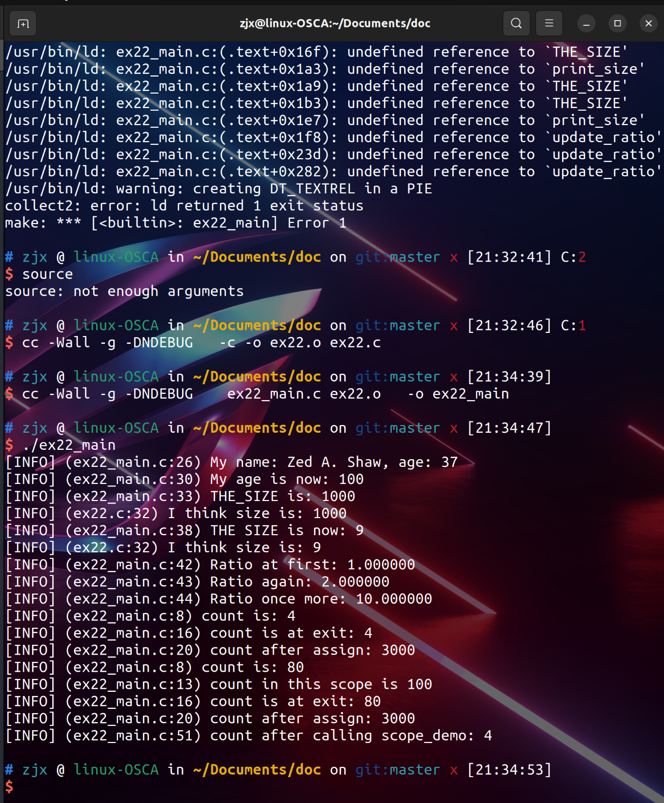

<mark>extern</mark>

```
extern int THE_SIZE;
```

这个关键词告诉编译器“这个变量已存在，但是他在别的‘外部区域’里”。通常它的意思是一个`.c`文件要用到另一个`.c`文件中定义的变量。这种情况下，我们可以说`ex22.c`中的`THE_SIZE`变量能被`ex22_main.c`访问到。

<mark>static（文件）</mark>

```
static int THE_AGE = 37;
```

这个关键词某种意义上是`extern`的反义词，意思是这个变量只能在当前的`.c`文件中使用，程序的其它部分不可访问。要记住文件级别的`static`（比如这里的`THE_AGE`）和其它位置不同。

<mark>static（函数）</mark>

如果你使用`static`在函数中声明变量，它和文件中的`static`定义类似，但是只能够在该函数中访问。它是一种创建某个函数的持续状态的方法，但事实上它很少用于现代的C语言，因为它们很难和线程一起使用。

实际这次的练习讲的就是全局变量和局部变量，其中最重要的就是以下几点：

```
void scope_demo(int count)
{
    log_info("count is: %d", count);

    if(count > 10) {
        int count = 100;  // BAD! BUGS!

        log_info("count in this scope is %d", count);
    }

    log_info("count is at exit: %d", count);

    count = 3000;

    log_info("count after assign: %d", count);
}
```

这段代码里的if()语句开启了一下属于自己的作用域，在这个语句里的变量，属于局部变量，出了这个循环count该是多少还是多少。

```
int count = 4;
    scope_demo(count);
    scope_demo(count * 20);

    log_info("count after calling scope_demo: %d", count);

    return 0;
}
```

输出：

```
[INFO] (ex22_main.c:8) count is: 4
[INFO] (ex22_main.c:16) count is at exit: 4
[INFO] (ex22_main.c:20) count after assign: 3000
[INFO] (ex22_main.c:8) count is: 80
[INFO] (ex22_main.c:13) count in this scope is 100
[INFO] (ex22_main.c:16) count is at exit: 80
[INFO] (ex22_main.c:20) count after assign: 3000
[INFO] (ex22_main.c:51) count after calling scope_demo: 4
```

最后运行`scope_demo`，可以在实例中观察到作用域。要注意到的关键点是，`count`局部变量在调用后保持不变。你将它像一个变量一样传入函数，它一定不会发生改变。要想达到目的你需要我们的老朋友<mark>指针</mark>。如果你将指向`count`的指针传入函数，那么函数就会<mark>持有它的地址并且能够改变它</mark>。

下面是一些编程C代码时需要遵循的规则，可以让你避免与栈相关的bug：

- 不要隐藏某个变量，就像上面`scope_demo`中对`count`所做的一样。这可能会产生一些隐蔽的bug，你认为你改变了某个变量但实际上没有。

- 避免过多的全局变量，尤其是跨越多个文件。如果必须的话，要使用读写器函数，就像`get_age`。这并不适用于常量，因为它们是只读的。我是说对于`THE_SIZE`这种变量，如果你希望别人能够修改它，就应该使用读写器函数。

- 在你不清楚的情况下，应该把它放在堆上。不要依赖于栈的语义，或者指定区域，而是要直接使用`malloc`创建它。

- 不要使用函数级的静态变量，就像`update_ratio`。它们并不有用，而且当你想要使你的代码运行在多线程环境时，会有很大的隐患。对于良好的全局变量，它们也非常难于寻找。

- 避免复用函数参数，因为你搞不清楚仅仅想要复用它还是希望修改它的调用者版本

我认为很需要理解的是：

在C语言中，不同的源文件（.c文件）可以通过头文件（.h文件）进行联系。头文件通常包含了变量和函数的声明，而定义则在对应的源文件中实现。通过这种方式，你可以将代码分割成多个文件，以提高代码的可维护性和可读性。

- `ex22.h` 文件包含了变量和函数的声明：

- `ex22.c `文件实现了声明在头文件中的变量和函数：

- `ex22_main.c` 文件通过包含头文件 `ex22.h` 来使用 `ex22.c` 文件中定义的变量和函数：

## 达夫设备

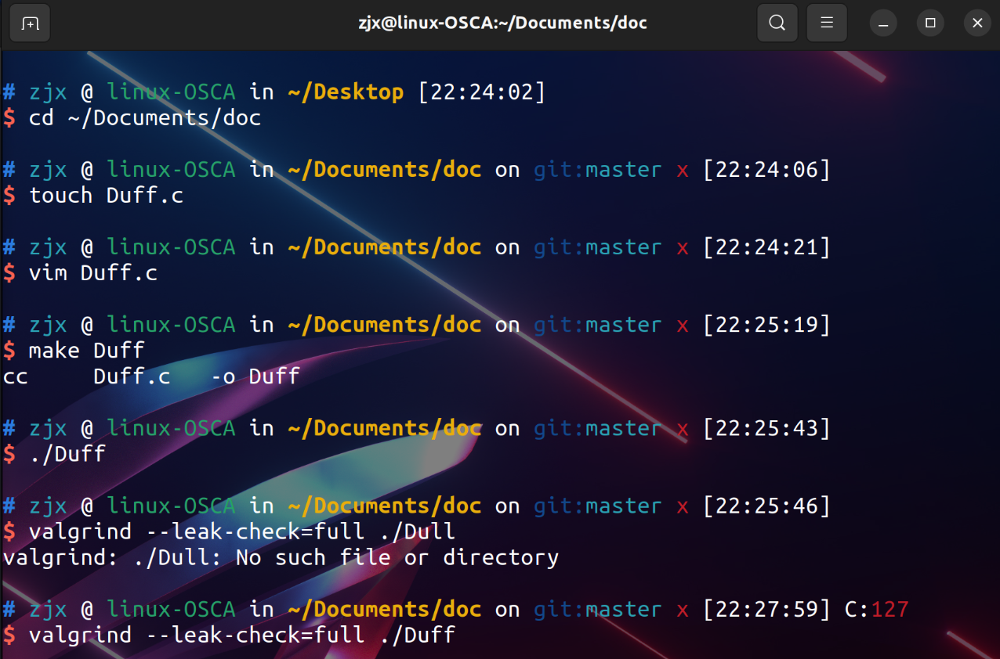

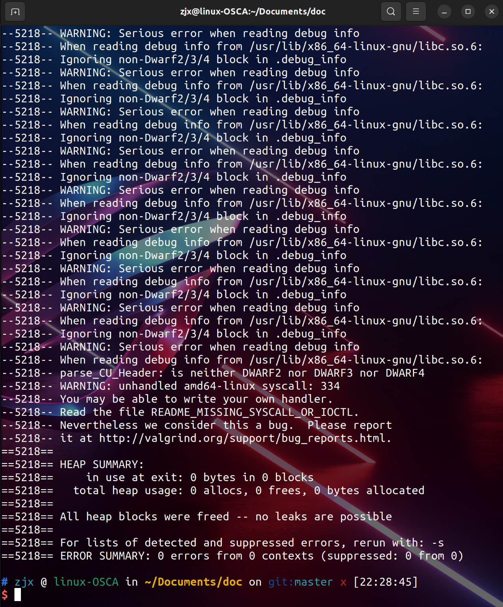

```
int duffs_device(char *from, char *to, int count) {
    // 计算循环展开的次数
    int n = (count + 7) / 8;

    // 使用 switch 对余数进行判断
    switch (count % 8) {
        case 0: 
            do {
        *to++ = *from++;
    // 这里意味着执行到这里后继续执行 case 7 的代码
        case 7: *to++ = *from++;
        case 6: *to++ = *from++;
        case 5: *to++= *from++;
		case 4: *to++ = *from++;
		case 3: *to++ = *from++;
		case 2: *to++ = *from++;
		case 1: *to++ = *from++;
	// 在这里，do-while 循环包含了每个 case，因此每个 case 都会重复执行直到 n 变为 0
		} while (--n > 0);
	// 循环展开结束
	// 函数返回输入的 count（即要复制的字节数）
		return count;
```

这段代码的主要思想是通过循环展开来减小循环控制的开销，从而提高复制数据的性能。关键点解释如下：

1. **计算循环展开的次数 `n`：**
   - `(count + 7) / 8` 用于计算循环展开的次数。这里的 `+ 7` 是为了向上舍入到整数除法的结果，确保循环能够完全展开。

2. **使用 `switch` 判断余数：**
   - `switch(count % 8)` 通过余数判断循环展开的起始位置，即从 `case 0` 到 `case 7`。

3. **循环展开（Duff's device）：**
   - 每个 `case` 中包含一组复制语句，例如 `*to++ = *from++;`，这样的语句会在每次循环迭代中执行。
   - <mark>`do-while` 循环确保了每个 `case` 会被至少执行一次，然后通过 `--n` 来控制循环的次数。</mark>

4. **返回输入的字节数：**
   - 函数返回输入的 `count`，即要复制的字节数。这是为了保持函数的原始语义。

需要注意的是，`Duff's device` 的使用在现代编程中相对较少，因为现代编译器通常能够自动进行循环展开和其他性能优化。手动使用 `Duff's device` 的场景通常需要仔细权衡，以确保性能提升超过了代码可读性和维护性的损失。

当`count`等于12时，n为2，共俩次循环，但是循环中开始的位置不同，并且位置不同进行复制的次数就不同，`count%8`等于4，那么就从`case4`开始向下执行，进行四个字节的复制，然后--n等于1，再次进入do函数，执行8次复制字节，然后--n等于0，不满足循环条件，退出循环，一共复制了12个字节，等于`count`数。

### 输入输出和文件

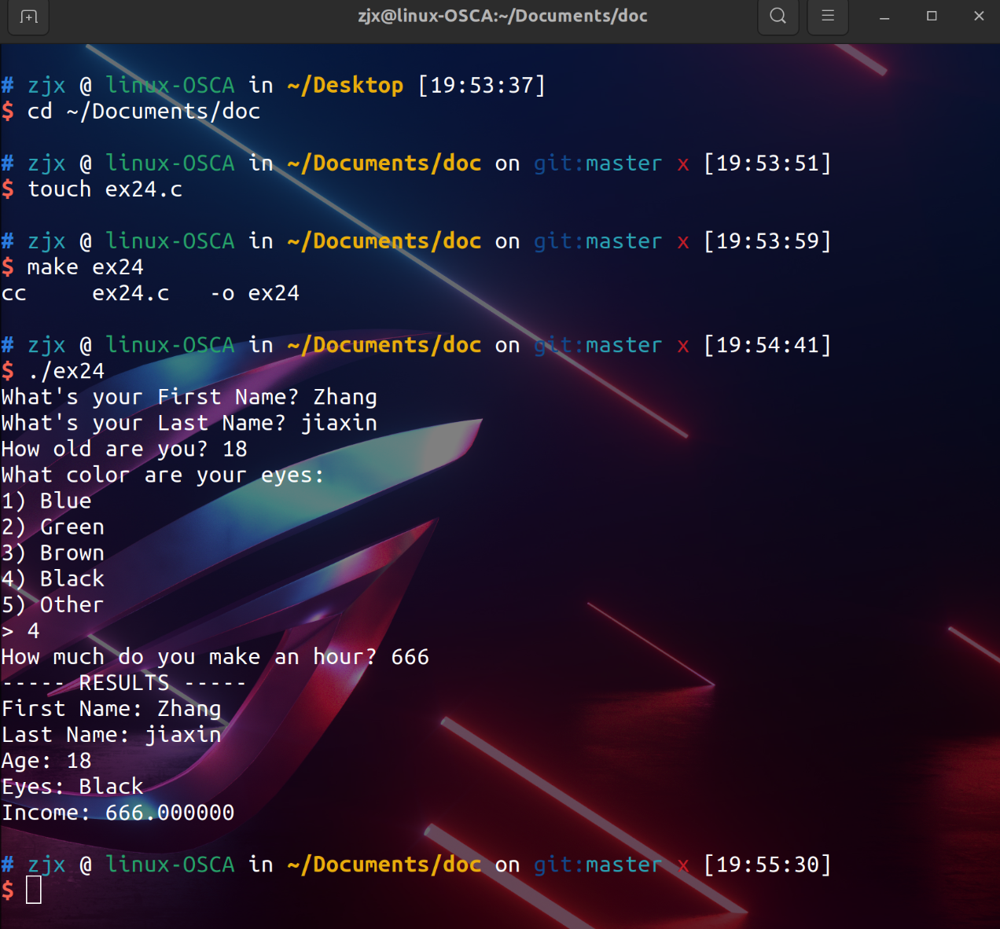

### C语言IO函数

在C语言中，主要的输入/输出（I/O）函数位于` <stdio.h> `头文件中。以下是一些常用的C语言I/O函数：

<mark>f是file的缩写代表了文件的意思，s应该是string的缩写，代表了字符串。</mark>

1.`printf`： 格式化输出函数，用于将格式化的数据打印到标准输出（通常是终端）。

```
int printf(const char *format, ...);
```

2.`scanf`： 格式化输入函数，用于从标准输入（通常是键盘）读取格式化的数据。

```
int scanf(const char *format, ...);
```

3.`fprintf`： 格式化输出函数，用于将格式化的数据打印到指定的文件。

```
int fprintf(FILE *stream, const char *format, ...);
```

4.`fscanf`： 格式化输入函数，用于从指定的文件读取格式化的数据。

```
int fscanf(FILE *stream, const char *format, ...);
```

5.`sprintf`： 格式化输出函数，将格式化的数据写入字符串。

```
int sprintf(char *str, const char *format, ...);
```

6.`snprintf`： 安全的格式化输出函数，将格式化的数据写入字符串并限制写入的字符数，避免缓冲区溢出。

```
int snprintf(char *str, size_t size, const char *format, ...);
```

7.`getchar`： 从标准输入获取一个字符。

```
int getchar(void);
```

8.`putchar`： 将一个字符输出到标准输出。

```
int putchar(int character);
```

9.`fgets`： 从文件流读取一行数据。

```
char *fgets(char *str, int size, FILE *stream);
```

10.`fputs`： 将字符串写入文件流。

```
int fputs(const char *str, FILE *stream);
```

这些函数提供了基本的输入和输出功能，允许你从键盘读取数据、将数据打印到屏幕或写入文件。请注意，I/O 函数涉及文件流（FILE 类型），并且需要正确处理文件的打开和关闭。

我感觉这段代码还好理解，毕竟就是与平常稍有语法差别的标准输入输出罢了，比较有意思的是 `OTHER_EYES`的值在代码中并未直接定义，你也能猜到它应该为4，可是为什么呢？

- 在给定的代码中，`OTHER_EYES `的值没有被明确地定义。在 C 语言中，枚举的值是从 0 开始递增的，每个成员的值比前一个成员的值增加 1。

- 由于 `EyeColor `枚举的成员顺序是从 `BLUE_EYES` 开始的，因此 `OTHER_EYES` 的值应该是 4。因此，你可以为 `OTHER_EYES` 明确指定值，也可以不指定，由编译器自动分配。

```
typedef enum EyeColor {
    BLUE_EYES, GREEN_EYES, BROWN_EYES,
    BLACK_EYES, OTHER_EYES = 4
} EyeColor;
```

与

```
typedef enum EyeColor {
    BLUE_EYES, GREEN_EYES, BROWN_EYES,
    BLACK_EYES, OTHER_EYES
} EyeColor;
```

是等价的，你可以你行修改代码，也可以让编译器自动为`OTHER_EYES`赋值。

### 变参函数

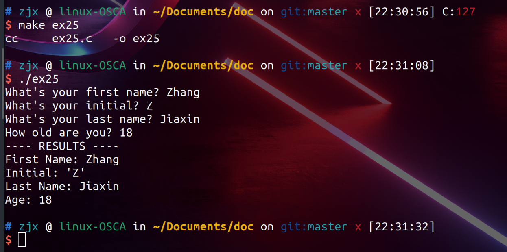

```
int read_scan(const char *fmt, ...)
{
    int i = 0;
    int rc = 0;
    int *out_int = NULL;
    char *out_char = NULL;
    char **out_string = NULL;
    int max_buffer = 0;

    va_list argp;
    va_start(argp, fmt);

    for(i = 0; fmt[i] != '\0'; i++) {
        if(fmt[i] == '%') {
            i++;
            switch(fmt[i]) {
                case '\0':
                    sentinel("Invalid format, you ended with %%.");
                    break;

                case 'd':
                    out_int = va_arg(argp, int *);
                    rc = read_int(out_int);
                    check(rc == 0, "Failed to read int.");
                    break;

                case 'c':
                    out_char = va_arg(argp, char *);
                    *out_char = fgetc(stdin);
                    break;

                case 's':
                    max_buffer = va_arg(argp, int);
                    out_string = va_arg(argp, char **);
                    rc = read_string(out_string, max_buffer);
                    check(rc == 0, "Failed to read string.");
                    break;

                default:
                    sentinel("Invalid format.");
            }
        } else {
            fgetc(stdin);
        }

        check(!feof(stdin) && !ferror(stdin), "Input error.");
    }

    va_end(argp);
    return 0;

error:
    va_end(argp);
    return -1;
}
```

这里的变参函数叫做`read_scan`，它使用了`va_list`数据结构执行和`scanf`相同的工作，并支持宏和函数。

### `va_list`数据结构：

- `va_list` 是 `C `语言中用于访问不定参数函数中参数列表的数据类型。在 C 语言中，有一组宏（`<stdarg.h> `头文件中的宏）允许函数通过不定数量的参数进行调用。这样的函数被称为不定参数函数，而 `va_list `就是用于处理这些不定参数的工具。

- 具体来说，`va_list `是一个指向参数列表的指针，它允许你在函数中访问这些参数。在函数内部，你可以使用一系列宏来逐个访问参数。这些宏包括 `va_start`、`a_arg`、`va_copy` 和 `va_end`。

- 以下是对这些宏的简要说明：

`va_start`: 初始化 `va_list `对象，使其指向参数列表的第一个参数。
`va_arg`: 返回 `va_list` 指向的参数，并将指针移动到下一个参数。
`va_copy`: 复制一个`va_list` 对象。
`va_end`: 清理 `va_list` 对象。
在给定的代码中，`va_list argp `是在 `va_start` 宏中被初始化的，然后在函数中通过不定参数的方式访问各种类型的参数。例如：

```
Copy code
va_list argp;
va_start(argp, fmt);

// 在循环中通过 va_arg 访问参数
// ...

va_end(argp);
```

这种机制允许函数按照指定的格式字符串读取和处理不同类型的参数。

---

```
 *out_string = calloc(1, max_buffer + 1);
    check_mem(*out_string); 这段代码是什么意思
```

- 这段代码用于动态分配内存来存储字符串，并通过` calloc `函数将分配的内存初始化为零。让我们逐步解释：

  - `calloc(1, max_buffer + 1);`: `calloc `是一个用于动态分配内存的函数，它接受两个参数，分别是要分配的块数和每个块的大小。在这里，我们请求分配一个块，其大小为 max_buffer + 1 个字节。`max_buffer + 1` 是因为我们通常需要一个额外的字节来存储字符串结尾的 `null `字符`（'\0'）`，以确保字符串正确终止。

  - `*out_string = ...;`: 这将分配的内存地址赋值给 out_string 指针。这样，` *out_string` 就指向了一个包含 `max_buffer + 1 `个字节的内存块。

`check_mem(*out_string);`: `check_mem `是一个宏，用于检查内存分配是否成功。如果 `*out_string` 为 `NULL`，说明内存分配失败，程序会跳转到 `error` 标签处进行错误处理。

综合起来，这段代码的作用是安全地分配足够空间来存储字符串，并将分配的内存地址存储在 `out_string` 指针中。

---

```
char *result = fgets(*out_string, max_buffer, stdin); check(result != NULL, "Input error.");
```

- 这段代码使用 `fgets `函数从标准输入中读取字符串，并将其存储到先前分配的内存块中。让我们逐步解释：
  - `fgets(*out_string, max_buffer, stdin);`: `fgets `是一个用于从指定的文件流（这里是标准输入 `stdin`）读取一行字符串的函数。它接受三个参数：目标缓冲区的指针，最大读取的字符数（包括换行符和 `null `终止符），以及文件流。

- `*out_string`: 这是指向先前分配的内存块的指针，用于存储从标准输入读取的字符串。
  `max_buffer`: 指定最大读取的字符数。这个值通常是分配内存时传递的 `max_buffer + 1`，以确保有足够的空间存储字符串和 `null` 终止符。
  `stdin`: 标准输入流。
  `char *result = ...;`: `fgets` 的返回值是一个指向目标缓冲区的指针，或者如果读取失败（例如，到达文件末尾或发生错误），则返回 `NULL`。这里将 `fgets `的返回值存储在 result 变量中。

- `check(result != NULL, "Input error.");`: `check` 是一个宏，用于检查条件是否为真。在这里，它检查 result 是否为` NULL`，如果是，表示发生了输入错误。如果条件不满足，程序会跳转到 `error` 标签处进行错误处理。
- `fgets `函数在读取字符串时会将换行符（如果存在）和 null 终止符都存储在目标缓冲区中，但是返回的字符串不包括换行符，而是在其末尾添加了 null 终止符。所以，实际存储在缓冲区中的内容是包括换行符和 null 终止符的，但在处理返回的字符串时，通常不考虑换行符。

综合起来，这段代码的目的是从标准输入中安全地读取一行字符串，并将其存储在先前分配的内存块中，同时检查输入是否成功。

---

### error标签

```
error:
    if (*out_string) free(*out_string);  // 如果 out_string 不为 NULL，释放内存
    *out_string = NULL;  // 将 out_string 设置为 NULL，防止出现悬挂指针
    return -1;  // 返回错误代码
```

在这段代码中，`goto error`;语句并没有直接出现在主函数`main`中。实际上，`goto error`;语句被用在check宏中的错误检查逻辑中。这个宏在代码中的使用如下：

```
check(rc == 0, "Failed first name.");
```

`check`宏通常用于简化错误检查，如果发生错误，它会跳转到`error`标签执行错误处理代码。`check`宏在头文件`dbg.h`中

- 这段`error`代码是错误处理的一部分，用于释放动态分配的内存并将指针置为 NULL，以避免悬空指针。

具体解释如下：

`if (*out_string)`：这个条件语句检查` *out_string `是否非空，即指针是否指向有效的内存块。如果指针不为空，说明内存已经成功分配。

`free(*out_string)`：如果指针非空，就调用 free 函数释放 *out_string 指向的内存块。这是为了防止内存泄漏，确保在函数出错的情况下释放已分配的内存。

`*out_string = NULL`：无论指针是否为空，都将指针置为 `NULL`。这是一种良好的编程实践，可以避免出现悬空指针`（dangling pointer）`问题，即指针指向已释放的内存。

`return -1`：最后，函数返回错误代码 -1，表示在执行过程中发生了错误。

这样的错误处理机制确保了在发生错误时及时释放已分配的资源，同时使指针保持良好的状态，避免了悬空指针可能导致的未定义行为。

## 编写第一个真正的程序

在这个练习中，需要自己不断的改进了来达到实现最终程序的目的。

我目前的情况：

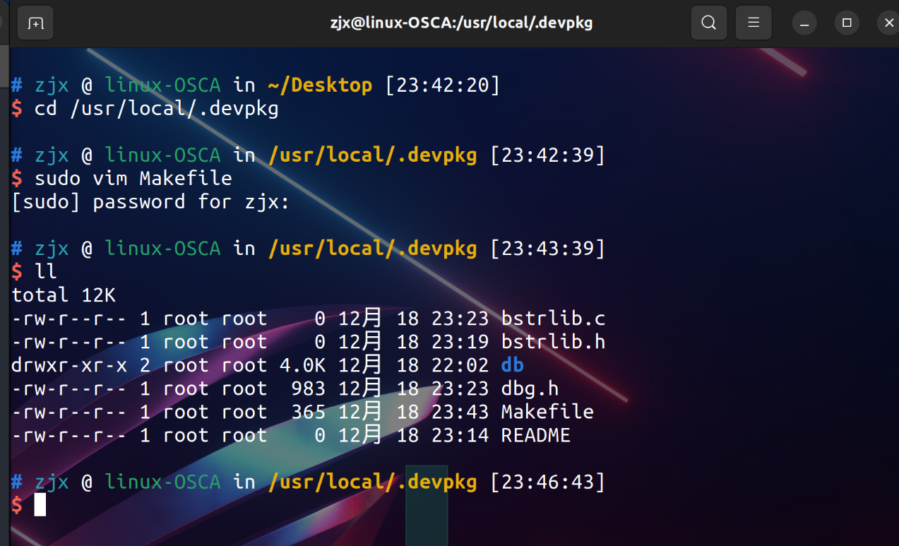

在写入Makefile时，需要注意因为只有读入的权力，你可以赋予写入的权力，如果你无法赋予写入的权力，可以试一下以管理员身份使用vim打开Makefile文件，然后在结束时<mark>输入w！来强制写入</mark>。

```
1|sudo vim filename   #使用管理员身份进行	编辑
2|:w!   #结束时的输入
```

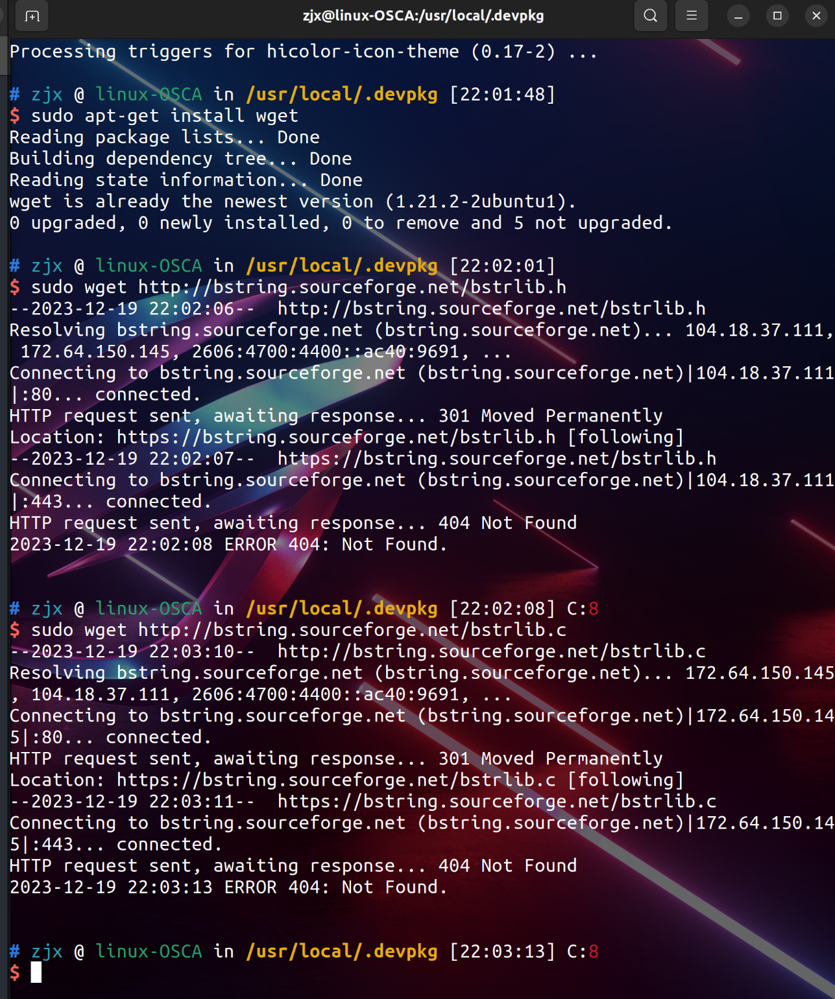

2023.12.19今天我用vim打开`bstrlib.c`和`bstrlib.h`文件，发现里面居然是空的，然后我再用那个`curl`来下这俩个文件，发现请求无响应。可能是因为文件的位置发生了变换，然后我通过官网，找到了文件的位置，可是还是无响应，只能在库上直接复制粘贴了。

[bstrlib.c](https://github.com/websnarf/bstrlib/blob/master/bstrlib.c)

[bstrlib.h](https://github.com/websnarf/bstrlib/blob/master/bstrlib.h)

Makefile文件内容解析：

以下是格式完全正确的Makefile文件

```
PREFIX?=/usr/local
CFLAGS=-g -Wall -I${PREFIX}/apr/include/apr-1 -I${PREFIX}/apr/include/apr-util-1
LDFLAGS=-L${PREFIX}/apr/lib -lapr-1 -pthread -laprutil-1

all: devpkg

devpkg: bstrlib.o db.o shell.o commands.o

install: all
	install -d $(DESTDIR)/$(PREFIX)/bin/
	install devpkg $(DESTDIR)/$(PREFIX)/bin/

clean:
	rm -f *.o
	rm -f devpkg
	rm -rf *.dSYM

```

- `PREFIX?=/usr/local`: 这行定义了PREFIX变量，表示安装目录的前缀。如果之前未定义，使用默认值`/usr/local`。

- `CFLAGS=-g -Wall -I${PREFIX}/apr/include/apr-1 -I${PREFIX}/apr/include/apr-util-1`: 这行定义了`CFLAGS`变量，包含了编译时的一些选项，例如调试信息（-g）、警告（-Wall）以及头文件的搜索路径。

- `LDFLAGS=-L${PREFIX}/apr/lib -lapr-1 -pthread -laprutil-1`: 这行定义了`LDFLAGS`变量，包含了链接时的一些选项，例如库文件的搜索路径和需要链接的库。

- all: `devpkg`: 这行定义了一个目标，表示在运行make时默认构建的目标是`devpkg`。

- `devpkg`: `bstrlib.o db.o shell.o commands.o`: 这行表示`devpkg`这个目标依赖于`bstrlib.o`、`db.o`、`shell.o`和`commands.o`这四个文件。如果它们中的任何一个发生了变化，make将重新构建`devpkg`。

- `install: all`: 这行表示install这个目标依赖于all，也就是在安装之前会先构建`devpkg`。

- `install -d $(DESTDIR)/$(PREFIX)/bin/`: 这行用于创建安装目录。

- `install devpkg $(DESTDIR)/$(PREFIX)/bin/`: 这行用于将构建好的`devpkg`可执行文件安装到指定目录。

- clean: 这个目标用于清理构建过程中生成的中间文件和可执行文件。

- `rm -rf *.dSYM`: 这行用于删除可能由调试信息生成的`.dSYM`目录。

我目前的进度：

还缺一些依赖

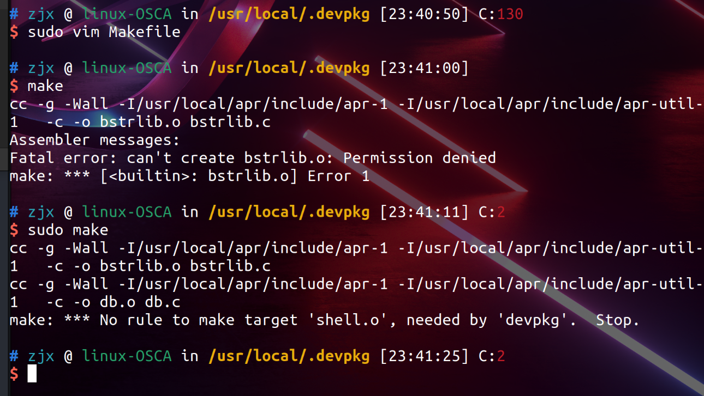

### 终于成功了，做项目不容易啊2023.12.20：

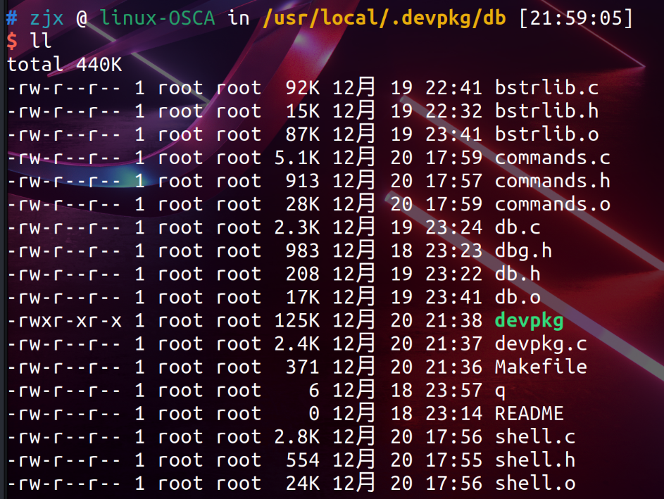

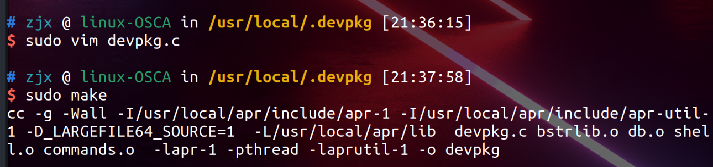

我至少改了20多次的有关文件的东西，尤其是那个Makefile，我本来打算放弃了，然后我想了想一下还是再试一次吧，没想到成功了，成功来的总是那么突然，总在你感到绝望时突然降临。

### 创造性和防御性编程

创造性编程思维：

暂时接受一种可以不会惧怕风险的思维方式->

- 我不会犯错误。
- 人们所想的并不重要。
- 我脑子里面诞生的想法才是最好的。

创造性思维的阴暗面->

- 编写完美的软件是可行的。
- 我的大脑告诉我了真相，它不会发现任何错误，所以我写了完美的软件。
- 我的代码就是我自己，批判它的人也在批判我。

强调：

- 恐惧会快速地扼杀创造力

- 你经常会碰到一些程序员，它们对自己创造的软件具有强烈的荣誉感。这很正常，但是这种荣誉感会成为客观上改进作品的阻力。

防御性编程思维：

- 软件中存在错误。
- 你并不是你的软件，但你需要为错误负责。
- 你永远不可能消除所有错误，只能降低它们的可能性。

这种思维方式让你诚实地对待你的代码，并且为改进批判地分析它。注意上面并没有说**你**充满了错误，只是说你的**代码**充满错误。这是一个需要理解的关键，因为它给了你编写下一个实现的客观力量。

就像创造性思维，防御性编程思维也有阴暗面。防御性程序员是一个惧怕任何事情的偏执狂，这种恐惧使他们远离可能的错误或避免犯错误。当你尝试做到严格一致或正确时这很好，但是它是创造力和专注的杀手。

八个防御性编程策略（核心）：

永远不要信任输入->永远不要提供的输入，并总是校验它。

避免错误->如果错误可能发生，不管可能性多低都要避免它。

过早暴露错误->过早暴露错误，并且评估发生了什么、在哪里发生以及如何修复。

记录假设->清楚地记录所有先决条件，后置条件以及不变量。

防止过多的文档->不要在实现阶段就编写文档，它们可以在代码完成时编写。

使一切自动化->使一切自动化，尤其是测试。

简单化和清晰化->永远简化你的代码，在没有牺牲安全性的同时变得最小和最整洁。

质疑权威->不要盲目遵循或拒绝规则。

## Makefile进阶

基本的项目结构：

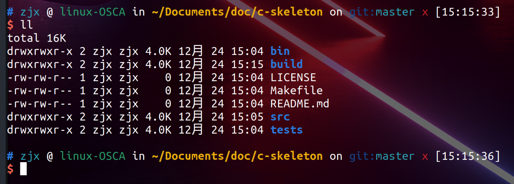

```
LICENSE
```

如果你在项目中发布源码，你会希望包含一份协议。如果你不这么多，虽然你有代码的版权，但是通常没有人有权使用。

```
README.md
```

对你项目的简要说明。它以`.md`结尾，所以应该作为Markdown来解析。

```
Makefile
```

这个项目的主要构建文件。

```
bin/
```

放置可运行程序的地方。这里通常是空的，Makefile会在这里生成程序。

```
build/
```

当值库和其它构建组件的地方。通常也是空的，Makefile会在这里生成这些东西。

```
src/
```

放置源码的地方，通常是`.c`和`.h`文件。

```
tests/
```

放置自动化测试的地方。

```
src/dbg.h
```

练习20的调试宏
