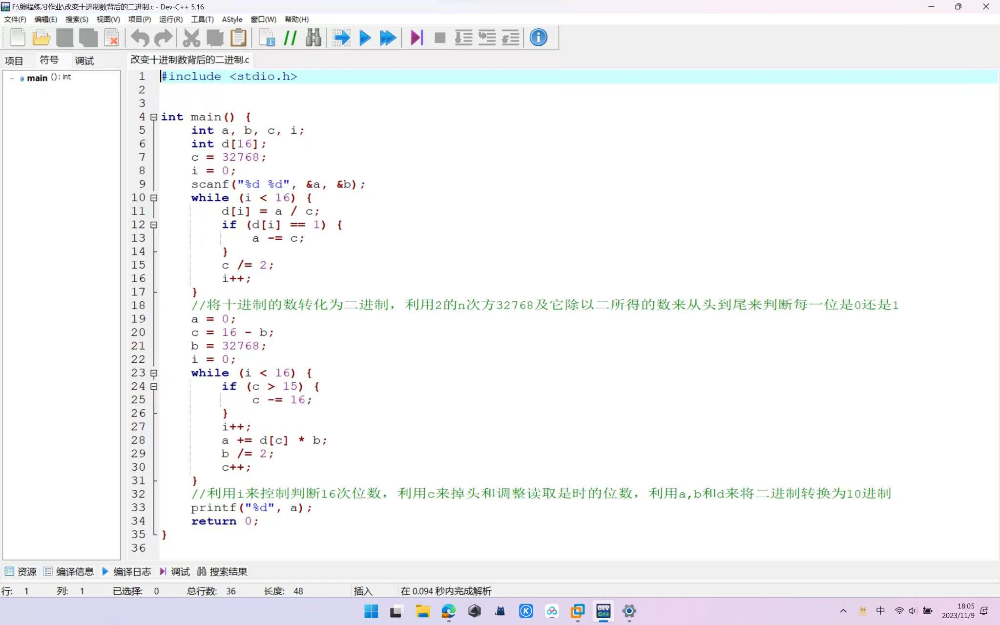
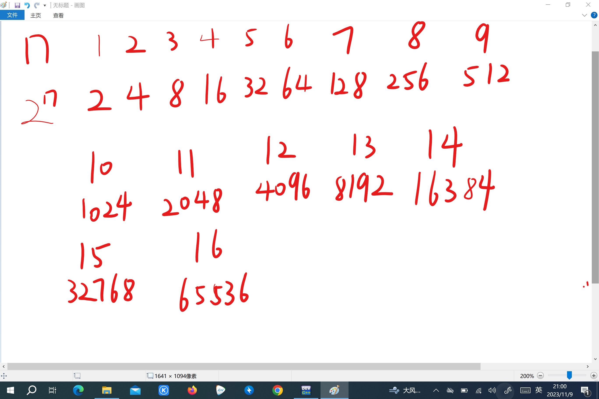
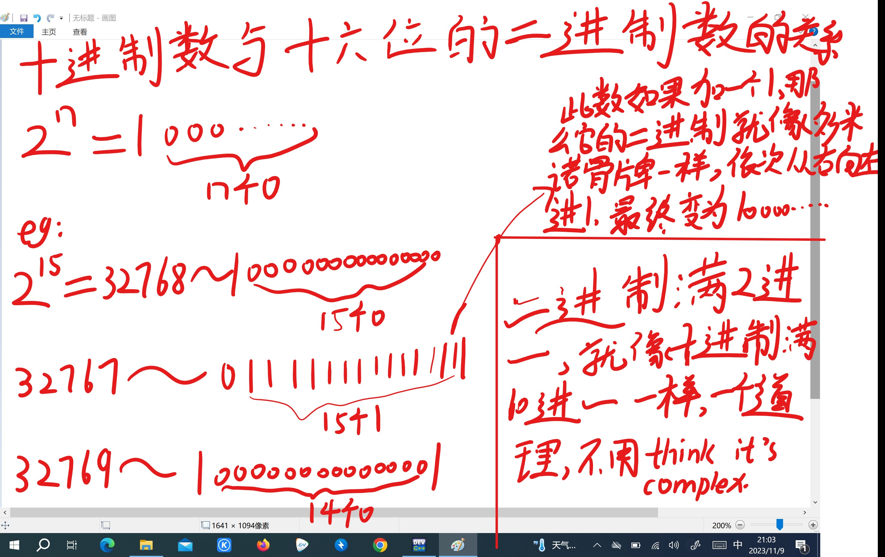
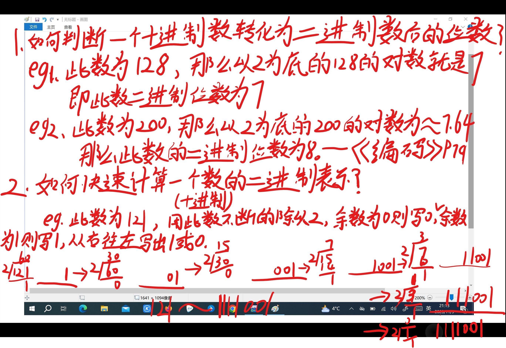
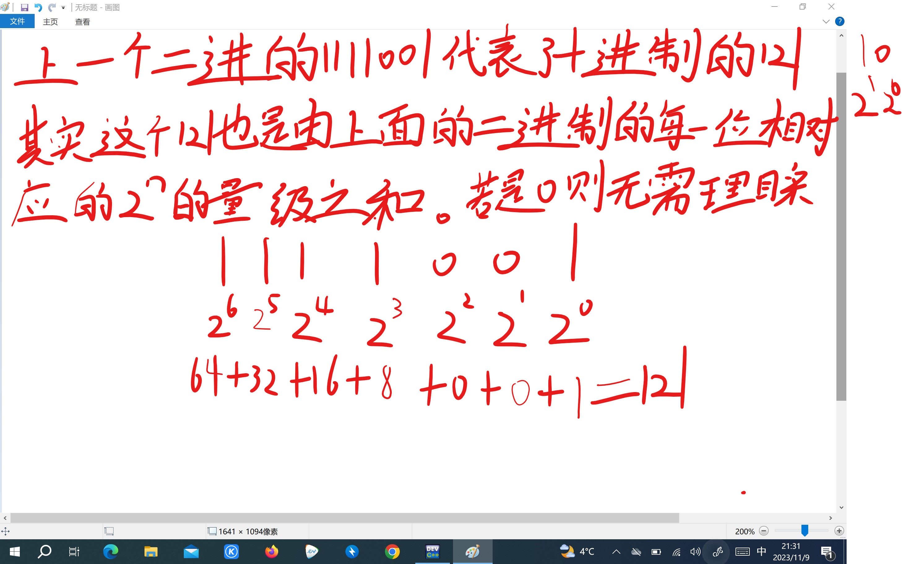
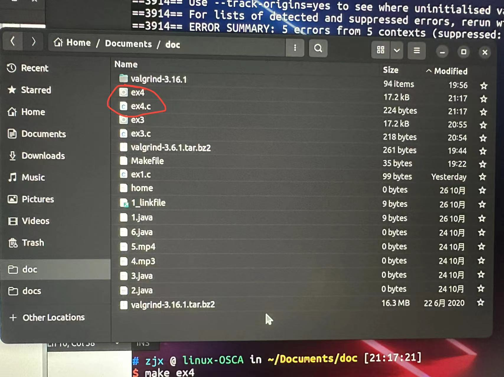

### 十进制与二进制：

```
【问题描述】

假设有一16位的无符号整数，可以对其二进制数据进行循环右移操作，右移后仍然是无符号整数。编写程序从控制台读入要右移的整数和循环右移的位数，求得并输出循环右移后的十进制数据。

【输入形式】

从控制台输入要右移的十进制整数（大于等于0，小于等于65535）和循环右移的位数（大于等于0，小于等于16），两整数之间用一个空格分隔。

【输出形式】

向控制台输出循环右移后的十进制整数。

【输入样例1】

65532 2

【输出样例1】

16383

【样例1说明】

输入的待右移的整数为65532，该无符号整数的二进制形式为：1111111111111100，向右循环右移两位后的二进制形式为：0011111111111111，对应的十进制数据为：16383。

【输入样例2】

6 3

【输出样例2】

49152

【样例2说明】

输入的待右移的整数为6，该无符号整数的二进制形式为：0000000000000110，向右循环右移3位后的二进制形式为：1100000000000000，对应的十进制数据为：49152。
```

- 
- 接下来我用四张图来介绍一下十进制与二进制的相互转化，并且如果你看懂了接下来的四张图，那么你就可以读懂上面这个程序是如何实现的了，先简单介绍一下这个程序的整体思路：1.将二进制的16位数存储到d中，然后从左到右以此判别此位是否为1。2.利用i来判别16次位数，利用c来实现右移，实际上是改变了一开始读取的位次，到尾后又从头开始读取，然后再利用32768也就是2的15次方来实现转换为十进制。
- 
- 
- 
- 

---

## Learn C the hard way：

### 注意事项(目前我遇到的)：

1.在运行你需要运行的文件时，你必须先cd的文件所在目录，列入我的ex4文件



- 首先输入命令：

```
cd ~/Documents/doc
```

- 然后再输入：

```
./ex4
```

这样进可以运行文件中的c程序了

2.要修改文件内容时，比如ex4.c，首先你会在这个文件中进行修改，可是当你修改完，然后运行这个文件输入：

```
./ex4
```

- 你发现怎么还是上次的结果，我不是已经修改了吗，这时你只需要先输入命令：

```
make ex4
```

- 它就会更新新的ex4

### 我目前学到或者见识到的东西：

### make:

1.make(在Python中，你仅仅需要输入`python`，就可以运行你想要运行的代码。Python的解释器会运行它们，并且在运行中导入它所需的库和其它东西。Make会构建源码，执行测试，设置一些选项以及为你做所有Python通常会做的事情。)

### valgrind:

2.valgrind（是一种检测错误的工具）

a.下载：

```
1|wget https://sourceware.org/pub/valgrind/valgrind-3.16.1.tar.bz2      #使用下载命令下载压缩包
```

```
2|tar-jxvf valgrind-3.16.1.tar.bz2   #解压安装包
```

```
3|cd valgrind-3.16.1    #进入目录
```

```
4|./configure    #配置valgrind,生成MakeFile文件
```

```
5|make    #编译Valgrind
```

```
6|make install   #安装Valgrind
```

在valgrind下运行文件

```
valgrind ./ex4
```

### 句法

3.1使用char来声明，以周围带有'（单引号）的单个字符来表示，使用%c来打印。

```
char initial = 'A';
printf("I have an initial %c.\n", initial);
```

- 3.2.使用char name[]来声明，以周围带有“的一些字符来表示，使用%s来打印。

```
char first_name[] = "Zed";
printf("I have a first name %s.\n", first_name);
```

- 3.3.long用%ld占位符
- 3.4.使用%e以科学计算法的形式打印

- 3.5.特殊语法'\0'声明了一个字符，这样创建了一个“空字节”字符，实际上是数字0：

```
char nul_byte = '\0';
int care_percentage = bugs * nul_byte;
printf("Which means you should care %d%%.\n",
            care_percentage);
```

- 结果：

```
Which means you should care 0%.
```

- 3.6.用俩个%%来打印一个%

```
printf("Which means you should care %d%%.\n",
            care_percentage);
```

- 3.7.&&与||：

```
【问题描述】

   在中国数学历史上广泛流传着一个&ldquo;韩信点兵&rdquo;的故事。韩信点兵时，为了知道有多少兵，同时又能保住军事机密，便让士兵排队报数：

按从1至5报数，记录最末一个士兵的报数为1；

按从1至6报数，记录最末一个士兵的报数为5；

按从1至7报数，记录最末一个士兵的报数为4；

按从1至11报数，记录最末一个士兵的报数为10；

你知道韩信至少有多少兵？

【输入输出说明】无输入，输出至少应有的士兵数。
```

```
1  	 :  	#include <stdio.h>
2  	 :  	
3  	 :  	int main() {
4  	 :  	
5  	 :  	    int a ;
6  	 :  	    for (a = 1; a % 5 != 1 || a % 6 != 5 || a % 7 != 4 || a % 11 != 10; a++);
7  	 :  	    printf("%d", a);
8  	 :  	    return 0;
9  	 :  	}
10   :  	
 
```

- 我利用此题来介绍一下二者的区别
- 1.||表示或者，要想此题得出正确答案，那个a除以那四个数之后，得到的余数也是分别四个特定的数。只要不满足其中任何一个，那么就需要使a不断递增，知道找到那一位正确的数。此代码中，只要a满足4个条件中的任意一个，也就是有一个除完数之后余数并不是自己想要的，那么就会继续进入循环，它是一种或的关系。也就是只要有一个满足条件就会进入循环，当所有条件都不满足时，才会跳出循环。
- 2.&&表示并且，也就是说，只有当四个条件都满足时，才会进入循环，也就是说a必须做到除完数后，没有一个余数符合条件，才会进入循环，更新a的值。如果有其中一个余数符合我们想要的，而另外三个不符合，它也会跳出循环，直接输出。也就是只要有一个不满足循环条件，那么它就会跳出循环，满足所有条件时才会进入循环。

4.数组大小：

```
#include <stdio.h>

int main(int argc, char *argv[])
{
    int areas[] = {10, 12, 13, 14, 20};
    char name[] = "Zed";
    char full_name[] = {
        'Z', 'e', 'd',
         ' ', 'A', '.', ' ',
         'S', 'h', 'a', 'w', '\0'
    };

    // WARNING: On some systems you may have to change the
    // %ld in this code to a %u since it will use unsigned ints
    printf("The size of an int: %ld\n", sizeof(int));
    printf("The size of areas (int[]): %ld\n",
            sizeof(areas));
    printf("The number of ints in areas: %ld\n",
            sizeof(areas) / sizeof(int));
    printf("The first area is %d, the 2nd %d.\n",
            areas[0], areas[1]);

    printf("The size of a char: %ld\n", sizeof(char));
    printf("The size of name (char[]): %ld\n",
            sizeof(name));
    printf("The number of chars: %ld\n",
            sizeof(name) / sizeof(char));

    printf("The size of full_name (char[]): %ld\n",
            sizeof(full_name));
    printf("The number of chars: %ld\n",
            sizeof(full_name) / sizeof(char));

    printf("name=\"%s\" and full_name=\"%s\"\n",
            name, full_name);

    return 0;
}
```

```
The size of an int: 4
The size of areas (int[]): 20
The number of ints in areas: 5
The first area is 10, the 2nd 12.
The size of a char: 1
The size of name (char[]): 4
The number of chars: 4
The size of full_name (char[]): 12
The number of chars: 12
name="Zed" and full_name="Zed A. Shaw"

```

int的大小是4，areas中含有5个整数，所以自然需要用20个字节来储存它

char的大小是1，name中含有三个字符的字符串，full__ _name中含有12个单字符，而打印出它们的字节大小却分别是4和12，full__ _name很好理解,因为它本身就含有12个单字符，但name为什么是4呢，百思不得其解下，我谷歌了一下，原来char类型的数组是以“\0”空字符结尾的。这下就明白了， full__name本身就是以“\0”空字符来结尾的，所以就是12个字节，不需要+1，而name原本应该是“zed\0”，所以它需要+1.

5.数组和字符串：

```
#include <stdio.h>

int main(int argc, char *argv[])
{
    int numbers[4] = {0};
    char name[4] = {'a'};

    // first, print them out raw
    printf("numbers: %d %d %d %d\n",
            numbers[0], numbers[1],
            numbers[2], numbers[3]);

    printf("name each: %c %c %c %c\n",
            name[0], name[1],
            name[2], name[3]);

    printf("name: %s\n", name);

    // setup the numbers
    numbers[0] = 1;
    numbers[1] = 2;
    numbers[2] = 3;
    numbers[3] = 4;

    // setup the name
    name[0] = 'Z';
    name[1] = 'e';
    name[2] = 'd';
    name[3] = '\0';

    // then print them out initialized
    printf("numbers: %d %d %d %d\n",
            numbers[0], numbers[1],
            numbers[2], numbers[3]);

    printf("name each: %c %c %c %c\n",
            name[0], name[1],
            name[2], name[3]);

    // print the name like a string
    printf("name: %s\n", name);

    // another way to use name
    char *another = "Zed";

    printf("another: %s\n", another);

    printf("another each: %c %c %c %c\n",
            another[0], another[1],
            another[2], another[3]);

    return 0;
}

```

输出：

```
numbers: 0 0 0 0
name each: a   
name: a
numbers: 1 2 3 4
name each: Z e d 
name: Zed
another: Zed
another each: Z e d 
```

- 5.1第一个numbers并没有提供全部的四个参数，第一个name也只提供了一个元素，可是为什么numbers可以将所有的元素打印出来，而name却只有一个a。那是因为numbers为int类型，未提供的剩余元素都会默认为0，而char未写出的元素默认为“\0"空字符，而空字符并不会显示。
- 5.2创建一个字符串的常用语法char name[4] = {'a'}和char *another = "name"俩中，其中后者比较常用。

- 在C语言中字符数组和字符串没有什么不同。
