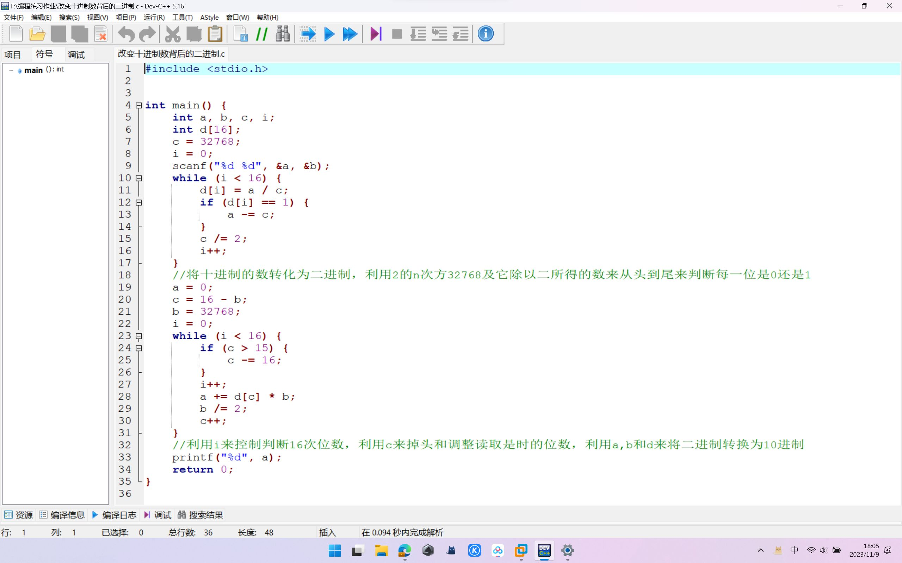

### 十进制与二进制：

【问题描述】

假设有一16位的无符号整数，可以对其二进制数据进行循环右移操作，右移后仍然是无符号整数。编写程序从控制台读入要右移的整数和循环右移的位数，求得并输出循环右移后的十进制数据。

【输入形式】

从控制台输入要右移的十进制整数（大于等于0，小于等于65535）和循环右移的位数（大于等于0，小于等于16），两整数之间用一个空格分隔。

【输出形式】

向控制台输出循环右移后的十进制整数。

【输入样例1】

65532 2

【输出样例1】

16383

【样例1说明】

输入的待右移的整数为65532，该无符号整数的二进制形式为：1111111111111100，向右循环右移两位后的二进制形式为：0011111111111111，对应的十进制数据为：16383。

【输入样例2】

6 3

【输出样例2】

49152

【样例2说明】

输入的待右移的整数为6，该无符号整数的二进制形式为：0000000000000110，向右循环右移3位后的二进制形式为：1100000000000000，对应的十进制数据为：49152。

9号晚上领航回来对二进制和十进制自己的一点理解进行说明
